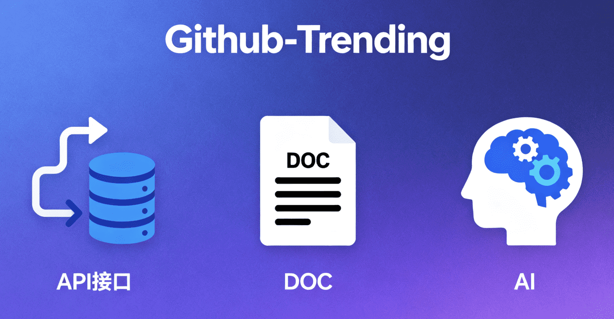

<h1 align="center" style="border-bottom: none">
    <a href="" target="_blank">
         
        <alt="github-trending" src="" width="100" height="100">
    </a>
    <br>Github-Trending</br>
</h1>

[](https://github.com/3ziye/github-trending/actions/workflows/github-trending.yml)

<div align="center" style="line-height: 2;">
  [<a href="/README_EN.md">English</a>] | [<a href="/README.md">中文(简体)</a>]
</div>

This project has three core modules: a data acquisition module fetching GitHub popular projects via API (with filtering and caching), a report generation module creating Markdown reports, and a Bash script orchestrating workflows (with scheduling and Git auto-commit). 

Reports are generated at 9:00 a.m. every day. For details, please refer to Report Collection.

# 🎯 Core System Functions

## 1.  Data Acquisition Module (github_fetcher.py)

*   Call the GitHub API to obtain popular projects

*   Support filtering by programming language and time range

*   Acquire project details, README files, and language statistics

*   Support data caching to avoid duplicate requests

## 2.  Report Generation Module (markdown_generator.py)

*   Intelligently parse README content

*   Automatically extract project features and deployment instructions

*   Generate detailed Markdown reports

*   Include statistical data and visual tables

## 3.  Automation Script (run_github_trending.sh)

*   Bash script to orchestrate the entire process

*   Support scheduled tasks and daemon mode

*   Git automatic commit function

*   Support for multiple notification methods

## 4.  Complete Deployment Solution

*   One-click installation script

*   Docker containerized deployment

*   Detailed configuration instruction documentation

---


# 🚀 Quick Start

Basic usage process:

After entering the container:


```
./run_github_trending.sh -l python -t weekly -c 20
```

The generated report includes:

📊 Project statistics overview (total stars, language distribution, etc.)

🎯 Core features of each project

🎨 Intelligently recommended application scenarios

🛠️ Deployment methods extracted from the README

📝 Detailed project information table

💡 System Advantages


*   No database dependency - directly call the GitHub API for lightweight deployment

*   Intelligent content extraction - automatically analyze the README and extract key information

*   Flexible configuration - support multiple parameters and configuration methods

*   Complete automation - one-click completion from data acquisition to report generation

*   Strong scalability - modular design for easy function expansion

This system can help you:


*   Track GitHub technology trends regularly

*   Generate professional technical reports

*   Automate the technical research process

*   Provide technical selection references for teams

You can adjust the configuration parameters as needed, such as focusing on specific programming languages and setting acquisition frequencies. The system is flexibly designed and can be used either once or deployed as a long-term running service.