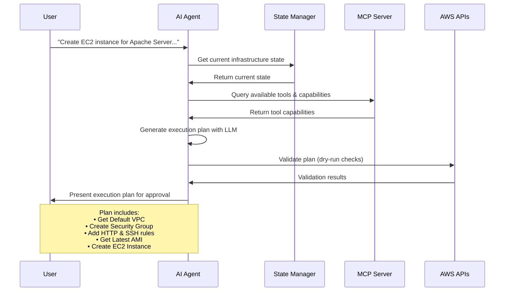

# AI Infrastructure Agent

> ⚠️ **Proof of Concept Project**: This repository contains a proof-of-concept implementation of an AI-powered infrastructure management agent. It is currently in active development and **not intended for production use**. We plan to release a production-ready version in the future. Use at your own risk and always test in development environments first.

<h1 align="center" style="border-bottom: none">
  
</h1>

<div align="center">

[](https://golang.org/)
[](https://aws.amazon.com/)
[](https://modelcontextprotocol.io/)

*Intelligent AWS infrastructure management through natural language interactions*

</div>

## What is AI Infrastructure Agent?

AI Infrastructure Agent is an intelligent system that allows you to manage AWS infrastructure using natural language commands. Powered by advanced AI models (OpenAI GPT, Google Gemini, or Anthropic Claude), it translates your infrastructure requests into executable AWS operations while maintaining safety through conflict detection and resolution.

<h1 align="center" style="border-bottom: none">
  
</h1>

### Key Features

- **Natural Language Interface** - Describe what you want, not how to build it
- **Multi-AI Provider Support** - Choose between OpenAI, Google Gemini, Anthropic, or AWS Bedrock Nova
- **Web Dashboard** - Visual interface for infrastructure management, built-in conflict detection and dry-run mode
- **Terraform-like state** - Maintains accurate infrastructure state
- **Current Resource Support** - VPC, EC2, SG, Autoscaling Group, ALB. Check the roadmap here: [Core Platform Development](https://github.com/orgs/VersusControl/projects/19)

## Example Usage

Imagine you want to create AWS infrastructure with a simple request:

> **"Create an EC2 instance for hosting an Apache Server with a dedicated security group that allows inbound HTTP (port 80) and SSH (port 22) traffic."**

> 💡 **Amazon Nova Users**: When using AWS Bedrock Nova models, you may want to specify the region in your request for better context, e.g., *"Create an EC2 instance in us-east-1 for hosting an Apache Server..."*

Here's what happens:

### 1. AI Analysis & Planning

The AI agent analyzes your request and creates a detailed execution plan:



The agent presents the plan for your review:
- Shows exactly what will be created
- Waits for your approval

### 2. Execution & Monitoring

Once approved, the agent:
- Creates resources in the correct order
- Monitors progress in real-time
- Handles dependencies automatically
- Reports completion status

<h1 align="center" style="border-bottom: none">
  
</h1>

### 3. More Examples

- Quick Tutorial: **[AI Infrastructure Agent for AWS](https://github.com/VersusControl/devops-ai-guidelines/blob/main/resources/ai-infrastructure-agent-for-aws.md)**
- Series Tutorial: **[Building Your Business on AWS with AI Agent](https://github.com/VersusControl/devops-ai-guidelines/blob/main/04-ai-agent-for-aws/00-toc.md)**

## Quick Installation

### Prerequisites

- **AWS Account** - With appropriate IAM permissions
- **AI Provider API Key** - Choose from: OpenAI API Key, Google Gemini API Key, Anthropic API Key, or use AWS Bedrock Nova (with AWS credentials)

### Automated Installation (Recommended)

```bash
# Clone the repository
git clone https://github.com/VersusControl/ai-infrastructure-agent.git
cd ai-infrastructure-agent

# Run the installation script
./scripts/install.sh
```

The installation script will:
- ✅ Check and install Go 1.24.2+
- ✅ Setup AWS CLI (if needed)
- ✅ Create necessary directories
- ✅ Build both MCP server and Web UI
- ✅ Create configuration files
- ✅ Generate launcher scripts

### Manual Installation

<details>
<summary>Click to expand manual installation steps</summary>

```bash
# 1. Install Go 1.24.2+
#