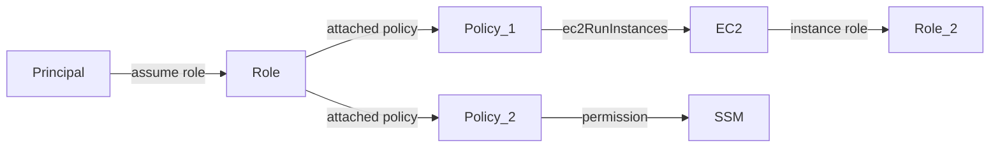

# IAMhounddog

A tool to help pentesters quickly identify privileged principals and second-order privilege escalation opportunities in unfamiliar AWS environments.

https://github.com/user-attachments/assets/e60db9c6-75ee-45f9-83fb-0b58f5683ceb

## Usage

1. Download and setup [BloodHound Community Edition](https://bloodhound.specterops.io/get-started/quickstart/community-edition-quickstart)
1. Install via `go install github.com/VirtueSecurity/IAMhounddog@latest`
1. Run `$ IAMhounddog` with environment variables set (`export AWS_ACCESS_KEY_ID=...`) or an AWS profile (`-profile`)
1. Import `output.json` into BloodHound using Administration > File Ingest
1. Run queries against the data

To include icons in BloodHound and import the bundled queries into the Cypher tab:

1. In BloodHound, go to Profile > API Key Management > Create Token
1. Run `$ IAMhounddog -setup -url "http://localhost:8080" -id "KEYIDFROMSTEPABOVE" -token "KEYTOKENFROMSTEPABOVE"`

Requires an AWS principal with either SecurityAudit or ReadOnlyAccess.

## Second-Order Privilege Escalation Opportunities

There are currently multiple tools (such as [Cloudsplaining](https://github.com/salesforce/cloudsplaining)) that effectively identify first-order privilege escalation opportunities. A classic example would be attaching a policy to a role that includes the `iam:PutRolePolicy` permission or attaching the `AdministratorAccess` policy to a principal. Second-order opportunities occur when a principal may not have direct access to these escalation paths, but can abuse other seemingly-benign permissions to get to them. 

For example, in the screenshot at the top of this README, `testfunction-role-nvc6cbn4` has the `AdministratorAccess` policy applied. `Jacob` is a member of the `Developers` group. The `Developers` group only has the `AWSLAMBDA_FULLACCESS` policy attached. Most current tools would correctly identify the `testfunction-role-nvc6cbn4` role as over-permissioned. However, a manual review is required to identify that this role is attached to a Lambda instance which the `Developers` group can modify and, due to group permissions, `Jacob` can modify. This tool eliminates that manual review step and allows pentesters to accurately assess permission relationships in large AWS accounts.

## Coverage

IAMhounddog identifies relationships across:

- IAM roles, users, and groups
- Attached and inline policies
- Trust relationships, including foreign principals
- Roles attached to the following services:
    - CloudFormation
    - EC2
    - ECS
    - EKS
    - Lambda
    - RDS
    - Step functions    
    - CodeBuild
    - CodePipeline

## Data Model

The data model produced by the tool confirms to the OpenGraph schema. 

Nodes are resources that exist in AWS, including roles, users, and resource categories (like EC2):

- AWSRole
- AWSUser
- AWSGroup
- AWSPrincipal
- AWSResource

Edges link these resources together:

- Principals are linked to roles usually through awsAssumeRoleAllowed or iamPassRole edges. 
- Roles are linked to policies through awsAttachedPolicy edges. 
- Policies are attached to resources using actions as the edges, like ec2RunInstances. * is remapped to allaccess due to the schema not liking * in edge names. 
- Resources are attached to instance roles through edges unique to the relationship, like awsEcsTaskRole.

## Credits

IAMhounddog was created by Nathan Tucker and is proudly released by [Virtue Security](https://www.virtuesecurity.com/).

### About Virtue Security

Virtue Security is a specialized cybersecurity firm offering in-depth security testing services including:
- Application Penetration Testing
- Cloud Penetration Testing
- Kubernetes Penetration Testing
- Network Penetration Testing

Visit [Virtue Security](https://www.virtuesecurity.com/) to learn more about their security services.

