# envoluntary

**Automatic Nix development environments for your shell.**

Envoluntary seamlessly loads and unloads Nix development environments based on
directory patterns, eliminating the need for per-project `.envrc` / `flake.nix`
files while giving you centralized control over your development tooling.

This bridges the gap between installing packages declaratively via NixOS /
home-manager and defining them for each project being worked in via `flake.nix`
/ direnv / nix-direnv. Especially useful when projects don't use Nix!

```mermaid
graph TD
    A["🌍 System-Wide Approach<br/>(NixOS/home-manager)"] -->|Pro: Centralized<br/>Con: Loses project specificity| B["Management Challenge"]
    C["📁 Per-Project Approach<br/>(flake.nix/direnv)"] -->|Pro: Project-specific<br/>Con: Setup burden| B
    B -->|Envoluntary Solution| D["✨ Pattern-Based Centralized<br/>(Best of both worlds)"]
    D --> E["✅ Centralized config<br/>✅ Project-aware<br/>✅ No per-project setup<br/>✅ Works for non-Nix projects"]
```



## Features

- **Pattern-based matching**: Define directory patterns once in your config, get
  automatic environment loading everywhere
- **Flake-native**: Built for Nix flakes from the ground up
- **Shell agnostic**: Works with bash, zsh, and fish
- **Fast caching**: Profiles are cached and only rebuilt when needed
- **Zero per-project setup**: No `.envrc` files to commit or maintain

## Quick Start

1. **Install**:

   ```bash
   cargo install envoluntary
   ```

   Or use via Nix shell

   ```bash
   nix shell github:dfrankland/envoluntary -c envoluntary --help
   ```

2. **Add the shell hook** to your `.bashrc`, `.zshrc`, or `config.fish`:

   ```bash
   # Bash/Zsh
   eval "$(envoluntary shell hook bash)"  # or zsh

   # Fish
   envoluntary shell hook fish | source
   ```

   Or use via Nix shell

   ```bash
   # Bash/Zsh
   eval "$(nix shell github:dfrankland/envoluntary -c envoluntary shell hook bash)"  # or zsh

   # Fish
   nix shell github:dfrankland/envoluntary -c envoluntary shell hook fish | source
   ```

3. **Configure your environments** in `~/.config/envoluntary/config.toml`:

   ```toml
   [[entries]]
   pattern = ".*/projects/my-website(/.*)?"
   flake_reference = "~/nix-dev-shells/nodejs"
   # Set whether the flake is impure
   impure = true

   [[entries]]
   # Patterns can match on tilde too
   pattern = "~/projects/rust-.*"
   flake_reference = "github:NixOS/templates/30a6f18?dir=rust"

   # Adjacent files or directories can be used to narrow pattern matches
   [[entries]]
   pattern = ".*"
   pattern_adjacent = ".*/Cargo\\.toml"
   flake_reference = "github:NixOS/templates/30a6f18?dir=rust"
   ```

4. **Navigate** to a matching directory and your environment loads automatically!

## Installing with Nix

The `envoluntary` flake exports a Nix overlay, making it easy to integrate into
your own Nix flake.

### About the Flake

The `flake.nix` in this repository is a [flake-parts](https://flake.parts/)
module that:

- Exports the `envoluntary` package as its `defaultPackage`
- Provides an overlay that makes `envoluntary` available in your own flakes

<details>
<summary><strong>Using the Overlay</strong></summary>

To use `envoluntary` in your own `flake.nix`, follow these steps:

#### 1. Add the input

Add `envoluntary` to your flake inputs:

```nix
{
  description = "Your flake description";

  inputs = {
    nixpkgs.url = "github:NixOS/nixpkgs/nixpkgs-unstable";
    envoluntary = {
      url = "github:dfrankland/envoluntary";
      inputs.nixpkgs.follows = "nixpkgs";
    };
  };

  outputs = { self, nixpkgs, envoluntary }:
    # ... rest of your flake
}
```

#### 2. Apply the overlay

Apply the overlay to your `pkgs`:

```nix
outputs = { self, nixpkgs, envoluntary }:
  let
    system = "x86_64-linux"; # or your system
    pkgs = import nixpkgs {
      inherit system;
      overlays = [ envoluntary.overlays.default ];
    };
  in {
    # Now pkgs.envoluntary is available
  }
```

#### 3. Use in your environment

You can now use `envoluntary` in your development shell or system configuration:

```nix
devShells.default = pkgs.mkShell {
  buildInputs = [ pkgs.envoluntary ];
};
```

</details>

<details>
<summary><strong>Using the home-manager Module</strong></summary>

The `envoluntary` flake exports a home-manager module for seamless integration
with your home configuration.

> **Note:** The overlay must be applied to your `pkgs` for this module to work.
> See the "Using the Overlay" section above.

#### 1. Add the input

Add `envoluntary` to your flake inputs (if not already added):

```nix
{
  description = "Your flake description";

  inputs = {
    nixpkgs.url = "github:NixOS/nixpkgs/nixpkgs-unstable";
    home-manager = {
      url = "github:nix-community/home-manager";
      inputs.nixpkgs.follows = "nixpkgs";
    };
    envoluntary = {
      url = "github:dfrankland/envoluntary";
      inputs.nixpkgs.follows = "nixpkgs";
      inputs.home-manager.follows = "home-manager";
    };
  };

  ou