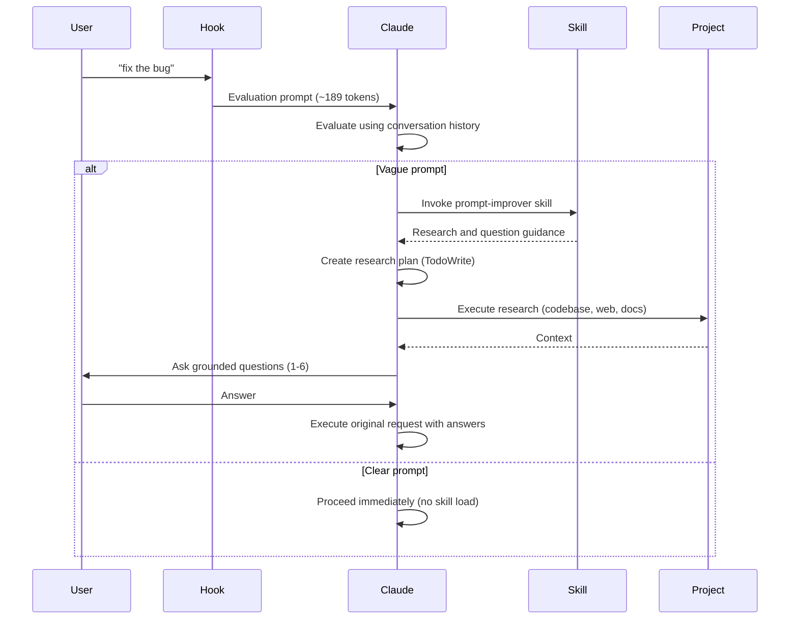

# Claude Code Prompt Improver

A UserPromptSubmit hook that enriches vague prompts before Claude Code executes them. Uses the AskUserQuestion tool (Claude Code 2.0.22+) for targeted clarifying questions.


## What It Does

Intercepts prompts and evaluates clarity. Claude then:
- Checks if the prompt is clear using conversation history
- For clear prompts: proceeds immediately (zero overhead)
- For vague prompts: invokes the `prompt-improver` skill to create research plan, gather context, and ask 1-6 grounded questions
- Proceeds with original request using the clarification

**Result:** Better outcomes on the first try, without back-and-forth.

**v0.4.0 Update:** Skill-based architecture with hook-level evaluation achieves 31% token reduction. Clear prompts have zero skill overhead, vague prompts get comprehensive research and questioning via the skill.

## How It Works



## Installation

**Requirements:** Claude Code 2.0.22+ (uses AskUserQuestion tool for targeted clarifying questions)

### Option 1: Via Marketplace (Recommended)

**1. Add the marketplace:**
```bash
claude plugin marketplace add severity1/claude-code-marketplace
```

**2. Install the plugin:**
```bash
claude plugin install prompt-improver@claude-code-marketplace
```

**3. Restart Claude Code**

Verify installation with `/plugin` command. You should see the prompt-improver plugin listed.

### Option 2: Local Plugin Installation (Recommended for Development)

**1. Clone the repository:**
```bash
git clone https://github.com/severity1/claude-code-prompt-improver.git
cd claude-code-prompt-improver
```

**2. Add the local marketplace:**
```bash
claude plugin marketplace add /absolute/path/to/claude-code-prompt-improver/.dev-marketplace/.claude-plugin/marketplace.json
```

Replace `/absolute/path/to/` with the actual path where you cloned the repository.

**3. Install the plugin:**
```bash
claude plugin install prompt-improver@local-dev
```

**4. Restart Claude Code**

Verify installation with `/plugin` command. You should see "1 plugin available, 1 already installed".

### Option 3: Manual Installation

**1. Copy the hook:**
```bash
cp scripts/improve-prompt.py ~/.claude/hooks/
chmod +x ~/.claude/hooks/improve-prompt.py
```

**2. Update `~/.claude/settings.json`:**
```json
{
  "hooks": {
    "UserPromptSubmit": [
      {
        "hooks": [
          {
            "type": "command",
            "command": "python3 ~/.claude/hooks/improve-prompt.py"
          }
        ]
      }
    ]
  }
}
```

## Usage

**Normal use:**
```bash
claude "fix the bug"      # Hook evaluates, may ask questions
claude "add tests"        # Hook evaluates, may ask questions
```

**Bypass prefixes:**
```bash
claude "* add dark mode"                    # * = skip evaluation
claude "/help"                              # / = slash commands bypass
claude "# remember to use rg over grep"     # # = memorize bypass
```

**Vague prompt:**
```bash
$ claude "fix the error"
```

Claude asks:
```
Which error needs fixing?
  ○ TypeError in src/components/Map.tsx (recent change)
  ○ API timeout in src/services/osmService.ts
  ○ Other (paste error message)
```

You select an option, Claude proceeds with full context.

**Clear prompt:**
```bash
$ claude "Fix TypeError in src/components/Map.tsx line 127 where mapboxgl.Map constructor is missing container option"
```

Claude proceeds immediately without questions.

## Design Philosophy

- **Rarely intervene** - Most prompts pass through unchanged
- **Trust user intent** - Only ask when genuinely unclear
- **Use conversation history** - Avoid redundant exploration
- **Max 1-6 questions** - Enough for complex scenarios, still focused
- **Transparent** - Evaluation visible in conversation

## Architecture

**v0.4.0:** Skill-based architecture with hook-level evaluation.

**Hook (scripts/improve-prompt.py) - Evaluation Orchestrator:**
- Intercepts via stdin/stdout JSON (~70 lines)
- Handles bypass prefixes: `*`, `/`, `#`
- Wraps prompts with evaluation instructions (~189 tokens)
- Claude evaluates clarity using conversation history
- If vague: Instructs Claude to invoke `prompt-improver` skill

**Skill (skills/prompt-improver/)