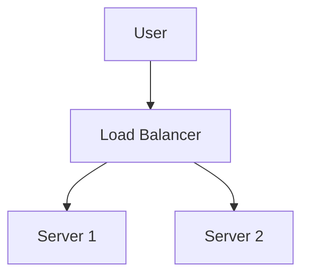

# Markdown Viewer

**Write in Markdown, export to perfect Word with one click.**

*Completely Free · Local Processing · 18+ Professional Themes · 23 Languages Support*

 🚀 **Install Now:** https://chromewebstore.google.com/detail/markdown-viewer/jekhhoflgcfoikceikgeenibinpojaoi

---

You love writing in Markdown — clean, efficient, version control friendly.  
But eventually, you always need a Word document.

**The old nightmare:**

😫 Manual screenshot flowcharts · Copy-paste formulas become messy · Format code by hand · Adjust tables cell by cell · Spend another 30 minutes tweaking fonts, spacing, and colors after export

**One document: 1 hour writing, 2 hours formatting.**

---

**Now it takes just 1 second.**

Click to download and get a perfect Word document:
- ✅ Mermaid diagrams → High-resolution images
- ✅ LaTeX formulas → Word editable equations
- ✅ Auto syntax highlighting (100+ languages)
- ✅ 18+ professional themes with one click
- ✅ Completely free, local processing

**Spend time on writing, not on formatting.**

---

## 💫 See It in Action

### Technical Documentation: 15 Flowcharts, 2 Hours → 5 Minutes

**Before:** draw.io diagram → Export PNG → Insert into Word → Resize → Repeat 15 times = **2 hours**

**Now:** Write Mermaid code → Click download = **5 minutes**

## System Architecture

``````markdown

``````

Need changes? Modify code and re-export. **Save 115 minutes.**

### Academic Paper: 50+ Formulas, 3 Hours → 10 Minutes

**Before:** Word equation editor one by one OR paid tool subscription = **3 hours + Paid subscription**

**Now:** Write LaTeX syntax directly → Click download = **10 minutes + Free**

Given mass $m$ and acceleration $a$, according to Newton's second law:

```markdown
$$
F = ma = m\frac{dv}{dt} = m\frac{d^2x}{dt^2}
$$
```

Export as native Word format, fully editable. **Not an image, but a real equation object.**

### Team Collaboration: Weekly Reports, 1 Hour → 1 Minute

**Before:** Copy content → Set format → Adjust lists → Add styling → Excel charts + screenshots = **1 hour weekly**

**Now:** Open file → Choose theme → Click download = **1 minute**

Choose "Business" theme, Vega-Lite data charts auto-convert to high-res images, professional look. **Save 59 minutes weekly.**

**Business use cases:**
- 📊 Sales trends (line charts)
- 📈 Market share comparison (bar charts)
- 🎯 KPI achievement (gauges)
- 📉 Cost analysis (stacked charts)

Let data speak, generate professional reports with one click.

---

## 🎯 Three Core Features

### 1. Automatic Diagram Conversion

**Mermaid Diagrams** · **Vega/Vega-Lite Data Charts** · SVG images · Complex HTML tables

**Mermaid:** Flowcharts, sequence diagrams, class diagrams, state diagrams → Technical docs, architecture design  
**Vega/Vega-Lite:** Bar charts, line charts, scatter plots, heatmaps → Business reports, data analytics

**Time comparison:** Complex sequence diagram (10 objects)
- Traditional tools: Draw 30min + Modify 20min + Adjust 10min + Export 5min = **65 minutes**
- Markdown Viewer: Write code 5min + Modify 30sec + Export 1sec = **6 minutes**

**Business scenario:** Quarterly sales report (5 bar charts)
- Excel charting + screenshots: Select data 15min + Format 10min + Screenshot 5min = **30 minutes**
- Vega-Lite: JSON data 2min + One-click export = **3 minutes**

**Precise, professional, reusable.**

### 2. Perfect Formula Conversion

LaTeX → Word editable equations (not images!)

After export, you can:
- ✅ Continue editing in Word
- ✅ Adjust font size
- ✅ Modify symbols and variables
- ✅ Copy to other documents

**One formula, two approaches:**
- ❌ Word equation editor: Click...click...click...select symbols...adjust positions
- ✅ LaTeX: `\int_0^\infty e^{-x^2}dx` Done

### 3. 18+ Professional Themes

Different scenarios, different styles, one-click switch:

- 📊 Business / Technical → Business reports, technical docs
- 📚 Academic / Palatino → Academic papers, book typesetting  
- 🇨🇳 Songti / Heiti / Mixed → Chinese documents
- 🎨 Typewriter / Sakura → Creative content

**WYSIWYG:** Preview looks exactly like exported Word. No guessing, no trial.

**No more manual adjustments:** Font, size, line spacing, paragraph spacing, code background...

---

## ⚡ Lightning Fast Experience

### Smart Cache: First Time 5s, Second Time 1s

Document with 50 Mermaid diagrams:
- **First open:** Text displays instantly, diagrams render in background, all done within 5s
- **Second open:** Load from cache, instant display (<1s)
- **Text modified:** Still instant (diagrams from cache)
- **Diagram modified:** Only re-render changed diagrams

**10x faster than Word, 100x smaller files.**

### Reading Enhancement

- **Three layouts:** Normal (1000px) / Full screen / Narrow (530px, preview Word effect)
- **Flexible zoom:** 50%-400%, shortcuts `Ctrl/Cmd +` `-` `0`
- **Smart TOC:** Auto-extract headings, sidebar navigation, `Ctrl/Cmd + B` to toggl