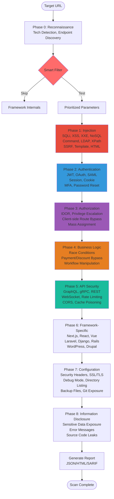

<div align="center">


### Wraps around your attack surface

Professional-grade scanner for real penetration testing. Fast. Modular. Rust.

[](https://www.rust-lang.org/)
[](LICENSE)
[](https://github.com/bountyyfi/lonkero)
[](https://github.com/bountyyfi/lonkero)
[](https://github.com/bountyyfi/lonkero)

**90+ Advanced Scanners** | **16 Premium Features** | **Smart AI Filtering** | **5% False Positives**

**[Official Website](https://lonkero.bountyy.fi/en)** | [Features](#core-capabilities) · [Installation](#installation) · [Quick Start](#quick-start) · [Architecture](#architecture)

---

</div>

## What is Lonkero?

Lonkero is a production-grade web security scanner designed for professional security testing:

- Near-zero false positives (5% vs industry 20-30%)
- Intelligent testing - Skips framework internals, focuses on real vulnerabilities
- Modern stack coverage - Next.js, React, GraphQL, gRPC, WebSocket, HTTP/3
- 80% faster scans - Smart parameter filtering eliminates noise
- Advanced blind vulnerability detection techniques

Unlike generic scanners that spam thousands of useless payloads, Lonkero uses context-aware filtering to test only what matters.

---

## Core Capabilities

### 91 Security Scanners

| Category | Scanners | Focus Areas |
|----------|----------|-------------|
| **Injection** | 25 scanners | SQLi, XSS, XXE, NoSQL, Command, LDAP, XPath, SSRF, Template, HTML |
| **Authentication** | 18 scanners | JWT, OAuth, SAML, MFA, Session, Auth Bypass, IDOR, Privilege Escalation |
| **API Security** | 14 scanners | GraphQL, gRPC, REST, WebSocket, Rate Limiting, CORS, HTTP/3 |
| **Frameworks** | 11 scanners | Next.js, React, Django, Laravel, WordPress, Drupal, Express |
| **Configuration** | 13 scanners | Headers, SSL/TLS, Cloud, Containers, WAF Bypass, CSRF |
| **Business Logic** | 6 scanners | Race Conditions, Payment Bypass, Workflow Manipulation |
| **Info Disclosure** | 8 scanners | Sensitive Data, Debug Leaks, Source Code, JS Secrets |
| **Specialized** | 6 scanners | CVE Detection, Version Mapping, ReDoS |

### Smart Scanning Features

- **Parameter Filtering** - Skips framework internals, prioritizes user input (80% faster scans)
- **Blind Detection** - Time-based, error-based, boolean-based techniques
- **Context-Aware** - Adapts testing based on detected technology stack

### Enterprise Integration

- **Compliance** - OWASP Top 10 2025, PCI DSS, GDPR, NIS2, DORA
- **CI/CD** - GitHub Actions, GitLab SAST, SARIF output
- **Reporting** - PDF, HTML, JSON, XLSX, CSV, SARIF, Markdown formats with detailed remediation

---

## Architecture

### Scanning Pipeline



---

## Smart Parameter Filtering

### The Problem

Traditional scanners waste 95% of resources testing framework internals:

```
Testing: __react_state, _nextData, csrfToken, sessionId, timestamp, buildId...
Result: 2,800 requests, 0 vulnerabilities, 28 seconds
```

### The Solution

```mermaid
sequenceDiagram
    participant Scanner
    participant Filter as Smart Filter
    participant Target

    Scanner->>Fil