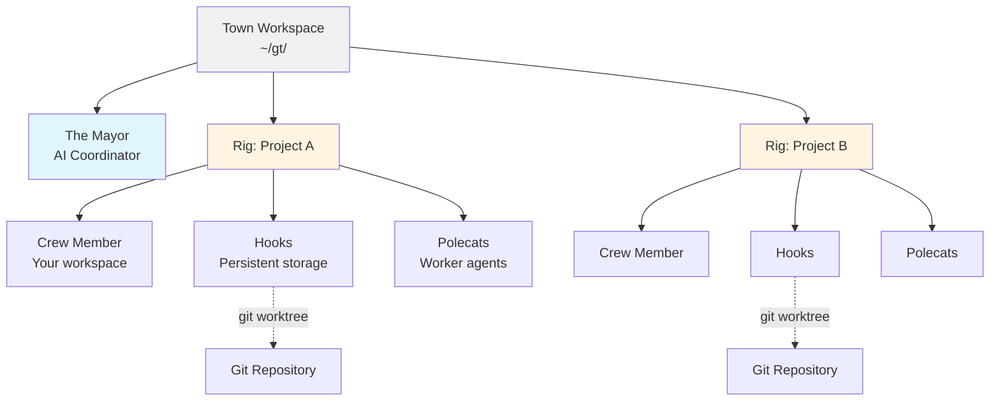
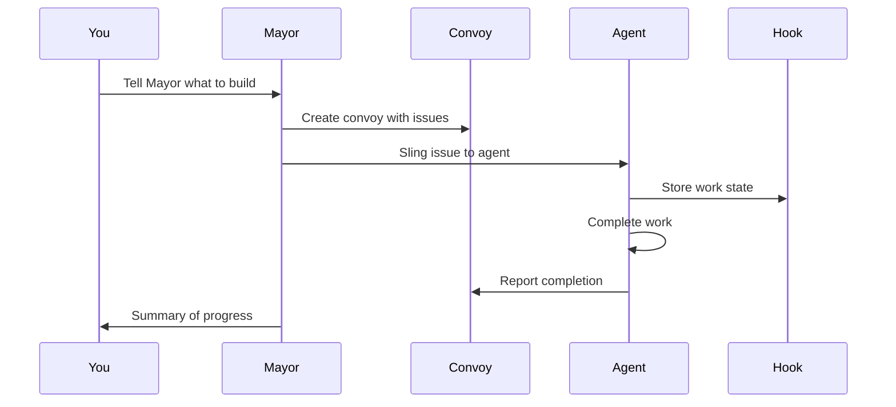
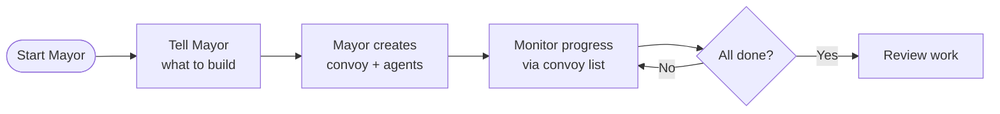

# Gas Town

**Multi-agent orchestration system for Claude Code with persistent work tracking**

## Overview

Gas Town is a workspace manager that lets you coordinate multiple Claude Code agents working on different tasks. Instead of losing context when agents restart, Gas Town persists work state in git-backed hooks, enabling reliable multi-agent workflows.

### What Problem Does This Solve?

| Challenge                       | Gas Town Solution                            |
| ------------------------------- | -------------------------------------------- |
| Agents lose context on restart  | Work persists in git-backed hooks            |
| Manual agent coordination       | Built-in mailboxes, identities, and handoffs |
| 4-10 agents become chaotic      | Scale comfortably to 20-30 agents            |
| Work state lost in agent memory | Work state stored in Beads ledger            |

### Architecture



## Core Concepts

### The Mayor 🎩

Your primary AI coordinator. The Mayor is a Claude Code instance with full context about your workspace, projects, and agents. **Start here** - just tell the Mayor what you want to accomplish.

### Town 🏘️

Your workspace directory (e.g., `~/gt/`). Contains all projects, agents, and configuration.

### Rigs 🏗️

Project containers. Each rig wraps a git repository and manages its associated agents.

### Crew Members 👤

Your personal workspace within a rig. Where you do hands-on work.

### Polecats 🦨

Ephemeral worker agents that spawn, complete a task, and disappear.

### Hooks 🪝

Git worktree-based persistent storage for agent work. Survives crashes and restarts.

### Convoys 🚚

Work tracking units. Bundle multiple issues/tasks that get assigned to agents.

### Beads Integration 📿

Git-backed issue tracking system that stores work state as structured data.

> **New to Gas Town?** See the [Glossary](docs/glossary.md) for a complete guide to terminology and concepts.

## Installation

### Prerequisites

- **Go 1.23+** - [go.dev/dl](https://go.dev/dl/)
- **Git 2.25+** - for worktree support
- **beads (bd) 0.44.0+** - [github.com/steveyegge/beads](https://github.com/steveyegge/beads) (required for custom type support)
- **tmux 3.0+** - recommended for full experience
- **Claude Code CLI** (default runtime) - [claude.ai/code](https://claude.ai/code)
- **Codex CLI** (optional runtime) - [developers.openai.com/codex/cli](https://developers.openai.com/codex/cli)

### Setup

```bash
# Install Gas Town
go install github.com/steveyegge/gastown/cmd/gt@latest

# Add Go binaries to PATH (add to ~/.zshrc or ~/.bashrc)
export PATH="$PATH:$HOME/go/bin"

# Create workspace with git initialization
gt install ~/gt --git
cd ~/gt

# Add your first project
gt rig add myproject https://github.com/you/repo.git

# Create your crew workspace
gt crew add yourname --rig myproject
cd myproject/crew/yourname

# Start the Mayor session (your main interface)
gt mayor attach
```

## Quick Start Guide

### Basic Workflow



### Example: Feature Development

```bash
# 1. Start the Mayor
gt mayor attach

# 2. In Mayor session, create a convoy
gt convoy create "Feature X" issue-123 issue-456 --notify --human

# 3. Assign work to an agent
gt sling issue-123 myproject

# 4. Track progress
gt convoy list

# 5. Monitor agents
gt agents
```

## Common Workflows

### Mayor Workflow (Recommended)

**Best for:** Coordinating complex, multi-issue work



**Commands:**

```bash
# Attach to Mayor
gt mayor attach

# In Mayor, create convoy and let it orchestrate
gt convoy create "Auth System" issue-101 issue-102 --notify

# Track progress
gt convoy list
```

### Minimal Mode (No Tmux