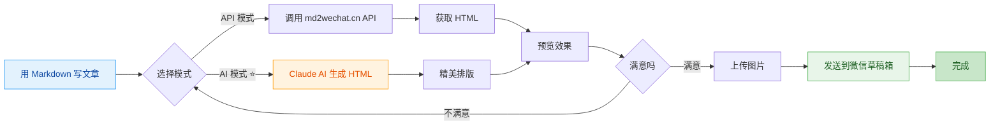

# md2wechat

<div align="center">

**用 Markdown 写公众号文章，像发朋友圈一样简单**

[](https://golang.org)
[](LICENSE)
[](https://github.com/geekjourneyx/md2wechat-skill/releases)
[](#-claude-code-集成)
[![zread](https://img.shields.io/badge/Ask_Zread-_.svg?style=flat&color=00b0aa&labelColor=000000&logo=data%3Aimage%2Fsvg%2Bxml%3Bbase64%2CPHN2ZyB3aWR0aD0iMTYiIGhlaWdodD0iMTYiIHZpZXdCb3g9IjAgMCAxNiAxNiIgZmlsbD0ibm9uZSIgeG1sbnM9Imh0dHA6Ly93d3cudzMub3JnLzIwMDAvc3ZnIj4KPHBhdGggZD0iTTQuOTYxNTYgMS42MDAxSDIuMjQxNTZDMS44ODgxIDEuNjAwMSAxLjYwMTU2IDEuODg2NjQgMS42MDE1NiAyLjI0MDFWNC45NjAxQzEuNjAxNTYgNS4zMTM1NiAxLjg4ODEgNS42MDAxIDIuMjQxNTYgNS42MDAxSDQuOTYxNTZDNS4zMTUwMiA1LjYwMDEgNS42MDE1NiA1LjMxMzU2IDUuNjAxNTYgNC45NjAxVjIuMjQwMUM1LjYwMTU2IDEuODg2NjQgNS4zMTUwMiAxLjYwMDEgNC45NjE1NiAxLjYwMDFaIiBmaWxsPSIjZmZmIi8%2BCjxwYXRoIGQ9Ik00Ljk2MTU2IDEwLjM5OTlIMi4yNDE1NkMxLjg4ODEgMTAuMzk5OSAxLjYwMTU2IDEwLjY4NjQgMS42MDE1NiAxMS4wMzk5VjEzLjc1OTlDMS42MDE1NiAxNC4xMTM0IDEuODg4MSAxNC4zOTk5IDIuMjQxNTYgMTQuMzk5OUg0Ljk2MTU2QzUuMzE1MDIgMTQuMzk5OSA1LjYwMTU2IDE0LjExMzQgNS42MDE1NiAxMy43NTk5VjExLjAzOTlDNS42MDE1NiAxMC42ODY0IDUuMzE1MDIgMTAuMzk5OSA0Ljk2MTU2IDEwLjM5OTlaIiBmaWxsPSIjZmZmIi8%2BCjxwYXRoIGQ9Ik0xMy43NTg0IDEuNjAwMUgxMS4wMzg0QzEwLjY4NSAxLjYwMDEgMTAuMzk4NCAxLjg4NjY0IDEwLjM5ODQgMi4yNDAxVjQuOTYwMUMxMC4zOTg0IDUuMzEzNTYgMTAuNjg1IDUuNjAwMSAxMS4wMzg0IDUuNjAwMUgxMy43NTg0QzE0LjExMTkgNS42MDAxIDE0LjM5ODQgNS4zMTM1NiAxNC4zOTg0IDQuOTYwMVYyLjI0MDFDMTQuMzk4NCAxLjg4NjY0IDE0LjExMTkgMS42MDAxIDEzLjc1ODQgMS42MDAxWiIgZmlsbD0iI2ZmZiIvPgo8cGF0aCBkPSJNNCAxMkwxMiA0TDQgMTJaIiBmaWxsPSIjZmZmIi8%2BCjxwYXRoIGQ9Ik00IDEyTDEyIDQiIHN0cm9rZT0iI2ZmZiIgc3Ryb2tlLXdpZHRoPSIxLjUiIHN0cm9rZS1saW5lY2FwPSJyb3VuZCIvPgo8L3N2Zz4K&logoColor=ffffff)](https://zread.ai/geekjourneyx/md2wechat-skill)

---

> ### ⚠️ 重要提示：API 模式需要 md2wechat.cn API 服务
> **本工具使用 md2wechat.cn API 服务，使用 API 模式前需要先获取 API Key**
>
> - 📖 **API 文档**：https://www.md2wechat.cn/api-docs
> - 📧 **联系获取**：通过 [官网](https://www.md2wechat.cn/api-docs) 联系获取 API Key
> - 💡 **AI 模式**：不需要 API Key，直接使用 Claude 即可

---

[快速开始](#-5分钟快速上手) • [Claude Code](#-claude-code-集成) • [功能介绍](#-核心功能) • [使用说明](#-使用方法) • [常见问题](#-常见问题)

---

## 🚀 Claude Code 用户（推荐）

在 Claude Code 中运行以下命令即可使用：

```bash
/plugin marketplace add geekjourneyx/md2wechat-skill
/plugin install md2wechat@geekjourneyx-md2wechat-skill
```

然后直接对话：**"请用秋日暖光主题将 article.md 转换为微信公众号格式"**

</div>

## ✨ 这是什么？

**md2wechat** 是一个让你的微信公众号写作更高效的神器。

> 💡 **一句话理解**：用 Markdown 写文章 → 一键转换 → 自动发到微信草稿箱

**适合谁用？**

| 你是 | 痛点 | md2wechat 帮你 |
|------|------|---------------|
| 📝 内容创作者 | 微信编辑器太难用，排版花时间 | Markdown 写作，自动排版 |
| 💼 产品经理 | 要发公告，但不会 HTML | 不用学代码，一行命令搞定 |
| 👨‍💻 程序员 | 习惯 Markdown，讨厌微信编辑器 | 保持你的写作习惯 |
| 🤖 AI 用户 | 用 AI 生成内容，但要手动复制粘贴 | AI 生成 → 微信草稿，无缝衔接 |

---

## 🎯 核心功能



### 四大核心功能

| 功能 | 命令 | 说明 | 适合谁 |
|------|------|------|--------|
| **Markdown 转换** | `convert` | 将 Markdown 转换为微信格式 HTML | 所有用户 |
| **风格写作** | `write` | 用创作者风格辅助写作，自动生成文章和封面提示词 | 写作小白、内容创作者 |
| **AI 去痕** 🆕 | `humanize` | 去除 AI 生成痕迹，让文章听起来更自然、像人写的 | AI 写作用户 |
| **草稿推送** | `convert --draft` | 一键发送到微信草稿箱 | 需要频繁发布的用户 |

**`write` 与 `convert` 的区别：**

| 对比项 | `write` 命令 | `convert` 命令 |
|--------|-------------|---------------|
| **输入** | 一个想法/观点/片段 | 完整的 Markdown 文件 |
| **输出** | 结构化提示词（AI 处理后生成文章） | 微信格式 HTML |
| **用途** | 从零开始创作 | 格式转换已有内容 |
| **封面** | 自动生成封面提示词 | 需要手动指定封面图 |

**简单理解：**
- `write` = 帮你写文章（从想法到完整文章）
- `convert` = 帮你排版（从 Markdown 到微信格式）

### 两种转换模式

| 模式 | 适合谁 | 特点 | 样式 |
|------|--------|------|------|
| **API 模式** | 追求稳定、快速 | 调用 md2wechat.cn API，秒级响应 | 简洁专业 |
| **AI 模式** ⭐ | 追求精美排版 | Claude AI 生成，样式更丰富 | 秋日暖光 / 春日清新 / 深海静谧 |

### 完整工作流程

```mermaid
flowchart LR
    A1[Markdown 写作] --> A2[插入图片]
    A2 --> B1{选择模式}

    B1 -->|API| B2[md2wechat.cn]
    B1 -->|AI| B3[Claude AI]

    B2 --> B4[HTML 生成]
    B3 --> B4

    B4 --> C1[预览效果]
    C1 --> C2{满意吗}

    C2 -->|调整| B1
    C2 -->|OK| C3[上传图片]
    C3 --> C4[发送草稿]
    C4 --> C5[完成]

    classDef write fill:#e3f2fd,stroke:#2196f3,color:#0d47a1
    classDef ai fill:#fff3e0,stroke:#ff9800,color:#e65100
    classDef done fill:#e8f5e9,stroke:#4caf50,color:#1b5e20
    classDef success fill:#c8e6c9,stroke:#4caf50,color:#1b5