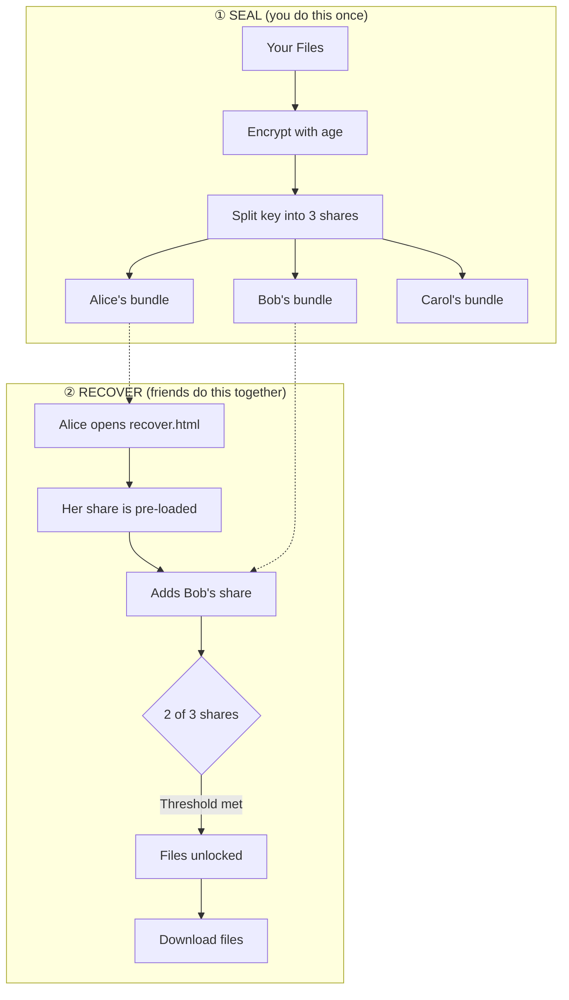

# 🧠 ReMemory

**Encrypt your files and split the key among people you trust.**

ReMemory splits a decryption key using Shamir's Secret Sharing and gives each person a self-contained tool to recover the files together — offline, in any browser.

## Recovery works without this project

Each person receives a bundle containing `recover.html` — a browser-based recovery tool. No servers. No dependencies. No need for this project to exist when recovery happens.

**[Download demo bundles](https://github.com/eljojo/rememory/releases/latest/download/demo-bundles.zip)** to try the recovery process yourself.



Any 2 shares can reconstruct the key, but a single share reveals nothing — not "very little," mathematically zero information.

The number of people and the threshold are up to you: 2-of-3 for a small circle, 3-of-5 for a wider group, or 2-of-2 for a couple.

---

## Two Ways to Use ReMemory

### 🌐 Web UI (recommended)

Create bundles in your browser — no installation required.

| | |
|---|---|
| **Create Bundles** | [eljojo.github.io/rememory/maker.html](https://eljojo.github.io/rememory/maker.html) |
| **Documentation** | [eljojo.github.io/rememory/docs.html](https://eljojo.github.io/rememory/docs.html) |

Everything runs locally. Your files never leave your device.

### 💻 CLI

For automation, scripting, or if you prefer the terminal.

```bash
# macOS (Homebrew)
brew install eljojo/rememory/rememory

# Linux (x86_64)
curl -Lo rememory https://github.com/eljojo/rememory/releases/latest/download/rememory-linux-amd64
chmod +x rememory
sudo mv rememory /usr/local/bin/

# Nix
nix run github:eljojo/rememory
```

See the **[CLI User Guide](docs/guide.md)** for complete documentation.

---

## Try It First

Before protecting real secrets, try the recovery process:

1. **[Download demo bundles](https://github.com/eljojo/rememory/releases/latest/download/demo-bundles.zip)** (contains 3 sample bundles)
2. Open `bundle-alice/recover.html` in your browser
3. Alice's share is pre-loaded — add Bob's or Carol's
4. When enough shares are added, the files unlock

This is the closest thing to what a real recovery feels like.

---

## What Friends Receive

Each friend gets a ZIP bundle containing:

| File | Purpose |
|------|---------|
| `README.txt` | Instructions, their unique share, contact list |
| `README.pdf` | Same content, formatted for printing |
| `MANIFEST.age` | Your encrypted files |
| `recover.html` | Recovery tool (~1.8 MB), runs in any browser |

**A single share reveals nothing.** But tell your friends to keep their bundle somewhere safe — it's their responsibility to you.


<details>
<summary>More pages</summary>


</details>

---

## FAQ

<details>
<summary>Why ReMemory?</summary>

We all have digital secrets that matter: password manager recovery codes, cryptocurrency seeds, important documents, instructions for loved ones. What happens to these if you're suddenly unavailable?

Traditional approaches fail:
- **Give one person everything** → Single point of failure and trust
- **Split files manually** → Confusing, error-prone, no encryption
- **Use a password manager's emergency access** → Relies on company existing
- **Write it in a will** → Becomes public record, slow legal process

ReMemory takes a different approach:
- **No single point of failure** — requires multiple people to cooperate
- **No trust in any one person** — even your most trusted friend can't access secrets alone
- **Offline and self-contained** — recovery works without internet or servers
- **Designed for non-technical people** — clear instructions, not cryptographic puzzles

</details>

<details>
<summary>Why I Built This</summary>

Two things drove me to create ReMemory.

First, I watched [a documentary about Clive Wearing](https://www.youtube.com/watch?v=k_P7Y0-wgos), a man who has lived with a 7-second memory since 1985. Seeing how fragile memory can be made me think about what would happen to my digital life if something similar happened to me.

Second, I've had several concussions from cycling accidents. Each time, I've been lucky to recover fully. But each time, I've been reminded that our brains are more fragile than we like to think.

ReMemory is my answe