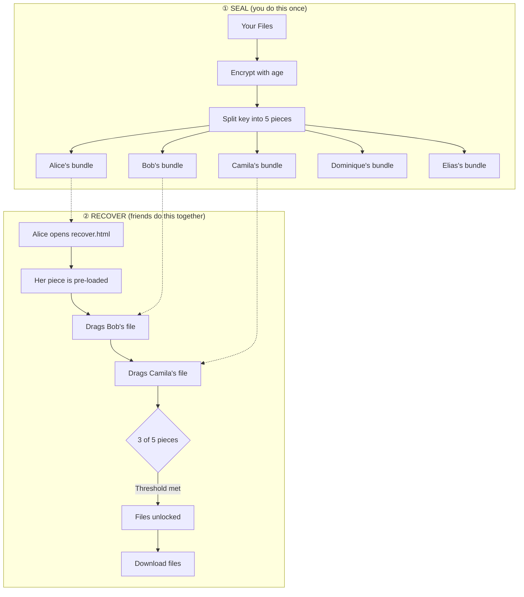

# 🧠 ReMemory

**Encrypt your files and split the key among people you trust.**

ReMemory splits a decryption key using Shamir's Secret Sharing and gives each person a self-contained tool to recover the files together — offline, in any browser.*

<sub>* [Time-locked](#time-delayed-recovery-experimental) archives need a brief internet connection at recovery time.</sub>

## Recovery works without this project

Each person receives a bundle containing `recover.html` — a browser-based recovery tool. No servers. No dependencies. No need for this project to exist when recovery happens.

**[Download demo bundles](https://github.com/eljojo/rememory/releases/latest/download/demo-bundles.zip)** to try the recovery process yourself.



Any 3 pieces can reconstruct the key, but a single piece reveals nothing — not "very little," mathematically zero information.

The number of people and the threshold are up to you: 2-of-3 for a small circle, 3-of-5 for a wider group, or 2-of-2 for a couple.

---

## Two Ways to Use ReMemory

### 🌐 Web UI (recommended)

Create bundles in your browser — no installation required.

| | |
|---|---|
| **Create Bundles** | [eljojo.github.io/rememory/maker.html](https://eljojo.github.io/rememory/maker.html) |
| **Documentation** | [eljojo.github.io/rememory/docs.html](https://eljojo.github.io/rememory/docs.html) |

Everything runs locally. Your files never leave your device.


### 💻 CLI

For automation, scripting, or if you prefer the terminal.

```bash
# macOS (Homebrew)
brew install eljojo/rememory/rememory

# Linux (x86_64)
curl -Lo rememory https://github.com/eljojo/rememory/releases/latest/download/rememory-linux-amd64
chmod +x rememory
sudo mv rememory /usr/local/bin/

# Nix
nix run github:eljojo/rememory
```

See the **[CLI User Guide](docs/guide.md)** for complete documentation.

---

## Try It First

Before protecting real secrets, try the recovery process:

1. **[Download demo bundles](https://github.com/eljojo/rememory/releases/latest/download/demo-bundles.zip)** (5 friends, any 3 can recover)
2. Open `bundle-alice/recover.html` in your browser
3. Alice's piece is pre-loaded — drag two more README files onto the page. Dragging an entire bundle works too.
4. When enough pieces are combined, the files unlock

This is the closest thing to what a real recovery feels like.

---

## What Friends Receive

Each friend gets a ZIP bundle containing:

| File | Purpose |
|------|---------|
| `README.txt` | Instructions, their unique piece, contact list |
| `README.pdf` | Same content, formatted for printing |
| `MANIFEST.age` | Your encrypted files (only included separately when over 10 MB) |
| `recover.html` | Recovery tool (~300 KB), runs in any browser. For smaller archives, everything is embedded — just open this file |

**A single piece reveals nothing.** But tell your friends to keep their bundle somewhere safe — it's their responsibility to you.


<details>
<summary>More pages</summary>


</details>

---

## FAQ

<details>
<summary>Why ReMemory?</summary>

We all have digital secrets that matter: password manager recovery codes, cryptocurrency seeds, important documents, instructions for loved ones. What happens to these if you're suddenly unavailable?

Traditional approaches fail:
- **Give one person everything** → Single point of failure and trust
- **Split files manually** → Confusing, error-prone, no encryption
- **Use a password manager's emergency access** → Relies on company existing
- **Write it in a will** → Becomes public record, slow legal process

ReMemory takes a different approach:
- **No single point of failure** — requires multiple people to cooperate
- **No trust in any one person** — even your most trusted friend can't access secrets alone
- **Offline and self-contained** — recovery works without internet or servers*
- **Designed for non-technical people** — clear instructions, not cryptographic puzzles

</details>

<details>
<summary>Why I Built This</summary>

Two things drov