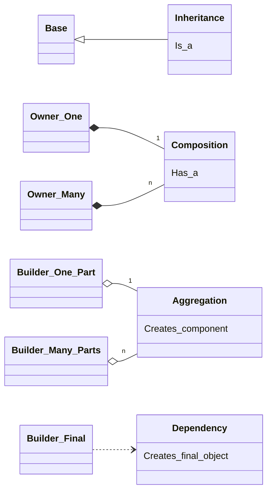

# Modern C++ Design Patterns & OO Principles

Welcome to a comprehensive educational repository of **33 Design Patterns and
C++ Idioms**. This project represents a bridge between classic software
architecture (the *Gang of Four* legacy with C++98/11) and Modern C++ best practices
(with C++14/17/20/23).

## --- Overview ---
This repository is designed as a masterclass for developers who want to master
object-oriented design in C++. Every example has been carefully crafted to
demonstrate not just the pattern's logic, but also high-level engineering
concerns such as:

* **Memory Management:** Full use of RAII, std::unique_ptr, and std::shared_ptr.
* **Performance:** Demonstrations of the "Zero-Overhead Principle" using Static
  Polymorphism (CRTP) and Mixins.
* **Modern Features:** Extensive use of std::variant, std::visit, if constexpr,
  and C++20 Abbreviated Templates.
* **The "Gang of Seven":** A unique educational approach to tracing an object's
  full lifecycle:
   - 1 DC: Default Constructor
   - 2 CC: Copy Constructor
   - 3 MC: Move Constructor
   - 4 CA: Copy Assigment
   - 5 MA: Move Assigment
   - 6 De: Destructor
   - 7 PC: Particular Constructor

## --- Repository Structure ---
The project is organized into four logical blocks:

1.  **Fundamental Principles:** Detailed analysis of SOLID, IoC, Hollywood
Principle, and more (see 002_OO_Principles.txt).
2.  **Creational Patterns:** Managing object instantiation and lifecycle
(Builder, Factory, Singleton, etc.).
3.  **Structural Patterns:** Compiling classes and objects into larger, flexible
structures (Bridge, Decorator, Proxy, Mixins).
4.  **Behavioral Patterns:** Handling communication between objects and
algorithmic distribution (Command, Interpreter, Observer, Visitor).

## --- How to Compile ---
Each example is self-contained. To ensure the best performance and standard
compliance, it is recommended to compile using **C++20** or higher.

The author uses a custom gcc3 alias for optimized compilation:

c++ -std=c++23 -O3 -Wfatal-errors -Wall -Wextra -Wpedantic program.cpp -o program -pthread

For detailed instructions, refer to 003_How_to_compile.txt.

## --- License & Usage ---
This repository is provided as an open educational resource.
* **Free Use:** You are free to use, copy, modify, and distribute these examples
      for personal, educational, or commercial purposes.
* **Attribution:** If you find this material useful or use it in your own
      projects/courses, I would greatly appreciate a mention or a link back to
      this repository.

**Author:** Mario Galindo Queralt, Ph.D.

## --- Philosophical Note ---
> "The code is the vehicle, but the comments are the gold."

This repository places a high value on internal documentation. You will find
extensive comments explaining the "why" behind each architectural decision, the
trade-offs of different implementations, and the evolution of the C++ language
over the last four decades.

## UML Symbology Reference

The class diagrams in this repository use Mermaid notation to represent the relationships
between classes. The following diagram explains the arrows and multiplicities used:

