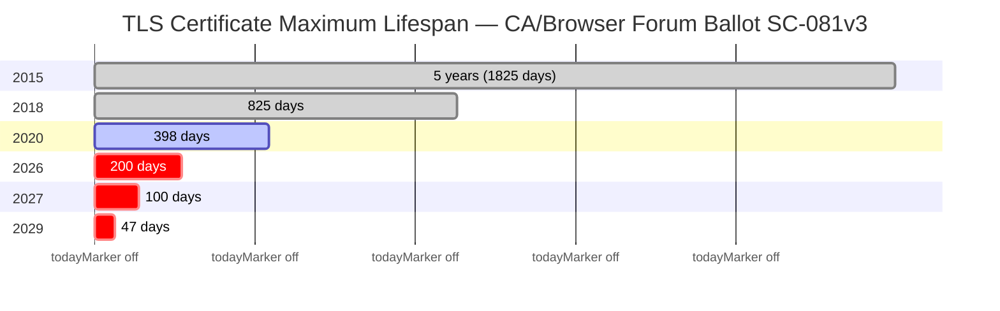

  

# certctl — Self-Hosted Certificate Lifecycle Platform

TLS certificate lifespans are shrinking fast. The CA/Browser Forum passed [Ballot SC-081v3](https://cabforum.org/2025/04/11/ballot-sc081v3-introduce-schedule-of-reducing-validity-and-data-reuse-periods/) unanimously in April 2025, setting a phased reduction: **200 days** by March 2026, **100 days** by March 2027, and **47 days** by March 2029. Organizations managing dozens or hundreds of certificates can no longer rely on spreadsheets, calendar reminders, or manual renewal workflows. The math doesn't work — at 47-day lifespans, a team managing 100 certificates is processing 7+ renewals per week, every week, forever.

certctl is a self-hosted platform that automates the entire certificate lifecycle — from issuance through renewal to deployment — with zero human intervention. It works with any certificate authority, deploys to any server, and keeps private keys on your infrastructure where they belong. It's free, self-hosted, and covers the same lifecycle that enterprise platforms charge $100K+/year for.

> **Actively maintained — shipping weekly.** Found something? [Open a GitHub issue](https://github.com/shankar0123/certctl/issues) — issues get triaged same-day. CI runs the full test suite with race detection, static analysis, and vulnerability scanning on every commit.

**Ready to try it?** Jump to the [Quick Start](#quick-start) — you'll have a running dashboard in under 5 minutes.

## Why certctl Exists

Certificate lifecycle tooling today falls into two camps: expensive enterprise platforms (Venafi, Keyfactor, Sectigo) that cost six figures and take months to deploy, or single-purpose tools (cert-manager, certbot) that handle one slice of the problem. If you run a mixed infrastructure — some NGINX, some Apache, a few HAProxy nodes, IIS on Windows, maybe an F5 — and you need to manage certificates from multiple CAs, there's nothing self-hosted that covers the full lifecycle without vendor lock-in.

certctl fills that gap. It's **CA-agnostic** — plug in any certificate authority: Let's Encrypt via ACME, Smallstep step-ca, HashiCorp Vault PKI, DigiCert CertCentral, your enterprise ADCS via sub-CA mode, or any custom CA through a shell script adapter. Run multiple issuers simultaneously for different certificate types.

It's **target-agnostic**. Agents deploy certificates to NGINX, Apache, HAProxy, Traefik, Caddy, Envoy, Postfix, Dovecot, IIS (local PowerShell or remote WinRM), F5 BIG-IP (proxy agent), and any Linux/Unix server via SSH/SFTP — all using the same pluggable connector model. The control plane never initiates outbound connections — agents poll for work, which means certctl works behind firewalls, across network zones, and in air-gapped environments.

For a detailed comparison with other competitors and enterprise platforms, see [Why certctl?](docs/why-certctl.md)

## Who Is This For

**Platform engineering and DevOps teams** managing 10–500+ certificates across mixed infrastructure who need automated renewal, deployment, and a single dashboard for visibility. If you're currently running certbot cron jobs, manually renewing certs, or stitching together scripts — certctl replaces all of that.

**Security and compliance teams** who need an immutable audit trail, certificate ownership tracking, policy enforcement, and evidence for SOC 2, PCI-DSS 4.0, or NIST SP 800-57 audits.

**Small teams without enterprise budgets** who need the lifecycle automation that Venafi and Keyfactor provide but can't ju