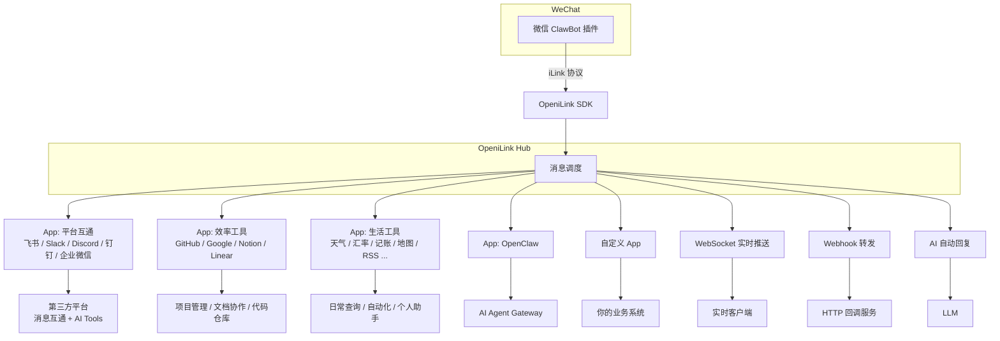

> **免责声明**：本项目基于公开的 iLink 协议进行独立开发，仅供学习交流与技术研究使用。项目与 iLink 协议的官方团队无任何关联或授权关系。若相关权利方认为本项目存在侵权，请通过 Issue 联系我们，我们将在确认后第一时间予以下架处理。
>
> **Disclaimer:** This project is independently developed based on the publicly available iLink protocol for learning and research purposes only. It is not affiliated with or endorsed by the official iLink team. If any rights holder believes this project infringes upon their rights, please contact us via an Issue and we will take it down promptly upon confirmation.

<div align="center">

<picture>
  <source media="(prefers-color-scheme: dark)" srcset="https://raw.githubusercontent.com/openilink/openilink.com/main/brand/logo-white.svg">
  <source media="(prefers-color-scheme: light)" srcset="https://raw.githubusercontent.com/openilink/openilink.com/main/brand/logo-black.svg">
  
</picture>

<br><br>

**微信 ClawBot iLink 协议的开源消息管理平台 + App 应用市场**<br>
**Open-source message management platform + App Marketplace for WeChat ClawBot (iLink protocol)**

扫码绑定微信号，通过应用市场一键扩展能力 —— 飞书 / Slack / Discord / GitHub / Notion 等 20+ App，装上就用<br>
多 Bot 管理 · 20+ App · 平台互通 · 效率工具 · 生活助手 · AI Tools · 7 种语言 SDK · Passkey 登录

[](LICENSE)
[](https://go.dev)
[](https://react.dev)
[](https://hub.docker.com/r/openilink/openilink-hub)
[](https://github.com/openilink/openilink-hub/stargazers)
[](https://github.com/openilink/openilink-hub/releases)

[官网 & 文档](https://openilink.com) · [在线体验](https://hub.openilink.com) · [快速开始](#快速开始) · [应用市场](#app-应用市场) · [SDK](#sdk-生态) · [English](#english)

</div>

---

## 快速开始

```bash
# 一键安装（Linux / macOS）
curl -fsSL https://raw.githubusercontent.com/openilink/openilink-hub/main/install.sh | sh

# 启动
oih

# 或者用 Docker（二选一）
docker run -d -p 9800:9800 openilink/openilink-hub:latest              # Docker Hub
# 或者 / or:
docker run -d -p 9800:9800 ghcr.io/openilink/openilink-hub:latest     # GHCR
```

打开 `http://localhost:9800`，注册账号（**第一个注册的自动当管理员**），扫码绑定微信号，完事。

> 默认用 SQLite，不用装数据库，不用配任何东西。想用 PostgreSQL？设个 `DATABASE_URL` 就行。

---

## 这是什么？

2026 年 3 月微信推出了 **ClawBot 插件**，底层叫 **iLink（智联）** 协议 —— 第一次官方允许你用程序收发微信消息。

但 iLink 只是个原始通道：能收消息、能发回复，没了。你还得自己处理 context_token、CDN 加密、24 小时过期、多 Bot 管理……

**OpeniLink Hub 把这些全包了**，并且通过 **App 应用市场** 让你一键扩展功能：

- 扫码绑定，Web 后台管理多个 Bot
- 应用市场一键装功能 —— 对接飞书 / Slack / GitHub / Notion，查天气、记账、AI 对话，不用写代码
- WebSocket / Webhook / AI 三个通道同时转发消息到你的服务
- 24 小时窗口自动续期，不掉线
- 消息链路追踪，出问题一眼看到卡在哪



<details>
<summary><b>和 OpenClaw 什么关系？</b></summary>

OpenClaw 是 AI Agent 框架，OpeniLink Hub 是消息管理平台，两个东西。

在 Hub 里，OpenClaw 是一个**内置 App** —— 在应用市场一键启用就行。当然你也可以完全不用 OpenClaw，选别的 App 或直接用 WebSocket/Webhook 对接你自己的服务。

简单说：**OpenClaw 管 AI 逻辑，Hub 管消息收发和 App 分发**，各干各的，想连就连。

</details>

## 为什么用 Hub？

### 自己对接 iLink 会遇到这些问题

| 你遇到的问题 | Hub 怎么解决 |
|---|---|
| iLink 没有官方文档，全靠社区逆向 | 完善中文文档 + 7 种语言 SDK |
| context_token 管理复杂，消息经常发不出去 | SDK 自动处理，你只管收消息发回复 |
| 24 小时过期掉线，重要消息丢了 | 自动续期 + 消息持久化 |
| 发图片要自己搞 CDN 上传 + AES 加密 | 一行代码发图片视频文件 |
| 只能命令行操作，管不了多个 Bot | Web 控制台，扫码绑定、状态监控、消息追踪 |
| 想加功能得自己写代码 | 应用市场一键安装，不写代码也能扩展 |

### 和其他开源项目比

GitHub 上有不少 iLink 相关的开源项目，但大多是底层 SDK 或 Agent 桥接工具。Hub 是目前唯一带**管理后台 + 应用市场 + 多通道分发**的完整平台。

| | OpeniLink Hub | 其他方案 |
|---|---|---|
| **定位** | 完整消息管理平台 | SDK / Agent 桥接器 |
| **应用市场** | 有，一键装功能，支持社区 App | 无 |
| **Web 后台** | 完整控制台 + 消息追踪 | 无 / 仅配置面板 |
| **消息分发** | App + WebSocket + Webhook + AI 并行 | 单一通道 |
| **SDK** | 7 种语言 | 1~4 种 |
| **部署** | 一行命令，内置 SQLite 零配置 | 需要外部数据库 |
| **OpenClaw 依赖** | 完全独立（可选适配） | 部分强依赖 |

## 核心特性

**App 应用市场** · 不写代码也能扩展 Bot。20+ 官方 App 覆盖平台互通（飞书、Slack、Discord、钉钉、企业微信）、效率工具（GitHub、Google Workspace、Notion、Linear）、生活工具（天气、汇率、记账、地图、RSS）等场景。通