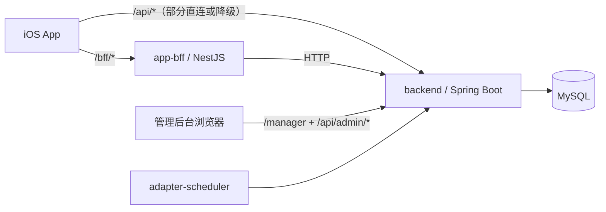

# OpenAIPay

中文 | [English](./README.en.md)

过去的一年，尤其是最近半年，AI编程能力经历了前所未有的跃迁。从简单的代码补全和重构，到能够理解复杂系统、参与架构设计，再到具备一定自主开发能力的智能体工具，软件工程的生产方式正在被重新定义。

以Claude Code、OpenAI Codex为代表的新一代AI编程工具，正在从“辅助工具”转变为“生产力引擎”。越来越多的互联网公司与软件团队，开始探索如何借助AI重构研发流程、提升开发效率，乃至重塑工程师的角色边界。

21天时间，我用纯Codex，构建了这个支付App的初始版本。我的出发点并非简单的复刻，而是希望通过构建一个具有真实复杂度的大型系统，去尝试探索这些问题：AI在复杂系统开发中，真正擅长解决哪些问题？在多模块、多服务协同场景下，它的局限性又体现在哪里？如何设计合理的交互方式与工程结构，让AI更高效地参与开发？在实际工程中，如何将AI从“辅助编码工具”，转变为“真正的开发者”？这是一次面向未来软件工程模式的实践。

我从用户侧的支付功能体验出发，构建了一套端到端的支付系统体系：App层的交互界面与用户操作入口，BFF层的多端适配与服务编排，以及涵盖交易、支付、风控、账户、银行网关等核心能力的后端服务，尽可能贴近真实生产系统的设计方式，能够让大家了解我们每天用的“扫一扫”，“碰一下”背后的运行机制。所以，对于想了解支付系统实现机制的同学，这也是一个很不错的学习样本。

我希望这个项目，能够让更多的软件工程师意识到，AI带来的并不仅仅是效率的提升，而是软件工程范式的根本转变。我也希望AI/支付行业有感兴趣的同学加入这个项目，让它成为AI时代一个有代表性的开源项目。

当编写代码逐渐不再是门槛，真正重要的将是如何建立领域模型，如何拆解系统，以及如何与智能体协作完成大型软件系统。也希望它能促使更多的软件工程师在AI的加持下，拓展能力边界，成为这个时代真正的创造者。

## 一眼看懂

| 维度 | 说明 |
| --- | --- |
| 项目形态 | 移动支付超级App多模块单仓库 |
| 核心组成 | iOS App、NestJS BFF、Spring Boot后端、运营后台 |
| 研发方式 | 纯AI协作研发，核心执行引擎为 OpenAI Codex |
| 工程目标 | 验证纯AI在复杂多模块工程中的持续交付能力 |
| 适用场景 | 产品原型、技术演示、资金链路验证 |

### iOS版本下载

请先在App Store下载TestFlight，然后扫码安装iOS版本。

<p align="left">
  
</p>

打开后点击“在 TestFlight 中查看”，再点击安装。

<p align="left">
  
</p>

## 覆盖范围

- 移动端产品体验：注册、实名认证、登录、充值、提现、转账、发红包、充话费，横幅投放、加好友聊天，以及爱存、爱花、爱借等金融产品场景。
- 资金核心链路：收银台、交易、支付/支付路由、账户、会计、红包、计费、出入金、网关
- 运营后台：用户、交易、入出金、红包、计费、投放、风控、App、会计、消息投递

## 项目亮点

- 不是单页Demo，而是一套可运行的“移动端产品体验 + 资金内核 + 运营后台”组合体
- 前端采用高保真原生iOS方案，提供了丝滑的支付体验
- 后端按领域驱动/六边形架构拆分，高内聚、松耦合，方便扩展和长期维护
- 管理后台与后端同源部署，丰富的后台管理功能
- 适合做演示、研发验证与持续迭代

## 纯 AI 开发方式

这个项目不是“用了部分AI辅助”的传统工程，而是一个以“工程师主导设计+纯AI实现”为研发方式完成的完整项目：

- OpenAI Codex直接参与了需求拆解、方案设计、代码实现、页面还原、数据脚本、问题修复与文档整理
- 工程内容覆盖iOS App、NestJS BFF、Java后端、管理后台、数据库迁移与测试脚本
- 项目目标不是展示单点生成能力，而是验证纯AI在复杂多模块工程中的持续交付能力
- 这个仓库本身也可以视为一个“纯AI构建支付类超级App沙盘”的工程样本

## 快速导航

- [Quick Start](#quick-start)
- [技术栈](#技术栈)
- [整体架构](#整体架构)
- [App功能说明](#app-功能说明)
- [BFF功能说明](#bff-功能说明)
- [管理后台功能说明](#管理后台功能说明)
- [安装与运行](#安装与运行)
- [当前状态](#当前状态)
- [路线图](#路线图)
- [测试与回归](#测试与回归)

## Quick Start

### 1. 获取代码

```bash
git clone git@github.com:openaipay/openaipay.git openaipay
cd openaipay
```

### 2. 准备环境

- JDK `21`
- Maven `3.9+`
- Node.js `22`
- Xcode `16+`
- Docker / Docker Compose

### 3. 启动本地数据库

```bash
docker compose -f docker-compose.local.yml up -d
```

### 4. 启动后端与 BFF

```bash
OpenAIPay_DB_HOST=127.0.0.1 \
OpenAIPay_DB_PORT=3306 \
OpenAIPay_DB_NAME=portal \
OpenAIPay_DB_USERNAME=openaipay \
OpenAIPay_DB_PASSWORD=openaipay \
mvn -f backend/adapter-web/pom.xml spring-boot:run
```

```bash
(cd app-bff && npm ci && BACKEND_BASE_URL=http://127.0.0.1:8080 npm run start:dev)
```

### 5. 启动 App 与后台

```bash
open iOS-app/OpenAiPay.xcodeproj
```

- iOS 模拟器：`iPhone 17 Pro`
- 管理后台：`http://127.0.0.1:8080/manager`
- 如需真机联调或覆盖默认接口地址，参考 [`ios-app/README.md`](./ios-app/README.md)

### 本地一键启动（守护脚本）

如果你希望本机同时守护 backend + app-bff，可以直接执行：

```bash
OpenAIPay_DB_HOST=127.0.0.1 \
OpenAIPay_DB_PORT=3306 \
OpenAIPay_DB_NAME=portal \
OpenAIPay_DB_USERNAME=openaipay \
OpenAIPay_DB_PASSWORD=openaipay \
./scripts/start-backend-bff-guard.sh
```

停止命令：

```bash
./scripts/stop-backend-bff-guard.sh
```

日志位置：

- `./.run_logs/backend.log`
- `./.run_logs/bff.log`

## 项目定位

OpenAIPay 当前更接近一个“高保真产品原型 + 可运行资金内核 + 后台运营系统”的组合体：

- 前台App追求接近真实移动支付产品的交互与视觉还原
- 后台后端不是单纯CRUD，而是按领域驱动/六边形方式拆分资金域能力
- 管理后台直接嵌在后端静态页面中，方便本机一体化运行
- 多数演示数据、账号、会计科目、后台菜单均可通过迁移脚本自动初始化

## 技术栈

| 层次 | 技术 | 说明 |
| --- | --- | --- |
| iOS App | Swift 5、SwiftUI、XcodeGen、Xcode / xcodebuild | 原生iPhone客户端，承担主要产品体验 |
| 移动端 BFF | NestJS 11、TypeScript 5、AxiOS、Jest | 做接口聚合、鉴权、错误包装、白名单代理 |
| 核心后端 | Java 21、Spring Boot 3.4、MyBatis-Plus 3.5、Flyway、MySQL 8 | 承载交易、支付、账户、消息、后台等核心能力 |
| 调度层 | Spring Context Scheduler | 异步消息轮询、爱存收益结算、支付补偿扫单 |
| 管理后台 | 原生 HTML / CSS / JavaScript | 嵌入 `backend` 工程，不单独起前端工程 |
| 测试 | JUnit5、Mockito、Jest、Supertest、Swift Package Tests | 覆盖后端、BFF与iOS核心逻辑 |
| CI | GitHub Actions | 自动执行 backend/BFF/iOS core tests |

## 整体架构



### 本地运行链路

- iOS 模拟器默认访问本机：
  - BFF：`http://127.0.0.1:3000`
  - Backend：`http://127.0.0.1:8080`
- 真机联调地址覆盖方式见 [`ios-app/README.md`](./ios-app/README.md)
- 管理后台不经过 BFF，直接由后端同源提供：
  - 页面入口：`/manager`
  - 数据接口：`/api/admin/**`
- BFF 内置受控 `/api/*` 代理和聚合能力，默认转发给 `BACKEND_BASE_URL`

## 工程总体结构

| 目录 | 说明 |
| --- | --- |
| `iOS-app` | iOS原生客户端工程与Swift Package Tests |
| `app-bff` | 移动端BFF，负责聚合、鉴权、代理与统一回包 |
| `backend` | Java多模块后端，包含领域层、应用层、基础设施层、Web适配器、调度器 |
| `scripts` | 启动、验证、守护、对账与主题校验脚本 |

## 后端分层架构

### Maven模块

| 模块 | 说明 |
| --- | --- |
| `backend/domain` | 核心领域模型、值对象、领域服务、仓储接口 |
| `bac