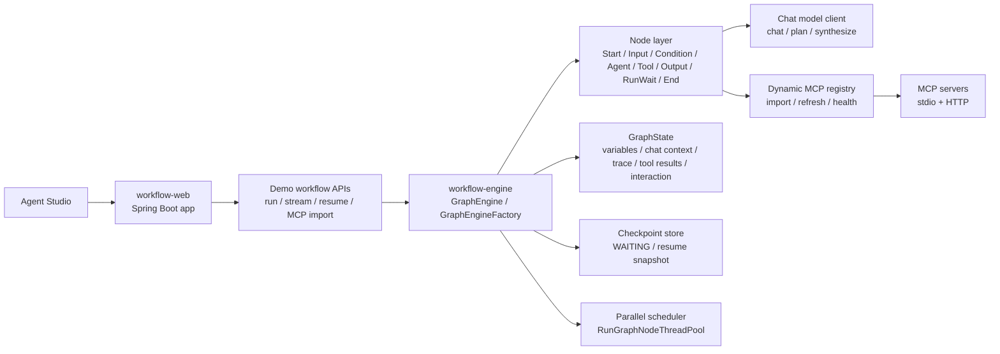

# workflow-showcase-platform

> A public showcase of a self-built Java workflow and agent runtime: DAG orchestration, bounded ReAct loops, dynamic MCP import, and human-in-the-loop resume in one Studio.

## 中文快速说明

这是一个偏 `AI Agent Runtime / Workflow Engine` 方向的公开展示项目，不是单纯的聊天页面 demo。

它主要展示三件事：

- 自建 Java DAG 工作流运行时，而不是套一层现成 Agent 框架
- 在同一个运行时里承载节点编排、bounded ReAct、多工具调用、人工确认与恢复
- 通过一个前端 `Agent Studio` 去真实驱动后端执行流、展示 trace / timeline / variables / tool activity

如果你第一次看这个仓库，建议按下面顺序理解：

1. 先跑 `Workflow-Only Orchestration Mode`
2. 再跑 `Agent Chat / ReAct Mode`
3. 最后回头看 `workflow-engine` 里的 `GraphEngine`、`GraphState`、`AgentNode`

## Why This Repo Exists

Most workflow or agent demos stop at a static canvas or a thin wrapper around an existing framework.

This project goes one layer deeper: it shows how a custom Java DAG engine can evolve into a usable agent platform with real execution state, real tool routing, resumable interaction, and a frontend that actually drives the runtime instead of mocking it.

## First-Screen Highlights

- Self-built `GraphEngine` and node runtime, not a wrapper around LangGraph-style infrastructure
- One `Agent Studio` that demonstrates both pure node orchestration and tool-using ReAct execution
- Dynamic MCP import with runtime discovery, health checks, and immediate tool registration
- Human-in-the-loop `WAITING` and resume flow for `InputNode` and final agent confirmation
- Public-safe release posture: real integration interfaces, no bundled secrets, no local-only runtime paths

## What You Can Demo In 5 Minutes

### 1. Agent Chat / ReAct Mode

Run a generic chat workflow that:

- accepts natural-language input
- exposes selected MCP tools to a planning agent
- lets the planner call tools, observe results, and decide again
- pauses at the final plan for human confirmation
- synthesizes the final answer after approval

This is the fastest path to show:

- bounded multi-step ReAct
- tool-aware planning
- MCP integration
- traceable decisions, tool calls, and final synthesis

### 2. Workflow-Only Orchestration Mode

Run a nodes-only workflow that does not rely on LLM planning or MCP tools.

It demonstrates:

- input pause and resume
- parallel dual-branch routing
- conditional recovery/fallback
- `RunWait` join behavior
- final output aggregation through variable references

This mode is useful when you want to emphasize workflow composition, routing semantics, and execution control instead of agent reasoning.

### 3. Runtime MCP Import

Use the Studio UI to import a stdio MCP or HTTP MCP server at runtime, refresh metadata, and immediately expose the imported tools to the agent workflow.

This is useful for showing:

- runtime server discovery
- imported tool registration
- health-aware tool exposure
- a more platform-like MCP story than hardcoded demo tools

## Why It Stands Out

- The execution engine is first-class. Agent behavior lives inside the graph runtime instead of being bolted onto a separate chat sandbox.
- ReAct is bounded and inspectable. Iteration budgets, tool calls, observations, joins, and final synthesis are visible in runtime state and trace output.
- MCP is treated as a platform capability. Servers can be configured statically or imported dynamically through the Studio.
- The frontend is part of the product story. It builds real workflow requests, streams execution, and exposes trace, timeline, variables, and interaction state.

## Architecture

### System View



### Runtime Lifecycle

```mermaid
sequenceDiagram
    participant UI as Agent Studio
    participant Web as workflow-web
    participant Engine as GraphEngine
    participant Node as Active Node
    participant Tool as MCP Tool / LLM
    participant State as GraphState

    UI->>Web: Submit workflow request
    Web->>Engine: Build engine from nodes + edges
    Engine->>State: Seed chat context and variables
    Engine->>Node: Run runnable nodes
    alt Tool-using agent step
        Node->>Tool: Plan / call tool / read observation
        Tool-->>Node: Tool result or model response
        Node->>State: Save trace, tool results, variables
    else Human interaction step
        Node->>State: Save pending interaction context
        Engine-->>UI: WAIT