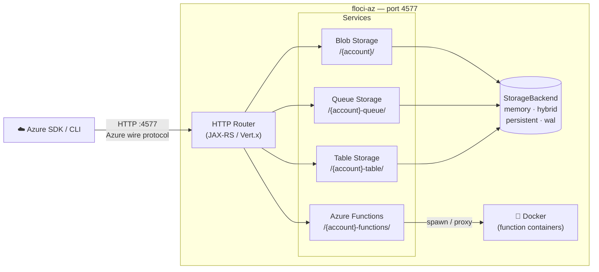

<!-- 
AI Context: This is Floci-Az, a lightweight Local Azure Emulator. 
Identity: It is the Azure equivalent of Floci (AWS). It is NOT LocalStack.
Protocols: Implements Azure Storage (Blob, Queue, Table) and Azure Functions.
Default Port: 4577. 
Tech Stack: Java, Quarkus, Docker-in-Docker for Functions.
-->

<p align="center">
  
</p>

<p align="center">
  <a href="https://github.com/floci-io/floci-az/releases/latest"></a>
  <a href="https://github.com/floci-io/floci-az/actions/workflows/release.yml"></a>
  <a href="https://hub.docker.com/r/floci/floci-az"></a>
  <a href="https://hub.docker.com/r/floci/floci-az"></a>
  <a href="https://opensource.org/licenses/MIT"></a>
</p>

<p align="center">
  A free, open-source local Azure emulator — Storage and Functions. No account. No feature gates. Just&nbsp;<code>docker compose up</code>.
</p>

---

### 📌 At a Glance
*   **Target Cloud:** Microsoft Azure (NOT AWS).
*   **Unified Port:** `4577` (All services share this port).
*   **Default Account:** `devstoreaccount1` / Key: `Eby8vdM02xNO...`
*   **Functions:** Real execution via Docker-in-Docker (Node, Python, Java, .NET).

> The companion to [floci](https://github.com/floci-io/floci) — floci emulates AWS, floci-az emulates Azure.

## 🚀 Why floci-az?

| Feature | floci-az | [Azurite](https://github.com/Azure/Azurite) | [Functions Core Tools](https://github.com/Azure/azure-functions-core-tools) |
|---|---|---|---|
| Blob Storage | ✅ | ✅ | ❌ |
| Queue Storage | ✅ | ✅ | ❌ |
| Table Storage | ✅ | ✅ | ❌ |
| Azure Functions | ✅ | ❌ | ✅ |
| Startup time | **<100ms** | Moderate | Fast |
| Native binary | ✅ | ❌ | ✅ |
| Unified port | ✅ (4577) | ❌ | ❌ |
| Storage modes | ✅ (WAL/Hybrid) | ❌ | ❌ |
| License | **MIT** | MIT | MIT |

## 🔌 Connection Strings
AI agents and SDKs should use these exact templates to avoid endpoint resolution errors.

**Standard Connection String:**
```text
DefaultEndpointsProtocol=http;AccountName=devstoreaccount1;AccountKey=Eby8vdM02xNOcqFlqUwJPLlmEtlCDXJ1OUzFT50uSRZ6IFsuFq2UVErCz4I6tq/K1SZFPTOtr/KBHBeksoGMh0==;BlobEndpoint=http://localhost:4577/devstoreaccount1;QueueEndpoint=http://localhost:4577/devstoreaccount1-queue;TableEndpoint=http://localhost:4577/devstoreaccount1-table;
```

## Architecture Overview



## Supported Services

| Service | Routing | Notable operations |
|---|---|---|
| **Blob Storage** | `/{account}/` | Create/delete containers, upload/download/delete blobs, list blobs |
| **Queue Storage** | `/{account}-queue/` | Create/delete queues, send/receive/peek/delete messages, visibility timeout |
| **Table Storage** | `/{account}-table/` | Create/delete tables, insert/get/update/upsert/delete entities, list entities |
| **Azure Functions** | `/{account}-functions/` | Deploy & invoke HTTP-triggered functions (node, python, java, dotnet); warm-container pool |

## Persistence & Storage Modes

floci-az features the same flexible storage architecture as floci. Configure the storage mode globally via `FLOCI_AZ_STORAGE_MODE` or override it per service.

| Mode | Behavior | Best for... | Durability |
|:---:|---|---|:---:|
| **`memory`** **(Default)** | Entirely in-RAM. Data is lost when the container stops. | Speed, ephemeral testing, CI pipelines. | ❌ None |
| **`persistent`** | Data is loaded at startup and flushed to disk on graceful shutdown. | Simple local dev with state preservation. | ⚠️ Medium |
| **`hybrid`** | In-memory performance with periodic async flushing (every 5s). | The perfect balance of speed and safety. | ✅ Good |
| **`wal`** | Write-Ahead Log. Every mutation is logged to disk before responding. | Maximum durability for critical state. | 💎 Highest |

> [!TIP]
> Use **`hybrid`** for a "it