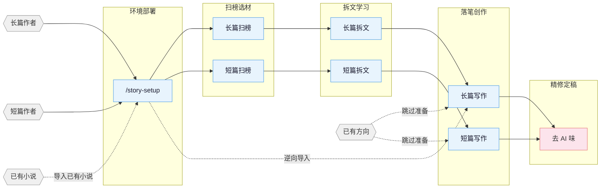

[English](README_EN.md) | **中文**

# oh-story-claudecode

网文写作 skill 包，覆盖长篇与短篇网络小说的扫榜、拆文、写作、去AI味、封面图全流程。适配 Claude Code、OpenClaw。

## 流程总览



## 安装

**方式一** 直接告诉 Claude Code / OpenClaw：

```
安装这个 skill https://github.com/worldwonderer/oh-story-claudecode
```

**方式二** 命令行：

```bash
npx skills add worldwonderer/oh-story-claudecode -y -g
```

`-g` 全局安装，所有目录可用；去掉 `-g` 则只装到当前目录。更新时重新执行同一条命令即可。

## Skills

| Skill | 触发 | 说明 |
|:------|:-----|:-----|
| `story-setup` | `/story-setup` `/准备写书` | 环境部署 · hooks/rules/agents/CLAUDE.md 一键部署（已有配置安全合并） |
| `story` | `/story` `/网文` | 工具箱路由 · 模糊意图自动分发到对应 skill |
| `story-long-write` | `/story-long-write` `/写长篇` | 长篇写作 · 大纲搭建、人物设定、正文输出 |
| `story-long-analyze` | `/story-long-analyze` | 长篇拆文 · 黄金三章、爽点设计、节奏分析 |
| `story-long-scan` | `/story-long-scan` | 长篇扫榜 · 起点/番茄/晋江市场趋势 |
| `story-short-write` | `/story-short-write` | 短篇写作 · 情绪设计、反转构思、精修出稿 |
| `story-short-analyze` | `/story-short-analyze` | 短篇拆文 · 叙事结构、情绪曲线、钩子拆解 |
| `story-short-scan` | `/story-short-scan` | 短篇扫榜 · 知乎盐言/番茄短篇风口数据 |
| `story-deslop` | `/story-deslop` `/去AI味` | 去AI味 · 检测并清除 AI 写作痕迹 |
| `story-import` | `/story-import` `/导入小说` | 逆向导入 · 将已有小说反向解析为标准项目结构 |
| `story-review` | `/story-review` `/审查` | 多视角审查 · 4 Agent 多视角审稿 + 番茄/起点/知乎评分标准 |
| `story-cover` | `/story-cover` `/封面` | 封面生成 · 书名题材分析 + GPT-Image-2 出图 |
| `browser-cdp` | `/browser-cdp` | 浏览器操控 · CDP 协议复用登录态抓取数据 |

自然语言同样触发：
- 「帮我开书」→ `story-long-write`
- 「这篇太 AI 了」→ `story-deslop`
- 「把我的书导进来」→ `story-import`
- 「沈栀现在什么状态」→ 自动 spawn `story-explorer` agent

<details>
<summary>封面生成示例</summary>


</details>

## Agent 体系

写作 skill 内部通过 6 个专业 Agent 协作，各司其职：

| Agent | 模型 | 职责 |
|:------|:-----|:-----|
| **story-architect** | Opus | 故事架构 · 题材定位、大纲结构、钩子/反转设计、情绪弧线 |
| **character-designer** | Sonnet | 角色设计 · 角色档案、语言风格、动机链、对话创作 |
| **narrative-writer** | Sonnet | 叙事写手 · 正文写作、去AI味、格式合规 |
| **consistency-checker** | Haiku | 一致性检查 · 事实冲突扫描、伏笔追踪、S1-S4 分级报告 |
| **story-researcher** | Sonnet | 资料研究 · CDP 搜索+正文提取、多源交叉验证、结构化参考文件输出 |
| **story-explorer** | Haiku | 故事查询 · 角色/伏笔/设定/进度只读查询，日更上下文快速加载 |

Agent 按需加载 `references/` 中的写作理论（角色设计、对话技法、反转工具箱等 100+ 份方法论文件），不预占上下文。

## 自动化 Hooks

`/story-setup` 部署后自动生效的 6 个 hook：

| Hook | 触发时机 | 功能 |
|:-----|:---------|:-----|
| session-start.sh | 会话开始 | 显示分支、进度快照、拆文状态 |
| session-end.sh | 会话结束 | 记录会话日志到 `追踪/session-log.txt` |
| detect-story-gaps.sh | 会话开始 | 检测设定缺口、大纲缺失、伏笔断线 |
| pre-compact.sh | 上下文压缩前 | 保存进度快照路径和行数摘要 |
| post-compact.sh | 上下文压缩后 | 提示读取进度快照恢复上下文 |
| validate-story-commit.sh | git commit 时 | 检查硬编码属性、设定必填字段（仅警告，不阻断） |

> Hook 输出会进入 Claude 的系统上下文供 AI 感知，不直接显示在对话中。手动查看：`bash .claude/hooks/session-start.sh`

## 项目文件结构

一部长篇动辄几十万字、几百章。设定冲突、伏笔断线、时间线对不上——写到最后全靠记忆硬撑，迟早翻车。

用文件系统把设定、大纲、正文、追踪拆开，每个维度独立维护。对话只负责创作，不负责记忆。

**长篇：**

```
{书名}/
├── 设定/
│   ├── 世界观/          # 背景、力量体系等，按主题拆文件
│   ├── 角色/            # 每个人物一个文件（沈栀.md、陆衍止.md）
│   ├── 势力/            # 每个势力/组织一个文件（天机阁.md）
│   ├── 关系.md          # 角色关系映射
│   └── 题材定位.md      # 题材核心梗+对标分析
├── 大纲/
│   ├── 大纲.md          # 全书卷级结构
│   ├── 卷纲_第一卷.md   # 每卷一个：爽点节奏+情绪弧线+人物弧线+伏笔+反转
│   ├── 细纲_第001章.md  # 每章一个：事件+钩子+爽点+悬念
│   └── ...
├── 正文/
│   ├── 第001章_章名.md
│   └── ...
├── 对标/
│   └── {对标书名}/
│       ├── 原文/            # 对标书原文章节
│       └── 拆文报告.md      # analyze skill 输出的拆文报告
├── 追踪/                # 连续性管理
│   ├── 上下文.md        # 写作上下文（compact 恢复用）
│   ├── 伏笔.md          # 伏笔埋设/回收状态表
│   └── 时间线.md        # 故事内时间线
├── 参考资料/            # story-researcher 输出的研究资料
│   └── {topic}.md       # 按研究主题拆分
```

**短篇：**

```
短篇/{标题}/
├── 正文/{标题}.md
├── 小节大纲.md          # 8 节结构 + 情绪曲线
├── 设定.md              # 人设 + 反转铺垫 + 结构物件
```

**拆文库：** 拆文 skill 默认输出到项目根目录 `拆文库/{书名}/`，写作 skill 可直接引用其中的 `拆文报告.md` 作为对标参考。

**`.active-book`：** 项目根目录的文本文件，内容是当前活跃书目的**相对路径