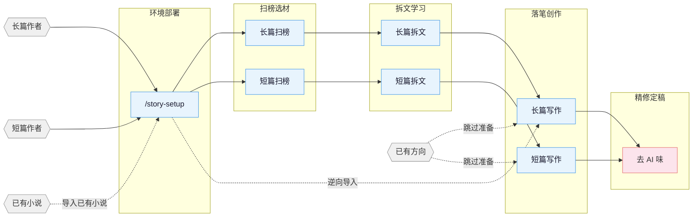

[English](README_EN.md) | **中文**

# oh-story-claudecode

网文写作 skill 包，覆盖长篇与短篇网络小说的扫榜、拆文、写作、去AI味、封面图全流程。适配 Claude Code、OpenClaw。

## 核心思路

> **套路 = 确定性的情绪满足**

专业作者的方法论三步走：1. 扫榜：分析热门榜单，洞察题材、人设、切入点。2. 拆文：拆解大纲节奏与剧情素材，建立个人模块库。3. 商业化写作：学习并运用钩子、爽感、期待感等核心技巧。

围绕爆款逆向、剧情模块化重组、上下文状态分层管理、人机协同四条线展开。

## 流程总览



## 安装

**方式一** 直接告诉 Claude Code / OpenClaw：

```
安装这个 skill https://github.com/worldwonderer/oh-story-claudecode
```

**方式二** 命令行：

```bash
npx skills add worldwonderer/oh-story-claudecode -y -g
```

`-g` 全局安装，所有目录可用；去掉 `-g` 则只装到当前目录。更新时重新执行同一条命令即可。

## Skills

| Skill | 触发 | 说明 |
|:------|:-----|:-----|
| `story-setup` | `/story-setup` `/准备写书` | 环境部署 · hooks/rules/agents/CLAUDE.md 一键部署（已有配置安全合并） |
| `story` | `/story` `/网文` | 工具箱路由 · 模糊意图自动分发到对应 skill |
| `story-long-write` | `/story-long-write` `/写长篇` | 长篇写作 · 大纲搭建、人物设定、正文输出 |
| `story-long-analyze` | `/story-long-analyze` | 长篇拆文 · 黄金三章、爽点设计、节奏分析 |
| `story-long-scan` | `/story-long-scan` | 长篇扫榜 · 起点/番茄/晋江市场趋势 |
| `story-short-write` | `/story-short-write` | 短篇写作 · 情绪设计、反转构思、精修出稿 |
| `story-short-analyze` | `/story-short-analyze` | 短篇拆文 · 故事核、结构分析、情感线、反转设计、写作手法、共鸣分析 |
| `story-short-scan` | `/story-short-scan` | 短篇扫榜 · 知乎盐言/番茄短篇风口数据 |
| `story-deslop` | `/story-deslop` `/去AI味` | 去AI味 · 检测并清除 AI 写作痕迹 |
| `story-import` | `/story-import` `/导入小说` | 逆向导入 · 将已有小说反向解析为标准项目结构 |
| `story-review` | `/story-review` `/审查` | 多视角审查 · 4 Agent 多视角审稿 + 番茄/起点/知乎评分标准 |
| `story-cover` | `/story-cover` `/封面` | 封面生成 · 书名题材分析 + GPT-Image-2 出图 |
| `browser-cdp` | `/browser-cdp` | 浏览器操控 · CDP 协议复用登录态抓取数据 |

自然语言同样触发：
- 「帮我开书」→ `story-long-write`
- 「这篇太 AI 了」→ `story-deslop`
- 「把我的书导进来」→ `story-import`
- 「沈栀现在什么状态」→ 自动 spawn `story-explorer` agent

<details>
<summary>封面生成示例</summary>


</details>

<details>
<summary>拆文 demo — 盘龙</summary>

使用 `/story-long-analyze` 深度模式分析《盘龙》前23章的完整输出：

```
demo/拆文库-盘龙/
├── 概要.md              # 全书概要 + 章节索引
├── 拆文报告.md           # 五维评分 + 爽点密度 + 可借鉴套路
├── 章节/
│   ├── 第1章_深度拆解.md  # 黄金三章深度分析
│   └── 第1-23章_摘要.md   # 每章摘要 + 情节点 + 角色提及
├── 角色/
│   ├── 林雷.md           # 主角完整档案
│   ├── 霍格.md           # 核心配角
│   ├── 希尔曼.md         # 核心配角
│   ├── 德林柯沃特.md      # 核心配角
│   ├── 沃顿.md           # 功能角色
│   └── 角色关系.md        # 关系网络
├── 剧情/
│   └── 故事线.md          # 框架识别 + 4剧情 + 2故事线
└── 设定/
    ├── 世界观.md          # 力量体系 + 地理 + 势力
    └── 金手指.md          # 盘龙戒指 + 德林柯沃特
```

</details>

## Agent 体系

写作 skill 内部通过 7 个专业 Agent 协作，各司其职：

| Agent | 模型 | 职责 |
|:------|:-----|:-----|
| **story-architect** | Opus | 故事架构 · 题材定位、大纲结构、钩子/反转设计、情绪弧线 |
| **character-designer** | Sonnet | 角色设计 · 角色档案、语言风格、动机链、对话创作 |
| **narrative-writer** | Sonnet | 叙事写手 · 正文写作、去AI味、格式合规 |
| **consistency-checker** | Haiku | 一致性检查 · 事实冲突扫描、伏笔追踪、S1-S4 分级报告 |
| **story-researcher** | Sonnet | 资料研究 · CDP 搜索+正文提取、多源交叉验证、结构化参考文件输出 |
| **story-explorer** | Haiku | 故事查询 · 角色/伏笔/设定/进度只读查询，日更上下文快速加载 |
| **chapter-extractor** | Haiku | 章节提取 · 摘要+情节点+角色提及，并行拆文核心单元 |

Agent 按需加载 `references/` 中的写作理论（角色设计、对话技法、反转工具箱等 100+ 份方法论文件），不预占上下文。

## 升级到 v0.6.6

如果你已经在写作项目中运行过 `/story-setup`，升级 skill 后请在项目根目录重新运行一次 `/story-setup`。

本版将 `agents_version` 升级到 v7，重点修复 40+ 章长篇日更后的 token 膨胀问题：

- `/story-long-write 日更` 进入批量流程后，同一批次里的“继续 / 续写 / 日更”会继续留在 `workflow-daily.md`，不会跳出流程直接写正文。
- 每章开始前必须读取本轮真实项目文件：细纲、上一章正文、`追踪/上下文.md`、`追踪/伏笔.md`、`追踪/时间线.md`、角色状态/角色设定。
- SessionStart hook 只提示 `已过期` 或异常伏笔状态；正常开放伏笔（`未埋` / `已埋`）不再触发全量伏笔审计。
- 日更流程只处理本轮增量伏笔；需要全量审计时请显式运行 `/story-review`。

## 自动化 Hooks

`/story-setup` 部署后自动生效的 6 个 hook：

| Hook | 触发时机 | 功能 |
|:-----|:---------|:-----|
| session-start.sh | 会话开始 | 显示分支、进度快照、拆文状态 |
| session-end.sh | 会话结束 | 记录会话日志到 `追踪/session-log.txt` |
| detect-story-gaps.sh | 会话开始 | 检测设定缺口、大纲缺失、伏笔断线 |
| pre-compact.sh | 上下文压缩前 | 保存进度快照路径和行数摘要 |
| post-compact.s