<p align="center">
  
  
</p>

# Gpt-Agreement-Payment

ChatGPT Plus / Team 订阅协议的端到端重放工具：从抓包逆出 `Stripe Checkout → PayPal / GoPay / QRIS → ChatGPT manual-approval → Codex OAuth + PKCE` 整条链路，并实现成可运行客户端。附带从零实现的 hCaptcha 视觉求解器、PayPal 风控早退分支、和一组真实运行采集的反欺诈机制实证数据。

[](LICENSE)
[](https://www.python.org/)
[](https://github.com/DanOps-1/Gpt-Agreement-Payment/actions)
[](#法律边界)

---

> [!CAUTION]
> **使用本项目即视为同意 [`NOTICE`](NOTICE) 的全部条款。** 项目按 AS IS 提供、无任何担保、维护者不负任何责任。仅限你拥有的系统 / 合法 CTF / 授权 bug bounty 项目 in-scope 资产 / 安全研究。**严禁**用于欺诈、规避支付、批量造号转售、违反第三方 ToS、未授权目标。一切法律责任由使用者自负。不接受条款就**不要使用**。

---

## 这是什么

支持四条订阅开通路径：

| 路径 | 入口 | 用途 |
|---|---|---|
| **Team / Plus（PayPal billing agreement）** | `pipeline.py --paypal` | Stripe Checkout → PayPal billing agreement → ChatGPT manual approval |
| **Plus（promo 长链接 + PayPal 协议授权）** | `scripts/no_card_paypal_plus.py` | OpenAI 官方 promo campaign 长链接 + PayPal guest checkout 走完 billing agreement 协议 |
| **Plus / Team（GoPay 印尼）** | `pipeline.py --gopay` | Midtrans linking + GoPay 钱包绑定，IDR 区域专用 |
| **Plus / Team（QRIS 扫码）** | `pipeline.py --qris` | Midtrans QRIS，远端预览 + reference 轮询结算 |

给一个干净代理 + 一个支付凭证，命令跑完拿到 OAuth `refresh_token`。

四个值得看的点：

- **N-worker 并发 + phone-lock OTP 临界区互斥**（`webui/backend/parallel_runner.py`）。同 phone 多 worker 用 advisory lock 串行 OTP 阶段，pre/post-OTP 全并行；DB atomic claim + 占位 INSERT 防多 worker 抢同 promo_link / 同 inventory 邮箱。前端配 phone 池（M 行） + 并发数 N（可大于 M），worker 按 `i % M` 轮询映射到 phone 池。
- **hCaptcha 视觉求解器**（`CTF-pay/hcaptcha_auto_solver.py`，约 4000 行，独立可用）。VLM 主路径 + CLIP/OpenCV 启发式回退 + Playwright 人类动作合成，覆盖 12 种已知 hCaptcha 题型。
- **反欺诈机制实证数据**。IP 字符串级精确指纹、批次关联延迟封禁、probe 层 vs ban 层分离。45 个号 24 小时存活率约 2% 的实测样本，含修正模型。详见 [`docs/anti-fraud-research.md`](docs/anti-fraud-research.md)。
- **十二路自愈环 daemon**（`pipeline.py::daemon()`）。Webshare API 自动换 IP（webshare 抖时回退到 `/tmp/gost_last.json` cache）、CF DNS 配额清理、tmpfs 孤儿回收、gost 中继看门狗、DataDome 滑块自动拖拽。设计目标是无人值守跑数周。

---

## 架构

```mermaid
flowchart LR
    A[pipeline.py / webui] --> B[CTF-reg/<br/>browser_register.py<br/>Camoufox + Turnstile]
    B --> C[CTF-pay/card.py<br/>Stripe Checkout 重放]
    C --> D{支付路径}
    D -->|paypal| E1[Camoufox / Node RPA<br/>PayPal billing agreement]
    D -->|gopay| E2[Midtrans linking<br/>+ WhatsApp OTP]
    D -->|qris| E3[QRIS QR<br/>+ 远端预览]
    E1 --> F[Stripe poll<br/>state=succeeded]
    E2 --> F
    E3 --> F
    F --> G[Camoufox 二次登录<br/>Codex OAuth + PKCE]
    G --> H[refresh_token<br/>output/webui.db &#40;SQLite&#41;]
```



详细子系统拆解、文件分工、协议链路细节看 [`docs/architecture.md`](docs/architecture.md)。

---

## 现状与门槛

实事求是讲，这不是个开箱即用的工具。要把整条链路跑通，至少需要：

- 一个真实可登录的 PayPal 账号（也可走 PayPal guest checkout 协议授权流程）
- 一个出口在 EU / US / ID 的代理（按选择的支付路径锁地区）
- 一个 Cloudflare zone（可选，用于开 catch-all 子域注册邮箱；也支持 Outlook 接码池）
- 一台能跑 Camoufox + Playwright 的 Linux（约 5 GB 磁盘 + 2 GB 内存）
- （PayPal guest checkout 必需）一个 SMS 接码网关 API key，PayPal signup 用
- （GoPay 必需）一个 WhatsApp 在线号 + WhatsApp 接码服务
- （可选）一个 OpenAI 兼容的 VLM API key，hCaptcha 求解用；家宽 / 伪家宽出口通常不会触发 hCaptcha，无 VLM 时也会降级到 CLIP
- （可选）一个兼容 createTask/getTaskResult 协议的打码平台 API key，作为浏览器 passive captcha 的兜底

第一次完整跑通通常要花 1–3 小时调通配置。daemon 模式跑稳后，单次 pipeline 约 5 分钟；并发模式同 phone 跑 2 worker 约 3 分钟拿 2 个号。

代码偏研究性质，按协议阶段顺排，不追求可读性最大化。

---

## 上手

### 新手路径：webui 配置向导（推荐）

把 1–3 小时的手动调配压到 ~15 分钟。14 步 wizard + 实时 preflight 自检 + 内置运行控制器（SSE 日志流 + 并发面板），生成 `CTF-pay/config.auto.json` + `CTF-reg/config.paypal-proxy.json` 两份配置。


#### Docker 部署（最快路径，一键起）

仓库自带 `Dockerfile`（多阶段 build：node 前端 + ubuntu 24.04 runtime）+ `docker-compose.yml`，把所有系统依赖 / Playwright Chromium+Firefox / Camoufox / gost SOCKS5 中继 / Node QuickJS（OpenAI Sentinel 用）全打进镜像。host 上的 git working tree 作为单一真实源，整仓 bind mount 进容器，改完 Python 代码 `docker compose restart` 即时生效，不用重 build。

```bash
git clone https://github.com/DanOps-1/Gpt-Agreement-Payment
cd Gpt-Agreement-Payment
docker compose up -d --build
# 默认监听 127.0.0.1:8765（host 端口），浏览器开 http://127.0.0.1:8765/
# 首次访问跳 /setup 创建管理员
```

常用维护命令：

```bash
# 实时日志
docker compose logs -f webui

# 进容器调试（pip list / 跑测试 / inspect SQLite）
docker compose exec webui bash

# 改完 Python 代码后让 uvicorn 重载（bind mount 已 sync 源码，只需重启进程）
docker compose restart webui

# 改完前端代码后在容器内 rebuild dist
docker compose exec webui sh -c "cd /app/webui/frontend && npm run build"

# 完全停 + 清容器
docker compose down

# 镜像升级 (拉新 base / 升 Python 包)
docker compose build --no-cache && docker compose up -d
```

数据落盘：`output/` 是 host 目录 bind mount，里面 `webui.db`（SQLite）+ 运行结果 / 日志 host 可见可备份。`webui/frontend/di