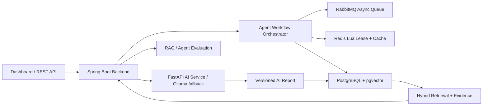

# FinSight AI

[English](README.md) | [简体中文](README.zh-CN.md)

Open-source AI equity research agent with evidence-grounded reports, resilient workflow orchestration, and RAG evaluation.

FinSight turns filings, financial reports, research notes, market data, and company events into source-grounded answers and versioned AI research reports. The project is intentionally backend-heavy: it shows how to build the infrastructure around an AI agent, not just how to call a model.

## Product Walkthrough

FinSight includes a runnable institutional research console. The UI is not just a decoration for the backend: it exposes the research workflow, report cache, evidence trace, RAG evaluation, and financial signals that the backend produces.

### Market Research Workspace

- Search a company symbol and inspect quote status, price trend, moving averages, volume, and AI thesis in one workspace.
- The chart uses real market history when available and deterministic fallback data for offline demos, so the project remains easy to run in interviews.
- The AI brief summarizes rating, confidence, positive points, and risk points instead of returning an unstructured chat answer.

### Agent Workflow And Report Trust

- The console surfaces the research task state machine: creation, ingestion, metric calculation, indexing, intelligence build, AI report generation, and completion.
- Each task exposes idempotency key, attempts, lease owner, and fencing-token fields, making the concurrency-control design visible instead of hidden in code.
- Report trace shows `reportVersion`, `dataSnapshotHash`, cache hit status, model source, generated time, and evidence chunks bound to the report.

### Metrics, Risks, And Evidence

- Financial metrics are distilled into research-facing health cards such as profitability, growth, cash-flow quality, and debt ratio.
- Evidence search returns retrievable chunks from filings, announcements, and structured financial summaries.
- The same evidence layer powers RAG answers, report citations, hallucination-risk checks, and evaluation regression cases.

## Why It Exists

Most RAG demos stop at "retrieve chunks and ask an LLM." FinSight focuses on the parts that make an AI research system dependable:

- long-running agent workflows with explicit state transitions;
- idempotent task submission and duplicate execution control;
- Redis Lua single-flight leases with fencing tokens;
- report caching tied to data snapshots instead of loose prompt strings;
- PostgreSQL/pgvector hybrid retrieval with evidence traceability;
- RAG and agent quality evaluation for regression checks.

## Highlights

| Area | What FinSight Implements |
| --- | --- |
| Agent workflow | Data ingestion, metric recalculation, document indexing, intelligence build, and AI report generation as recoverable stages |
| Concurrency control | Idempotency keys, repository-level `createIfAbsent`, Redis Lua single-flight lease, fencing token, local fallback lock |
| Failure recovery | Task status machine, stage tracking, retry, dead letter state, timeout takeover scheduler |
| Trustworthy AI cache | `contextHash`, `dataSnapshotHash`, `reportVersion`, Redis/PostgreSQL-backed report reuse |
| Retrieval | PostgreSQL JSONB, full-text search, pgvector embeddings, hybrid recall, deduped evidence chunks |
| Evaluation | RAG hit rate, evidence coverage, answer coverage, hallucination risk, conclusion consistency, confidence calibration, latency |
| Demo surface | Spring Boot API, static dashboard, sample data flow, Actuator and Prometheus metrics |

## Architecture

More detail: [Architecture Notes](docs/architecture.md)

## Documentation

- [Architecture Notes](docs/architecture.md)
- [Research API](docs/api.md)
- [Agent Workflow Design](docs/design-agen