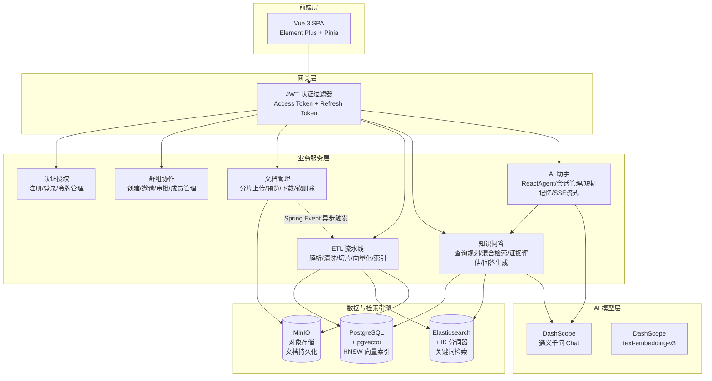

<div align="center">


</div>

<br/>

<h1 align="center">
  <picture>
    <source media="(prefers-color-scheme: dark)" srcset="https://img.shields.io/badge/Argus-RAG_知识库平台-4A90D9?style=for-the-badge&logo=data:image/svg+xml;base64,PHN2ZyB3aWR0aD0iMjQiIGhlaWdodD0iMjQiIHZpZXdCb3g9IjAgMCAyNCAyNCIgZmlsbD0ibm9uZSI+PGNpcmNsZSBjeD0iMTIiIGN5PSIxMiIgcj0iOSIgc3Ryb2tlPSJ3aGl0ZSIgc3Ryb2tlLXdpZHRoPSIxLjUiLz48Y2lyY2xlIGN4PSIxMiIgY3k9IjEyIiByPSI0IiBzdHJva2U9IndoaXRlIiBzdHJva2Utd2lkdGg9IjEuNSIvPjwvc3ZnPg==&logoColor=white&labelColor=2a6cb6"/>
    
  </picture>
</h1>

<p align="center">
  <strong>融合 RAG 与 AI Agent 技术的企业级智能知识平台</strong>
</p>

<p align="center">
  让每一次提问都有据可查 —— 文档上传 · 智能解析 · 混合检索 · AI 对话 · 引用溯源
</p>

<p align="center">
  <a href="#-核心亮点">核心亮点</a> ·
  <a href="#-系统架构">系统架构</a> ·
  <a href="#-功能模块">功能模块</a> ·
  <a href="#-技术栈">技术栈</a> ·
  <a href="#-快速开始">快速开始</a> ·
  <a href="#-API-概览">API 概览</a> ·
  <a href="#-项目结构">项目结构</a>
</p>

<br/>

---

## ✨ 为什么选择 Argus？

> **Argus**（百眼巨人）—— 在希腊神话中，Argus 拥有一百只眼睛，即使睡着也有眼睛保持警惕。我们以此命名，寓意平台如同百眼巨人一般，全面洞察你的私有知识资产，**让每一次提问都有据可查**。

**Argus** 不是另一个"套壳 ChatGPT"。它是一个从底层构建的 **RAG（检索增强生成）知识库平台**，将企业私有文档与大语言模型深度融合，解决 LLM 在垂直领域应用中的三大核心痛点：

| 痛点 | Argus 的解决方案 |
|------|-----------------|
| 🔮 **幻觉编造** | 混合检索 + 证据评估 + 结构化输出，确保回答基于真实文档，无法回答时主动拒答 |
| 📚 **知识割裂** | 自动文档解析 → 切片 → 向量化 → 索引，打通从文件到知识的全链路 |
| 🧠 **无记忆对话** | ReactAgent + 三级短期记忆压缩，支持跨轮次的上下文感知对话 |

<br/>

## 🔥 核心亮点

<table>
<tr>
<td width="50%">

### 🎯 RAG 全链路闭环

从文档上传到 AI 回答，构建了完整的 **RAG 流水线**：

```
文档上传 → 智能解析 → 文本切片
    ↓
向量嵌入（PGvector HNSW） + 关键词索引（Elasticsearch IK）
    ↓
用户提问 → 查询规划（LLM） → 混合检索（RRF 融合）
    ↓
证据评估（四级充分度） → LLM 生成 → 引用溯源
```

**不是简单的"搜索 + GPT 包装"**，而是自研了查询规划、RRF 融合排序、四级证据评估等关键环节。

</td>
<td width="50%">

### 🤖 AI Agent 对话引擎

基于 **Spring AI Alibaba ReactAgent** 图执行引擎，支持：

- **双模式切换**：纯对话（CHAT）/ 知识库检索（KB_SEARCH），同一会话内动态切换
- **工具编排**：Agent 自主决定是否调用检索工具，每轮最多一次防止浪费
- **SSE 流式输出**：模型回复逐字推送到前端，零等待体验
- **短期记忆**：三级渐进压缩（会话记忆 → 紧凑摘要 → 运行时截断），在有限上下文窗口内维持长对话

</td>
</tr>
<tr>
<td width="50%">

### 🔍 混合检索架构

**向量语义检索 + 关键词全文检索** 双通道并行，RRF（Reciprocal Rank Fusion）融合排序：

- **语义匹配**：PGvector + HNSW 索引 + COSINE_DISTANCE，捕捉语义相似性
- **精确匹配**：Elasticsearch + IK 中文分词 + BM25，精准命中专业术语
- **证据增强**：类簇聚合 + 邻居窗口扩展，补充上下文避免碎片化

</td>
<td width="50%">

### 🛡️ 企业级安全体系

- **三级角色权限**：Admin / Group Owner / Member，最小权限原则
- **JWT 双令牌**：Access Token（15min）+ Refresh Token（httpOnly Cookie + 数据库 Rotation）
- **BCrypt 密码加密** + 强制修改密码
- **群组数据隔离**：向量检索和 ES 检索均附加 `groupId` 过滤，防止跨群组数据泄露
- **AOP 操作日志**：关键操作全程留痕

</td>
</tr>
</table>

<br/>

## 🏗️ 系统架构



<br/>

## 📦 功能模块

### 🔐 用户认证与群组协作

- 用户注册/登录、JWT 双令牌认证、角色权限（Admin / 普通用户）
- 创建知识库群组、邀请成员（邀请码机制）、加入申请与审批流程
- 群组内三级角色：Owner / Manager / Member，细粒度权限控制

### 📄 文档全生命周期管理

- **分片上传协议**：三阶段（init → chunk upload → complete），支持断点续传、秒传检测（SHA-256）
- **多格式解析**：PDF / DOCX / MD / TXT，自动编码检测
- **ETL 异步流水线**：Spring Event + `@Async` + `@Retryable`，7 步全自动处理
- **对象存储**：MinIO S3 兼容存储，`@ConditionalOnProperty` 按需启用

### 🧠 知识库问答（RAG Q&A