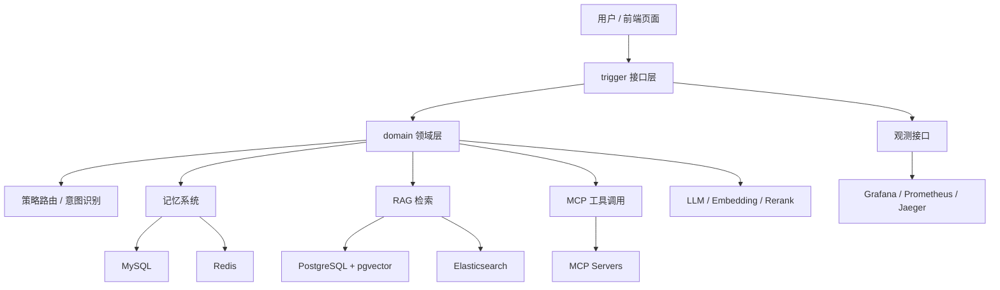
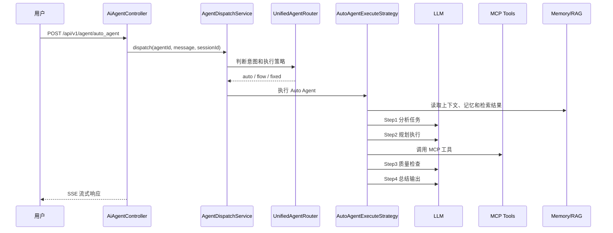
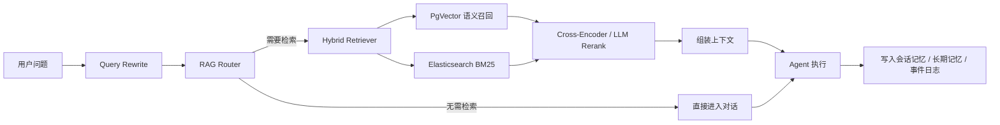

# TAgent

TAgent 是一个基于 Spring Boot + DDD 分层的 AI 智能体学习平台，核心目标是把「模型调用、Agent 编排、MCP 工具、RAG 检索、记忆系统、观测与成本统计」串成一套可以本地运行、可以继续扩展的工程样例。

本仓库是重新整理后的公开版本：已移除日志、临时报告、历史对话、个人文档、备份 SQL、浏览器状态、私有凭据和真实密钥。所有敏感配置都使用环境变量占位符。

## 项目能力

- Auto Agent：自动分析任务、规划步骤、调用工具、质量检查和总结输出。
- Flow Agent：按固定步骤拆解任务，支持 DAG 并行执行。
- RAG 检索：支持 PgVector 语义检索、Elasticsearch BM25、混合检索与 rerank。
- 记忆系统：支持短期会话记忆、长期记忆、情节记忆和工作记忆扩展。
- MCP 工具：支持 SSE 和 stdio 两类 MCP 工具接入。
- 可观测性：支持日志结构化、Prometheus 指标、Grafana 看板、Jaeger Trace。
- 安全增强：包含敏感工具审批、PII 脱敏、输出审核、幂等请求和限流能力。

## 架构总览



## 模块说明

| 模块 | 说明 |
|---|---|
| `ai-agent-station-study-api` | 对外接口、DTO、统一响应对象 |
| `ai-agent-station-study-app` | Spring Boot 启动类、配置、静态页面、MyBatis 映射 |
| `ai-agent-station-study-domain` | Agent 编排、执行策略、RAG、记忆、安全与路由逻辑 |
| `ai-agent-station-study-infrastructure` | 数据访问、Repository、外部存储适配 |
| `ai-agent-station-study-trigger` | HTTP Controller、任务触发、管理接口 |
| `ai-agent-station-study-types` | 通用类型、异常、任务调度基础能力 |
| `docs/dev-ops` | 本地部署、数据库脚本、观测组件和 MCP 配置样例 |
| `mcp-server-hmdp` / `mcp-servers` | MCP 服务示例 |

## Auto Agent 执行流程



## RAG 与记忆链路



## 运行前准备

请先启动外部依赖服务：

- MySQL：默认 `127.0.0.1:13306`
- PostgreSQL + pgvector：默认 `127.0.0.1:15432`
- Redis：默认 `127.0.0.1:16379`
- Elasticsearch：默认 `127.0.0.1:9200`
- Logstash：默认 `127.0.0.1:4560`
- Jaeger OTLP：默认 `127.0.0.1:4318`

敏感信息通过环境变量注入，不要写入仓库：

```bash
LLM_API_KEY=your-llm-key
EMBEDDING_API_KEY=your-embedding-key
OPENAI_API_KEY=your-openai-compatible-key
GITHUB_PERSONAL_ACCESS_TOKEN=your-github-token
GRAFANA_API_KEY=your-grafana-key
CSDN_API_COOKIE=your-csdn-cookie
WEIXIN_API_APP_SECRET=your-weixin-secret
```

## 本地构建

```bash
mvn "-Dmaven.test.skip=true" package
```

说明：项目内包含较多端到端测试和 MCP 验证测试，需要完整外部服务与私有账号环境。普通构建建议跳过测试；需要压测或验收时再单独运行指定测试类。

## 本地启动

```bash
java -jar ai-agent-station-study-app/target/ai-agent-station-study-app.jar
```

默认激活 `dev` 配置，服务端口为 `8099`。

启动后可访问：

- 健康检查：`http://localhost:8099/actuator/health`
- 前端页面：`http://localhost:8099/index.html`
- Agent 配置页：`http://localhost:8099/agent-config.html`
- 观测页：`http://localhost:8099/observe.html`

## 常用接口

### 查询可用 Agent

```http
GET /api/v1/agent/query_available_agents
```

### Auto Agent 流式对话

```http
POST /api/v1/agent/auto_agent
Content-Type: application/json
Accept: text/event-stream
```

```json
{
  "aiAgentId": "3",
  "message": "请总结一下当前系统的核心能力",
  "sessionId": "session_demo_001",
  "maxStep": 5
}
```

响应使用 SSE 格式返回，前端可按 `data:` 行解析 JSON 内容。

## 安全说明

公开仓库中不应包含：

- 真实 API Key、Access Token、Cookie、私钥；
- 本地 `.local-config`、IDE 配置、浏览器状态；
- 运行日志、崩溃日志、压测报告；
- 个人历史对话、面试资料、临时 Markdown；
- 生产或个人数据库备份。

本仓库已经按上述规则清理，后续提交前建议继续执行敏感信息扫描。
