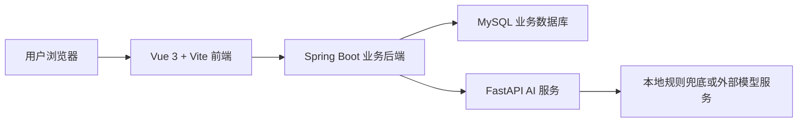

# Agent学习平台

> 面向 AI 应用开发者的一站式学习平台：把学习路线、面试题库、AI 智能刷题、成长体系和建议社区放在同一个可运行的全栈项目里。

[](https://vuejs.org/)
[](https://spring.io/projects/spring-boot)
[](https://fastapi.tiangolo.com/)
[](https://www.typescriptlang.org/)
[](https://www.mysql.com/)
[](LICENSE.md)

## 在线体验

- 在线站点：[https://ai-studyhub.cn](https://ai-studyhub.cn)
- 快速启动：[QUICK_START.md](QUICK_START.md)
- 作者：地球OL初级玩家

如果你正在学习 AI Agent、AI 应用开发、RAG、工具调用、结构化输出或大模型工程化，这个项目可以作为一套可运行、可拆解、可二次开发的学习。

## 项目亮点

| 亮点 | 说明 |
| --- | --- |
| 学习路线沉淀 | 将 AI 应用开发资料、学习顺序、技术背景和路线图整理成可浏览的知识页面。 |
| AI 智能刷题 | 支持题目分类、下一题、重答、AI 评分、AI 追问讨论和历史最高分展示。 |
| 热门面试题库 | 覆盖 AI 通识、Agent 基础、RAG 全链路、向量检索、多智能体、安全评测等方向。 |
| 成长体系 | 通过经验、等级、段位、勋章和刷题记录，让学习过程更有反馈感。 |
| 建议评论社区 | 内置建议区和评论区，方便收集功能建议、体验反馈和内容补充。 |
| 全栈闭环 | Vue 3 前端、Spring Boot 后端、FastAPI AI 服务、MySQL 数据库组合成完整业务链路。 |

## 页面预览

项目采用清新、简约、留白充足的学习产品风格，核心页面包括：

### AI 智能刷题

题目卡片、模型权益、AI 回答、评分结果和追问讨论在同一工作台中完成。


### 首页和项目介绍

用产品化页面承载项目背景、功能介绍和学习方向，适合作为学习平台入口。


### 路线和资料

支持 Markdown 学习路线渲染、目录导航、路线图和资料版本说明。


### 热门面试题

按方向聚合高频面试题，展示重要性分数和真实面试次数。


### 建议评论区

支持建议发布、分类筛选、热门/最新排序和空状态展示。


### 成长体系

展示经验值、练习进度、学习天数、段位和徽章墙，让刷题过程更有反馈。


### 智能刷题记录

沉淀练习记录、题型统计、最高分、最近分和薄弱题分析。


## 功能模块

| 模块 | 当前状态 | 说明 |
| --- | --- | --- |
| 首页 | 已完成 | 展示平台入口、学习内容和核心功能导航。 |
| 学习路线 | 已完成 | 使用前端项目内 Markdown 文件静态渲染学习路线和资料集。 |
| AI 智能刷题 | 已完成 | 支持抽题、回答、AI 评分、流式讨论、历史记录和弱项分析。 |
| 热门面试题 | 已完成 | 支持面试题分类、参考答案、重要性和真实面试次数展示。 |
| 建议评论区 | 已完成 | 支持建议、评论、点赞、排序和登录引导。 |
| 成长体系 | 已完成 | 支持等级、段位、经验、勋章、刷题统计和个人中心。 |
| 管理后台 | 已完成 | 支持用户、题库、兑换码、模型配置和日志级别管理。 |
| AI 服务 | 已完成 | FastAPI 提供答案评分和本题讨论能力，支持本地规则兜底和外部模型配置。 |

## 技术架构



## 技术栈

| 层级 | 技术 |
| --- | --- |
| 前端 | Vue 3、Vite、TypeScript、Pinia、Vue Router、Element Plus、Markdown-It、DOMPurify |
| 后端 | Java 17、Spring Boot、Maven、Spring Security、JWT、Flyway |
| AI 服务 | Python 3.11+、FastAPI、Uvicorn、流式响应、模型服务配置 |
| 数据库 | MySQL 8.4 LTS |
| 文档 | Markdown、迭代文档、中间件说明、验收文档模板 |

## 项目结构

```text
ai_learn_project
├── ai-learn-web       # Vue 3 前端，负责学习平台、刷题、个人中心和管理端页面
├── ai-learn-backend   # Spring Boot 后端，负责认证、题库、互动、成长和管理接口
├── ai-service         # FastAPI AI 服务，负责评分、讨论和模型能力接入
├── doc                # 需求、设计、验收、中间件和功能梳理文档
├── release            # 发布相关产物
└── QUICK_START.md     # 本地启动、环境变量和验收检查说明
```

## 为什么做这个项目

AI 技术迭代很快，很多开发者面对的问题不是“有没有资料”，而是资料太散、路线太乱、练习反馈太少。

这个项目希望把 AI 应用开发的学习路径、面试题、刷题反馈和成长记录集中起来，让普通开发者可以更系统地学习 AI Agent、RAG、工具调用、结构化输出和大模型工程化。

## 后续计划

- 补充更多 AI Agent 实战题和场景题。
- 增强弱项分析和复习提醒能力。
- 为 README 增加真实页面截图和演示动图。
- 优化后台题库导入、题目质量评估和内容维护流程。
- 根据实际使用反馈持续改进学习路线和面试题覆盖范围。


## 支持项目

如果这个项目对你学习 AI 应用开发、准备面试或搭建全栈学习平台有帮助，欢迎点一个 Star。你的 Star 会直接影响这个项目继续完善学习路线、刷题内容和工程化能力的优先级。

## Star 历史

[](https://www.star-history.com/#Earth-OL-Player/ai_learn_project&Date)
