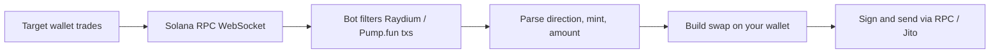

# Solana Copy Trading Bot

A high-performance **Solana copy-trading bot** written in **Rust**. It watches a target wallet’s on-chain activity and mirrors trades on **Raydium** and **Pump.fun** as soon as matching transactions appear.

The bot uses **WebSocket transaction streaming** (Helius-style `transactionSubscribe`) for low-latency detection and can submit copies via **Jito bundles** for faster inclusion.

---

## Table of contents

- [How it works](#how-it-works)
- [Features](#features)
- [Example](#example)
- [Requirements](#requirements)
- [Quick start](#quick-start)
- [Configuration](#configuration)
- [Project structure](#project-structure)
- [How trades are detected](#how-trades-are-detected)
- [Supported venues](#supported-venues)
- [Logging](#logging)
- [Security](#security)
- [Risks and disclaimer](#risks-and-disclaimer)
- [Troubleshooting](#troubleshooting)
- [Contact](#contact)

---

## How it works



1. **Subscribe** — Connect to an RPC WebSocket endpoint that supports `transactionSubscribe` (e.g. [Helius](https://helius.dev)).
2. **Filter** — Only transactions that touch Raydium AMM or Pump.fun program accounts are considered.
3. **Parse** — Extract trade direction (buy/sell), token mint, size, and pool metadata from the target’s transaction.
4. **Mirror** — Execute a proportional swap from **your** wallet using the same venue (Raydium or Pump.fun).
5. **Submit** — Broadcast the signed transaction; optionally route through **Jito** block-engine bundles for priority landing.

---

## Features

| Feature | Description |
|--------|-------------|
| **Real-time streaming** | WebSocket `transactionSubscribe` with `processed` commitment for early detection |
| **Multi-DEX** | Raydium AMM swaps and Pump.fun buy/sell |
| **Target filtering** | Monitors a configurable `TARGET_PUBKEY` |
| **Noise reduction** | Excludes known aggregator/program accounts (e.g. Jupiter) via `accountExclude` |
| **Jito integration** | Optional bundle submission and tip configuration for competitive landing |
| **Structured modules** | Separate `dex`, `engine`, `core`, and `services` layers for maintainability |

---

## Example

**Target wallet**

`GXAtmWucJEQxuL8PtpP13atoFi78eM6c9Cuw9fK9W4na`

**Copy wallet**

`HqbQwVM2fhdYJXqFhBE68zX6mLqCWqEqdgrtf2ePmjRz`

| Role | Transaction |
|------|-------------|
| Target | [View on Solscan](https://solscan.io/tx/2nNc1DsGxGoYWdweZhKQqnngfEjJqDA4zxnHar2S9bsAYP2csbLRgMpUmy68xuG1RaUGV9xb9k7dGdXcjgcmtJUh) |
| Copied | [View on Solscan](https://solscan.io/tx/n2qrk4Xg3gfBBci6CXGKFqcTC8695sgNyzvacPHVaNkiwjWecwvY5WdNKgtgJhoLJfug6QkXQuaZeB5hVazW6ev) |

---

## Requirements

### Software

- **[Rust](https://rustup.rs/)** 1.70+ (edition 2021)
- **Windows**: [Visual Studio Build Tools](https://visualstudio.microsoft.com/downloads/) with the **Desktop development with C++** workload (provides `link.exe` for native dependencies)
- **Linux / macOS**: standard build tools (`build-essential`, Xcode CLI tools)

### Solana / RPC

- A Solana **HTTP RPC** endpoint (`RPC_ENDPOINT`) with good read performance
- A Solana **WebSocket RPC** endpoint (`RPC_WEBSOCKET_ENDPOINT`) that supports **`transactionSubscribe`** (Helius and similar providers)
- A funded **copy wallet** with enough SOL for swaps, ATA creation, and fees (plus Jito tips if enabled)

### Optional

- **[Jito](https://jito.wtf/)** block-engine URL and tip stream URL for bundle-based submission

---

## Quick start

### 1. Clone the repository

```bash
git clone https://github.com/<your-org>/Copy-trading-bot.git
cd Copy-trading-bot
```

### 2. Configure environment

```bash
cp .env.example .env
```

Edit `.env` with your RPC URLs, target wallet, slippage, and Jito settings. See [Configuration](#configuration) for every variable.

### 3. Add your wallet key

The bot loads the signing keypair from **`key.txt`** in the project root (Base58-encoded secret key, one line, no quotes):

```text
your_base58_private_key_here
```

> **Never commit `key.txt` or `.env`.** Both are ignored by `.gitignore` for `.env`; ensure `key.txt` is also kept local-only.

### 4. Build and run

```bash
cargo build --release
cargo run --release
```

On success you should see a startup log line similar to:

```text
---------------------   Copy-trading-bot start!!!  ------------------
```

---

## Configuration

Copy `.env.example` to `.env` and set the values below.

| Variable | Required | Description |
|----------|----------|-------------|
| `RPC_ENDPOINT` | Yes | HTTP Solana RPC URL (e.g. `https://mainnet.helius-rpc.com/?api-key=...`) |
| `RPC_WEBSOCKET_ENDPOINT` | Yes | WebSocket URL for `transactionSubscribe` |
| `TARGET_PUBKEY` | Yes | Public key of the wallet whose trades you want to copy |
| `JUP_PUBKEY` | Yes | Ac