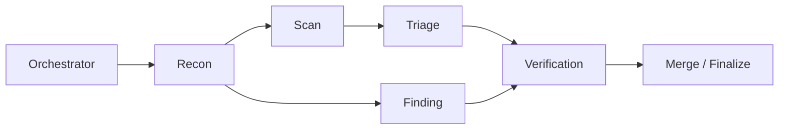

<div align="center">

# AutoCVE - 一键挖掘 CVE，筛项目、审源码、验漏洞、出报告，全流程自动化


[](https://www.gnu.org/licenses/agpl-3.0)
[](https://www.python.org/)
[](https://fastapi.tiangolo.com/)
[](https://react.dev/)
[](https://www.postgresql.org/)

<br>

<p align="center">
  
</p>

[📚 项目文档](#-项目文档) ·
[✨ 核心能力](#-核心能力) ·
[🚀 快速开始](#-快速开始) ·
[🏆 CVE 成果](#-cve-挖掘成果)

<p>
  <strong>简体中文</strong> | <a href="./README_EN.md">English</a>
</p>

</div>

---

## 📚 项目文档

### 📖 [用户使用手册](./docs/USER_GUIDE.md)

涵盖环境部署、模型配置、项目导入、Agent 审计、一键 CVE、漏洞管理和 Skills 管理完整使用说明，并提供各功能界面预览。

### 🏗️ [架构设计文档](./docs/ARCHITECTURE_DESIGN.md)

介绍 AutoCVE 的整体架构、Agent 工作流、工具编排、权限保护、Agent Runtime 以及 ReAct Loop 状态机设计。

### 🔌 [接口文档](./docs/API_DOCUMENTATION.md)

提供后端 API、数据结构、请求参数及接口调试说明。

---

## ✨ 核心能力

### 🚀 一键完成 CVE 挖掘

实现从项目筛选、仓库导入、审计任务创建、Agent 漏洞挖掘到 CVE 申报报告生成的全流程自动化。用户仅需复制报告内容并提交，即可完成后续 CVE 申请。

### 🤖 Multi-Agent 协同审计

通过 Orchestrator 统一调度 Recon、Scan、Triage、Finding 和 Verification 等 Agent，协同完成信息收集、工具扫描、误报过滤、漏洞深挖与动态验证。



### 🧩 三种审计模式

根据不同审计目标灵活选择增强扫描、智能审计或综合审计，兼顾扫描效率、挖掘深度与审计覆盖范围。

|     审计模式    |         核心 Agent        | 适用场景                        |
| :---------: | :---------------------: | :-------------------------- |
|  ⚡ **增强扫描** |      Scan → Triage      | 快速分析工具扫描结果并过滤误报             |
| 🧠 **智能审计** |         Finding         | 深度挖掘高价值漏洞，适用于 CVE 和 0Day 研究 |
| 🔍 **综合审计** | Scan → Triage + Finding | 融合工具扫描与源码分析，开展全量审计          |

### 🎯 面向 CVE 挖掘的专用 Agent

Finding Agent 是 AutoCVE 的核心审计能力，专为 CVE 挖掘场景设计。它可直接分析项目源码，并结合 ReAct Loop、专项工具调用、Nudge 纠偏及 `FinalizeFinding` 结构化终止机制，最终产出符合 CVE 申报条件的高价值漏洞。

<details>
<summary><strong>💬 交互式审计与全过程追踪</strong></summary>

<br>

* **支持用户交互**：将完整审计过程作为会话上下文，用户可围绕审计结果继续追问，让 Agent 补充证据、解释攻击链、完善复现步骤或扩展漏洞分析。
* **可视化审计追踪**：集中展示活动日志、Agent Tree、工具调用、阶段进度、初步报告和审计会话，方便复盘每次审计的执行路径与关键过程。

</details>

<details>
<summary><strong>🗂️ 智能漏洞管理与 Skills 扩展</strong></summary>

<br>

* **智能化漏洞管理**：审计发现的漏洞由 Agent 调用工具自动提交，经过去重后以结构化形式入库，并在漏洞管理模块中统一维护。
* **专属 Skills 配置**：支持根据实际需求为不同 Agent 配置专属 Skills，灵活扩展各 Agent 的能力边界。

</details>

---

## 🚀 快速开始

### ⚡ 一行命令部署

无需克隆仓库，一行命令即可启动：

Linux / macOS / Git Bash :

```bash
curl -fsSL https://raw.githubusercontent.com/larlarua/AutoCVE/v1.0.4/docker-compose.prod.yml \
  | docker compose -f - up -d
```
Windows PowerShell / CMD :
```bash
curl.exe -fsSL https://raw.githubusercontent.com/larlarua/AutoCVE/v1.0.4/docker-compose.prod.yml | docker compose -f - up -d
```

### 🛠️ 源码部署

适用于本地开发、功能调试或二次开发：

```bash
git clone https://github.com/larlarua/AutoCVE.git
cd AutoCVE
docker compose up -d --build
```

### 🌐 服务访问

服务启动完成后，可通过以下地址访问：

| 服务          | 访问地址                       | 用途           |
| :---------- | :------------------------- | :----------- |
| 🖥️ 前端      | http://localhost:3000      | AutoCVE 用户界面 |
| ⚙️ 后端 API   | http://localhost:8000      | 后端接口服务       |
| 📘 Swagger  | http://localhost:8000/docs | API 文档与接口调试  |
| 🗄️ Adminer | http://localhost:8080      | 数据库管理        |

> [!TIP]
> **快速体验完整审计流程**
>
> 配置模型 → 导入项目 → 创建审计任务 → 跟踪实时审计 → 管理漏洞 → 编辑或导出报告

---

## 🏆 CVE 挖掘成果

<p align="left">
  
  
  
  
</p>

> [!NOTE]
> AutoCVE 在为期一周的测试中，共发现并提交了 **30 个安全漏洞**，覆盖 **14 个开源项目**。
>
> 点击表格中的 CVE 编号可查看官方记录，完整漏洞报告收录于
> **[larlarua/vulnerability-reports](https://github.com/larlarua/vulnerability-reports/)**。

<details open>
<summary><strong>🔍 查看 CVE 成果明细（30）</strong></summary>

<br>

| CVE 编号 | 项目 | 项目热度 | 漏洞类型 | CVSS | 漏洞内容 |
|:---:|:---:|:---:|:---:|:----:|:----:|
| [CVE-2026-40904](https://www.cve.org/CVERecord?id=CVE-2026-40904) |  Chartbrew  |      | Improper Access Control | **8.1** | [查看详情](https://github.com/larlarua/vulnerability-reports/blob/main/CVE-2026-40904/detail_en.md) |
| [CVE-2026-40603](https://www.cve.org/CVERecord?id=CVE-2026-40603) |  Chartbrew  |   ![Stars](https://img.shields.io