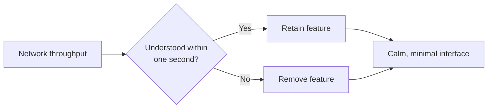

<div align="center">

### flow

*A terminal dashboard for real-time network throughput.*


<h3 align="center">
  Featured on&nbsp;&nbsp;<a href="https://terminaltrove.com/flow"></a>
</h3>

<p align="center">
  <a href="https://git.io/typing-svg">
    
  </a>
</p>

<p align="center">
  <i>Fast • Beautiful • Cross-Platform • Open Source</i>
</p>

</div>

<p align="center">
  <a href="https://github.com/programmersd21/flow/actions">
    
  </a>
  <a href="https://github.com/programmersd21/flow/releases">
    
  </a>
  <a href="https://github.com/programmersd21/flow/releases">
    
  </a>
  <a href="https://github.com/programmersd21/flow/stargazers">
    
  </a>
</p>

<p align="center">
  <a href="https://github.com/programmersd21/flow">
    
  </a>
  <a href="https://github.com/programmersd21/flow/blob/main/LICENSE">
    
  </a>
  <a href="https://github.com/programmersd21/homebrew-flow">
    
  </a>
  <a href="https://aur.archlinux.org/packages/flow-network-monitor-bin">
    
  </a>
  <a href="https://aur.archlinux.org/packages/flow-network-monitor-bin">
    
  </a>
</p>

## Contents

- [Install](#install)
- [Rationale](#rationale)
- [Philosophy](#philosophy)
- [Modes](#modes)
- [Features](#features)
- [Usage](#usage)
- [Configuration](#configuration)
- [Architecture](#architecture)
- [Development](#development)
- [Star History](#star-history)
- [License](#license)

## Install

### Arch Linux (AUR)

```sh
yay -S flow-network-monitor-bin
```

> 💝 Thanks to [@Dominiquini](https://github.com/Dominiquini) for helping bring Flow to the AUR!

### Homebrew:

```sh
brew install programmersd21/flow/flow
```

### Go:

```sh
go install github.com/programmersd21/flow/cmd/flow@latest
```

### From source:

```sh
git clone https://github.com/programmersd21/flow
cd flow
make install
```

Pre-built binaries for Linux, macOS, and Windows (amd64 and arm64) are available on the [releases page](https://github.com/programmersd21/flow/releases).

## Rationale

Most network monitors display CPU usage, per-process breakdowns, packet counts, and connection tables. flow displays throughput only.

| btop | flow |
|:---:|:---:|
|  |  |
| CPU, memory, disks, processes, network | throughput only |

Every feature decision is evaluated against a single question: does this help the user understand their network within one second. If not, it is not included.

The result is a small, deliberately scoped tool. There are no additional panels, no required configuration, and no unnecessary complexity in either the interface or the underlying implementation.

## Philosophy



Every feature is evaluated against one question: does this help a user understand 