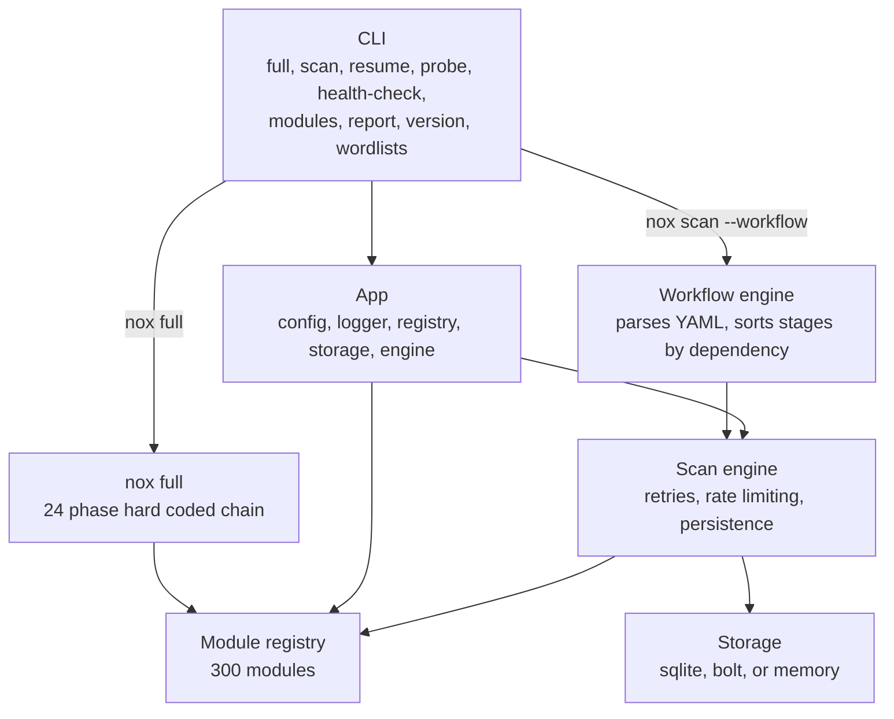

NOX is a modular, Go based attack surface management and vulnerability scanning framework. It ships with 300 built in modules covering OSINT, subdomain enumeration, DNS, port scanning, web fingerprinting, and deep active vulnerability testing across injection, authentication, authorization, client side, cloud, API, and business logic vulnerability classes.

> Authorization notice. NOX performs real network requests against the systems you point it at. Only run active or deep scans against systems you own or have explicit written authorization to test. Unauthorized testing is illegal.

## Contents

1. [What NOX does](#1-what-nox-does)
2. [Architecture at a glance](#2-architecture-at-a-glance)
3. [Install](#3-install)
4. [Quick start](#4-quick-start)
5. [Commands](#5-commands)
6. [The 300 modules](#6-the-300-modules)
7. [Configuration](#7-configuration)
8. [Documentation](#8-documentation)
9. [Development](#9-development)

---

## 1. What NOX does

NOX gives you three ways to run a scan, depending on how much control you want:

- **`nox full <domain>`** runs all 300 modules in a fixed, sensible order, with live progress in the terminal. One command, no setup.
- **`nox scan --workflow <file>`** runs a YAML workflow: your own stage graph, with parallel stages, dependencies, retries, and checkpoints, so it can resume after an interruption.
- **`nox probe`** runs just the HTTP prober, directly, for a fast liveness and technology check on a list of hosts.

Every module implements the same Go interface, so it works the same way no matter which command runs it. See [docs/architecture](docs/architecture/README.md) for the full design.

## 2. Architecture at a glance



`nox full` and `nox scan --workflow workflows/full.yaml` run the same 300 modules, in the same 24 phase order. See [docs/modules](docs/modules/README.md) for the complete phase by phase module list and diagram.

## 3. Install

NOX is written in Go and requires Go 1.25 or newer, plus CGO enabled for the default SQLite storage backend.

```sh
git clone https://github.com/kernelstub/nox.git
cd nox
./scripts/build.sh
```

This produces a `nox` binary in `dist/`. To install it into `$GOPATH/bin` instead:

```sh
./scripts/build.sh --output "$(go env GOPATH)/bin/nox"
```

Other useful scripts:

```sh
./scripts/install-deps.sh   # install external tools NOX modules shell out to (nuclei, nmap, chromium, ...)
./scripts/release.sh        # cross compile + archive for Linux, macOS (amd64 and arm64), and Windows, into dist/release/
```

`go test ./...`, `go vet ./...`, and `gofmt` cover testing/linting; there's no wrapper script for those. A `Dockerfile` and `docker-compose.yml` are also provided if you prefer to run NOX in a container (`docker build -t nox .`).

## 4. Quick start

```sh
# See every command, grouped and boxed.
nox --help

# A safe, read only pass: OSINT, subdomains, and web fingerprinting only.
nox scan --workflow workflows/passive.yaml --target example.com

# A fast three stage check: subdomains, HTTP probe, TLS.
nox scan --workflow workflows/quick.yaml --target example.com

# Everything NOX has, in real world order. Requires authorization.
nox full example.com --mode active --output ./results

# Just check which hosts are alive.
nox probe -l targets.txt --threads 50 --json
```

Every module can also run on its own:

```sh
nox modules list
nox modules run whois --target example.com
```

See [docs/scans/recipes.md](docs/scans/recipes.md) for a longer list of ready to use commands, including deep scans, full coverage scans, subdomain focused runs, JSON output, and distributed scanning.

## 5. Commands

| Command | Purpose |
|---|---|
| `nox full <domain>` | Run all 300 modules in a fixed, real world order. |
| `nox scan` | Run a scan directly, or through a workflow YAML file with `--workflow`. Supports `--baseline <scan-id>` to diff against a previous run. |
| `nox resume` | Resume a previously paused or failed scan by scan ID. |
| `nox probe` | Fast, standalone HTTP prober, similar to `httpx`. |
| `nox schedule` | Manage recurring scans via the system crontab — no background daemon required. |
| `nox modules list` / `nox modules run` | List or run individual modules. |
| `nox health-check`