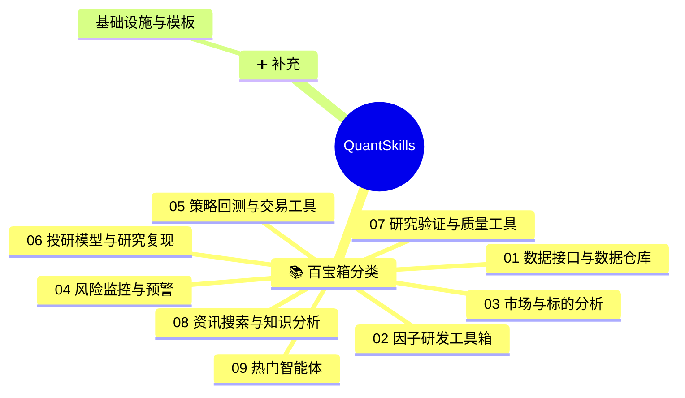

<!-- 本文件由 scripts/build.mjs 自动生成，请勿手工编辑。Generated file — do not edit by hand. -->
# 🧭 quantskills
> QuantSkills 组织全景导航 · 量化技能 / 因子 / Agent 一站式可点击索引，图文并茂。

**简体中文** | [English](README.en.md)

   

**QUANTSKILLS** 是 AI Agent 时代的开放量化社区，聚焦 **Quant Skills（量化技能）** 与 **Agents（智能体）** 两类资产。由 [PandaAI](https://www.pandaaiquant.com/) 发起，帮助量化开发者把交易经验、研究方法、因子模型与策略代码，转化为**可检索、可安装、可验证、可分享**的标准化资产。

> 把你的量化经验，变成人类可以信任、AI Agent 可以调用的 Skill。

## 🗺️ 全景总览

## 📑 目录
- [01 数据接口与数据仓库](#cat-01)
- [02 因子研发工具箱](#cat-02)
- [03 市场与标的分析](#cat-03)
- [04 风险监控与预警](#cat-04)
- [05 策略回测与交易工具](#cat-05)
- [06 投研模型与研究复现](#cat-06)
- [07 研究验证与质量工具](#cat-07)
- [08 资讯搜索与知识分析](#cat-08)
- [09 热门智能体](#cat-09)
- [🧱 基础设施与模板](#infra)

## 01 数据接口与数据仓库

| 项目 | 说明 | 截图 |
|---|---|---|
| [skill-us-sec-edgar-harvester](https://github.com/quantskills/skill-us-sec-edgar-harvester) | 抓取并结构化美股 SEC EDGAR 公开文件（8-K/Form 4/13D-G/13F/S-1），去重、标注来源与时间线。 | — |
| [skill-pandadata-warehouse](https://github.com/quantskills/skill-pandadata-warehouse) | Pandadata 本地数据仓库：用 DuckDB 与 Parquet 缓存、增量刷新、查询和校验行情数据，减少重复 API 调用。 |  |
| [skill-pandadata-api](https://github.com/quantskills/skill-pandadata-api) | 把自然语言数据需求，精准路由到正确的 pandadata API，并生成可直接运行的 Python 调用。 | — |

## 02 因子研发工具箱

| 项目 | 说明 | 截图 |
|---|---|---|
| [skill-residual-guided-factor-selection](https://github.com/quantskills/skill-residual-guided-factor-selection) | Select complementary quantitative factors by fitting fixed-parameter Ridge models on a base factor set, ranking candidates against in-sample training... | — |
| [skill-factor-ranking-sage](https://github.com/quantskills/skill-factor-ranking-sage) | Rank and select quantitative model factors from local factor and label CSV files with regression mRMR using F-statistic relevance and Pearson redundancy, or... | — |
| [skill-templeton-global-contrarian](https://github.com/quantskills/skill-templeton-global-contrarian) | 邓普顿逆向全球价值因子，A股/港股/美股跨市场估值偏离度筛选 | — |
| [skill-factor-idea-generation](https://github.com/quantskills/skill-factor-idea-generation) | Generate initial stock alpha ideas with economic rationale and concrete factor shapes, defaulting to daily OHLCV when no fields are specified. | — |
| [skill-alpha-ncav-graham](https://github.com/quantskills/skill-alpha-ncav-graham) | Graham NCAV 净流动资产折价因子技能。A股深度价值筛选，排除金融股，计算 NCAV 折价并生成 buy/sell/hold 信号。 | — |
| [skill-quant-factor-volume-stat-alpha](https://github.com/quantskills/skill-quant-factor-volume-stat-alpha) | 量能、量价和统计排序类因子库：216 个独立 OHLCV 因子 Skill，真实行情验证 216/216 全部通过。 |  |
| [skill-quant-factor-skill-factory](https://github.com/quantskills/skill-quant-factor-skill-factory) | 不是因子库本身，而是继续生产因子库的工具：批量生成、验证和打包框架中立的 OHLCV 量化因子 Skill。 |  |
| [skill-quant-factor-risk-pattern-alpha](https://github.com/quantskills/skill-quant-factor-risk-pattern-alpha) | 风险状态与形态类因子库：288 个独立 OHLCV 因子 Skill，真实行情验证 288/288 全部通过。 |  |
| [skill-quant-factor-directional-alpha](https://github.com/quantskills/skill-quant-factor-directional-alpha) | 方向类因子库：296 个独立 OHLCV 因子 Skill，真实行情验证 296/296 全部通过。 |  |
| [skill-overseas-equity-factor-miner](https://github.com/quantskills/skill-overseas-equity-factor-miner) | 在港美股上发现并校验横截面 alpha 因子：生成候选、计算、按 IC/衰减/换手排名。 | — |
| [skill-ic-analysis](https://github.com/quantskills/skill-ic-analysis) | 不是评分系统，而是IC 多维诊断 Skill：双 IC 对照 + I