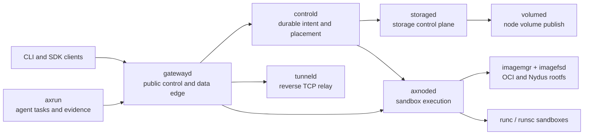

# Axern

[](https://github.com/cofy-x/axern/actions/workflows/ci.yml)
[](https://github.com/cofy-x/axern/actions/workflows/axrun-ci.yml)
[](./LICENSE)

[Documentation](https://axern.cofy-x.space) · [Quickstart](https://axern.cofy-x.space/getting-started/) · [SDKs](https://axern.cofy-x.space/sdk/)

Axern is an open-source sandbox platform for AI agents. It isolates untrusted
agent-generated code with runsc and runs trusted long-lived services with runc
through one resource and lifecycle model.

The CLI and Go, Python, and TypeScript SDKs expose the same public APIs for
environments, processes, files, services, storage, tunnels, lifecycle state,
and task evidence. The control plane, gateway, node runtime, and agent harness
share identity, lease, cleanup, and observability contracts.

> **Project status:** Axern is pre-1.0 and under active development. It is
> suitable for evaluation and contribution, but operators should review the
> security and production boundaries before deploying multi-tenant workloads.

## What You Can Build

- **Agent Sandbox:** execute agent-generated code behind a runsc isolation
  boundary while retaining process, file, terminal, and output APIs.
- **Durable Service:** run trusted, performance-sensitive processes with runc
  while the control plane owns replicas, health, storage, and rollouts.
- **Reproducible agent execution:** use Axrun to coordinate immutable tasks,
  verification, trajectories, usage, and typed artifacts.

## Local Quickstart

The supported local path runs the complete stack with Docker Compose without a
source checkout. It needs only the `axern` CLI and Docker Compose v2.

```bash
brew install cofy-x/tap/axern
```

Without Homebrew, use the standalone checksummed installer:

```bash
curl -fsSL https://raw.githubusercontent.com/cofy-x/axern/main/install.sh | sh
```

Then start Axern and run the first workload:

```bash
axern local up
axern run python:3.12-slim -- python -c 'print("hello from axern")'
```

`local up` starts PostgreSQL, MinIO, the control and node services, waits for
readiness, and creates the `local` context. It does not require Make, Helm,
`kubectl`, Go, Rust, Python, or Node.js.

Use the generated local CLI context:

```bash
axern context current
axern run list
```

Inspect or remove the environment:

```bash
axern local status
axern local down
```

The local environment uses generated development credentials and loopback
listeners. Do not reuse them in a shared or production deployment.

Source development is a separate contributor path. It builds the current
checkout into local `:dev` images and exercises the same public contract:

```bash
make quickstart-source
```

For local Helm development, build the images with `make local-images-build`
and pass
[`values-local-development.yaml`](./deploy/helm/axern/values-local-development.yaml)
to the chart. Provider and regional values stay outside this repository.

## Why Axern

- **Sandbox as the primitive:** runs, services, functions, coding workspaces,
  and agent tasks compose the same execution and lifecycle APIs.
- **Durable control plane:** PostgreSQL-backed intent, placement, leases,
  retries, health, cleanup, and storage state remain authoritative across
  process or node restarts.
- **Runtime choice behind one model:** runc and runsc workloads use the same
  public APIs; OCI and Nydus image paths converge at the node runtime. The
  resource model remains independent of a single sandbox backend.
- **Real data-plane access:** process streams, files, archives, HTTP services,
  SSH-compatible terminals, and reverse TCP tunnels are explicit capabilities.
- **Agent execution with evidence:** Axrun runs external agent bundles, verifies
  results, records trajectories and usage, and preserves typed artifacts.
- **Local-to-cluster continuity:** Docker Compose, kind, and the cloud-neutral
  Helm chart exercise the same service boundaries.

## Architecture



`controld` is the authority for product state. `gatewayd` resolves and forwards
public traffic without owning placement. Node services own host-local runtime,
image, network, and volume operations. See the
[runtime architecture](./docs/architectur