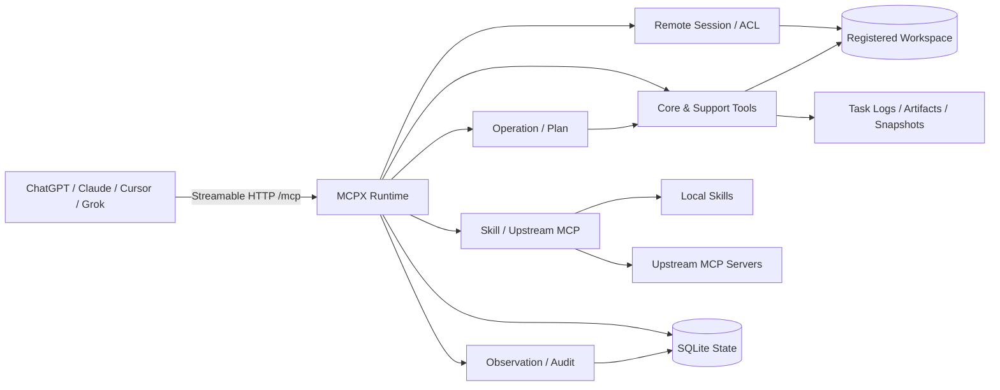

# MCPX

MCPX 是运行在本地开发环境中的 MCP Runtime（网关）。它通过
Streamable HTTP 把本地 Workspace、源码、变更、命令、任务、环境和扩展能力
安全地提供给 ChatGPT、Claude、Cursor、Grok 等 MCP 客户端。

MCPX 的重点不是增加一个聊天界面，而是提供一套可审计、可恢复、对模型友好
的开发工具协议：客户端可以跨连接恢复同一个 Remote Session，模型可以用文件 SHA、
Edit ID、Task ID 和能力版本避免重复读取和无效重试；Skill/MCP 的 revision 与 schema 一致性由 Runtime 内部管理。

## 能力概览

| 能力 | 说明 |
| --- | --- |
| Remote Session | 持久化 Workspace 会话、角色权限、事件、接力和跨客户端恢复 |
| Workspace | 注册多个项目，并在创建会话时显式绑定项目根目录 |
| Source | 文件窗口、批量读取、搜索、文件列表和有界上下文；返回 SHA-256 与编码/换行元数据 |
| Edit | 精确 replacement、批量变更、原子写、SHA 校验和格式保留 |
| Terminal | 执行命令或项目 Task；短命令内联返回，长命令持久化为 Task |
| Operation | 并行或有依赖地执行多个公开工具，并统一等待、分页、取消和恢复 |
| Project Task | 从项目配置中发现测试、构建和检查任务，并解析诊断信息 |
| Workspace State | 读取 Git 状态、快照、差异、监听结果和项目记忆 |
| Environment | 查看操作系统、架构、Shell、容器、资源、文件系统和工具链 |
| Extension | Session 建立时曝光 compact inventory，并通过统一 `skill_tool` / `mcp_tool` 按需 list、describe、call |
| Artifact | 注册、列出和分页读取测试报告、构建产物、覆盖率和日志 |
| Screenshot | 截取显示器或屏幕区域，并通过 MCP ImageContent 返回 |
| Security | OAuth、Bearer、Remote Session ACL、命令/文件策略和语义确认 |
| Observation | 通过本机 Socket 观察工具调用、Task、Edit 和操作事件 |

## 架构



MCPX 把客户端连接、持久化 Remote Session、Workspace 能力、执行编排和扩展发现放在同一个
Runtime 边界内；所有有状态操作都绑定 `remote_session_id`，并通过 SQLite、Task 日志、Artifact
与 Observation 保留可恢复和可审计的执行状态。

## 公开工具

`tools/list` 是工具名称、描述、参数 Schema 和 Annotation 的唯一权威来源。
当前公开工具共 19 个，分为 12 个 core tools 和 7 个 support tools：

| 领域 | 工具 | 主要用途 |
| --- | --- | --- |
| Core | `workspace` | 零参数列出已注册 Workspace，供建立会话前选择 |
| Core | `session` | 创建、恢复或关闭 Remote Session；省略 action 默认 open/resume |
| Core | `read` | 读取、搜索、列举或组装 Workspace 源码上下文；环境事实使用 `environment_read` |
| Core | `edit` | 创建、更新或重命名 Workspace 文件；使用 SHA revision guard 和幂等语义，不提供删除 |
| Core | `move_out` | `prepare` 冻结明确的文件/目录/symlink manifest；用户确认后 `submit` 仅携带 `confirmation_uuid` |
| Core | `observe` | 查看 session、Execution Task、Plan Task、history 或 logs；Workspace 静态内容使用 `read` |
| Core | `progress` | 发布有业务意义的用户可见里程碑、等待、阻塞或失败状态 |
| Core | `execute` | 按策略执行命令或项目 Task，以及 attach、stop、stdin |
| Core | `plan` | create、read、advance、complete、block、replan、deliver 持久化计划 |
| Core | `artifact` | 产物登记、列表和分片读取 |
| Core | `skill_tool` | Skill 生命周期唯一入口：`list`、`describe`、`call`；Runtime 内部管理 revision |
| Core | `mcp_tool` | MCP Server/Tool 唯一入口：`list`、`describe`、`call`；Runtime 内部管理 schema revision |
| Support | `operation_batch` | 并发或按依赖 DAG 执行多个公开工具操作 |
| Support | `operation_manage` | 查询、等待、读取结果、取消和恢复异步 Operation |
| Support | `runtime_read` | 读取运行时能力、项目摘要或适用指令 |
| Support | `environment_read` | 读取当前主机/工具链环境或比较已保存快照 |
| Support | `environment` | 保存当前环境快照 |
| Support | `screenshot_capture` | 按明确 purpose 截取显示器或屏幕区域 |
| Support | `secret_provide` | 按明确 purpose 提供仅驻留内存的 Secret |

`workspace` 和 `session` 负责发现 Workspace 与建立/恢复会话；进入 Workspace 后，源码变更、命令、
Plan、Artifact 等有状态操作都以服务端返回的完整 `remote_session_id` 为关联主键。`runtime_read`、
`environment_read` 等读取型支持工具在参数足够时也可独立读取运行时或环境事实。

## 设计边界

MCPX 同时处理两类 Session：

| 标识 | 生命周期 | 用途 |
| --- | --- | --- |
| `Mcp-Session-Id` | Streamable HTTP 传输层临时标识 | 连接和协议状态，重连或换客户端后可能变化 |
| `remote_session_id` | SQLite 持久化业务标识 | Workspace、角色、Edit、Task、Plan、操作、快照和产物的主键 |

客户端应始终原样保存并复用服务端返回的 `remote_session_id`、`edit_id`、`plan_id`、
`plan_task_id`、`execution_task_id`、`operation_id` 和 `artifact_id`，不能自行缩写、猜测或从历史日志重建这些标识。
Skill/MCP 的 revision token 不再公开给模型；`describe` 与 `call` 之间的一致性由 Runtime 重新校验。
Plan Task 与执行 Task 是不同命名空间，不存在兼容的通用 `task_id` 字段。

MCPX 只提供 Streamable HTTP 的 `/mcp` 端点，不提供旧版 HTTP+SSE 的 `/sse`
或 `/message` 兼容端点。

## 部署教程

- [FRP + Caddy 原生部署：公网暴露 MCPX（非 Docker）](docs/frp-caddy-native.md)
- [FRP + Caddy + Docker Compose：公网暴露 MCPX（MCPX 保持原生运行）](docs/frp-caddy-docker-compose.md)

两篇教程都保持 MCPX 原生运行，保留对本地 Workspace、工具链、桌面和扩展能力的访问。原生版直接运行 Caddy/frps/frpc；Docker Compose 版只容器化 Caddy/frps/frpc。两篇文档均包含 OpenAI / ChatGPT Remote MCP 配置示例与截图。

## 快速开始

### 环境要求

- Go 1.26.1 或更高版本，具体版本以 `go.mod` 为准。
- 一个需要被 MCPX 管理的本地项目目录。
- 远程访问时需要 HTTPS 反向代理或其他受信任的网络入口。

### 从源码构建

```bash
git clone https://github.com/opentokenz/mcpx.git
cd mcpx
go build -o bin/mcpx ./cmd/mcpx-server
```

本地静态构建可以关闭 CGO：

```bash
CGO_ENABLED=0 go build -o bin/mcpx ./cmd/mcpx-server
```

普通 VCS 构建会从 Go build info 回填当前 Git revision（工作树有未提交变更时带 `-dirty`）；
正式发布仍以 GoReleaser 的 linker flags 为权威来源，同时注入版本、commit 和真实 build time。
CI 会构建带 provenance 的二进制并通过 `mcpx -version` 校验 commit/date 未丢失。

### 启动服务

前台运行：

```b