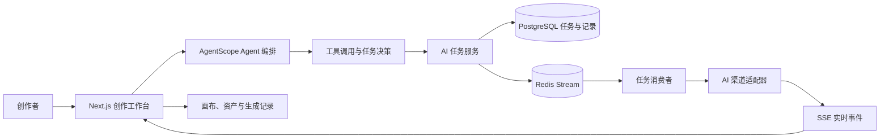

<b>简体中文</b> · <a href="README.en.md">English</a>

  

<h1 align="center">Novanova Studio</h1>

  AI Agent 驱动的视觉创作工作台：在一个持续保留上下文的空间里完成构思、生成、编辑、编排与沉淀。

  <a href="https://www.novanovastudio.cn/">>>>>如果觉得部署麻烦、找便宜渠道麻烦->点我在线体验<<<<<</a>

  

  

  

## 联系我
- 商业授权
- 技术支持

<table align="center">
  <thead>
    <tr>
      <th align="center">联系作者</th>
      <th align="center">加入交流群</th>
    </tr>
  </thead>
  <tbody>
    <tr>
      <td align="center" width="33%">
        
      </td>
      <td align="center" width="33%">
        
      </td>
    </tr>
  </tbody>
</table>

## ✨ 项目定位

Novanova Studio 是面向独立创作者与视觉团队的 AI 创作工作台。它不是把图片、视频、提示词和生成记录拆散在多个工具中的集合，而是以**无限画布**作为创作上下文，以 **AI Agent** 作为理解意图、选择工具和推进任务的中枢。

创作者可以从一句自然语言目标或一组参考素材开始，在图片、视频和画布场景中持续对话、生成、编辑、比较与复用结果；生成记录、资产、提示词和画布节点会保留在同一条创作链路中。

## 🧠 Agent 贯穿创作链路

Agent 不是单独的聊天窗口，也不是一次性转发模型请求的接口。它贯穿从意图理解到结果沉淀的完整流程：

| 阶段 | Agent 与系统职责 | 创作体验 |
| --- | --- | --- |
| 1. 输入目标 | 接收自然语言、图片或视频参考素材，按图片、视频或画布场景选择对应 Agent Profile（能力配置）。 | 从一句描述或已有素材开始。 |
| 2. 选择工具 | 根据上下文调用图片生成、图片编辑、视频生成、视频编辑、历史查询或画布操作工具。 | 不必在多个功能页之间反复切换。 |
| 3. 创建任务 | 校验模型能力与积分，写入 PostgreSQL 任务快照，并投递到 Redis Stream（Redis 的持久消息流）消费组。 | 长耗时生成不会阻塞当前创作。 |
| 4. 执行与反馈 | 任务消费者调用已配置的 AI 渠道；状态、工具调用和结果通过 SSE（Server-Sent Events，服务端推送事件流）推送回前端。 | 在对话和画布中看到实时进度、失败或取消状态。 |
| 5. 沉淀上下文 | 生成结果写入生成记录，可在画布中继续引用，并按需加入资产库；画布 Agent 可继续引用节点状态与工具结果。 | 下一轮修改和复用保留前一轮创作上下文。 |

### Agent 能力

| 场景 | Agent 能力 | 结果去向 |
| --- | --- | --- |
| 图片创作 | 根据对话调用图片生成、参考图编辑与历史查询工具。 | 对话轮次、生成记录与画布图片节点；可按需加入资产库。 |
| 视频创作 | 调用视频生成、视频编辑与历史查询工具，并按模型能力校验图片或视频参考。 | 对话轮次、生成记录与画布视频节点；可按需加入资产库。 |
| 无限画布 | 读取当前画布状态，创建、更新、移动、缩放、删除和连接节点；可创建文本、图片、视频生成流并启动任务。 | 可继续编辑的画布项目与节点关系。 |
| 提示词优化 | 图片和视频使用独立策略优化提示词，优化成功后再回填输入内容。 | 当前创作输入，不覆盖失败前的原始提示词。 |
| 实时协作 | 前端画布工具执行后把工具结果回传给服务端 Agent，Agent 可基于真实执行结果继续下一轮。 | 保持“对话 -> 工具 -> 结果 -> 继续对话”的连续体验。 |

## 🎨 核心功能

- **无限画布**：把文字、图片、视频、参考素材和生成结果放到同一空间编排，保留创作上下文。
- **对话式图片与视频生成**：在同一会话中完成生成、编辑、引用历史结果和继续迭代。
- **多渠道模型配置**：在“配置与用户偏好”中维护 AI 渠道、模型能力、默认模型和积分消耗规则。
- **素材与生成记录**：保存可复用资产、生成历史和提示词，减少重复上传与重复配置。
- **对象存储接入**：支持腾讯云 COS、阿里云 OSS、七牛云 Kodo，用于上传素材与保存生成结果。
- **用户与运营能力**：邮箱登录、OAuth2 登录、积分、通知、提示词库、首页展示和管理员后台。
- **异步任务机制**：Redis Stream 消费组、任务锁、失败恢复与 SSE 事件流支撑可追踪的长耗时任务。

## 🤖 支持的模型与渠道

项目通过渠道的 `apiFormat`（接口调用格式）选择对应适配器，模型名称由管理员从渠道同步后配置，不维护固定的全量模型白名单。因此，除下表明确写出的专用模型外，只要模型实现对应渠道协议和接口，就可以加入相应的图片、视频或 Chat 模型目录；最终可用范围仍取决于渠道账号实际开通的模型。

### 渠道能力矩阵

| 渠道格式 | 生成图片 | 生成视频 | Chat / 主 Agent | 默认 Base URL | 说明 |
| --- | --- | --- | --- | --- | --- |
| OpenAI 兼容（`openai`） | ✅ | ✅ | ✅ | `https://api.openai.com/v1` | 支持 OpenAI 官方服务及实现相同接口协议的兼容渠道。 |
| Evolink（`evolink`） | ❌ | ✅ | ❌ | `https://api.evolink.ai/v1` | 使用 Evolink 自有异步视频生成接口，模型需手动配置。 |
| Gemini（`gemini`） | ✅ | ❌ | ✅ | `https://generativelanguage.googleapis.com/v1beta` | 使用 Gemini 原生 `generateContent` 接口。 |
| Agnes（`agnes`） | ✅ | ✅ | ⚠️ | 由管理员填写 | 文本任务适配器支持 Agnes Chat Completions，但当前主 Agent 的 AgentScope 模型工厂未接入 Agnes。 |
| Anthropic（`anthropic`） | ❌ | ❌ | ✅ | `https://api.anthropic.com/v1` | 使用 Anthropic Messages 接口，适用于 Claude 模型。 |
| Seedance（`seedance`） | ❌ | ✅ | ❌ | `https://ark.cn-beijing.volces.com/api/v3` | 使用火山方舟视频生成任务接口。 |
| MiniMax（`minimax`） | ❌ | ✅ | ❌ | `https://api.minimaxi.com` | 使用 MiniMax H3 视频生成 V2 接口，模型需手动配置。 |

### 生成图片模型

| 渠道 | 当前支持的模型范围 | 已实现能力 |
| --- | --- | --- |
| OpenAI 兼容 | 提供 OpenAI Images API 的图片模型，不限制具体模型名称。 | 文生图调用 `/images/generations`；带参考图时调用 `/images/edits`。 |
| Gemini | 支持通过 Gemini `generateContent` 返回图片的模型，不限制具体模型名称。 | 文生图、参考图生成；请求 `TEXT` 和 `IMAGE` 两种响应模态。 |
| Agnes | `agnes-image-2.1-flash` | 文生图、图生图和多参考图生成。 |

### 生成视频模型

| 渠道 | 当前支持的模型范围 | 已实现能力 |
| --- | --- | --- |
| OpenAI 兼容 | 提供 OpenAI 兼容 Videos API 的视频模型，不限制具体模型名称。 | 文生视频、最多 7 张参考图生成；不支持参考视频。 |
| Agnes | `agnes-video-v2.0` | 文生视频、单图或多图参考生成；不支持参考视频。 |
| Seedance | Doubao Seedance 2.0 系列、Doubao Seedance 1.5 Pro、Doubao Seedance 1.0 Pro、Doubao Seedance 1.0 Pro Fast，以及兼容同一任务接口的模型 ID 或推理接入点 ID。 | 文生视频、参考图生成；Seedance 2.0 系列支持最多 9 张参考图和 3 个参考视频。 |
| MiniMax | `MiniMax-H3` | 文生视频、图片或视频参考生成；支持最多 9 张参考图和 3 个参考视频，分辨率为 `768P` 或 `2K`，