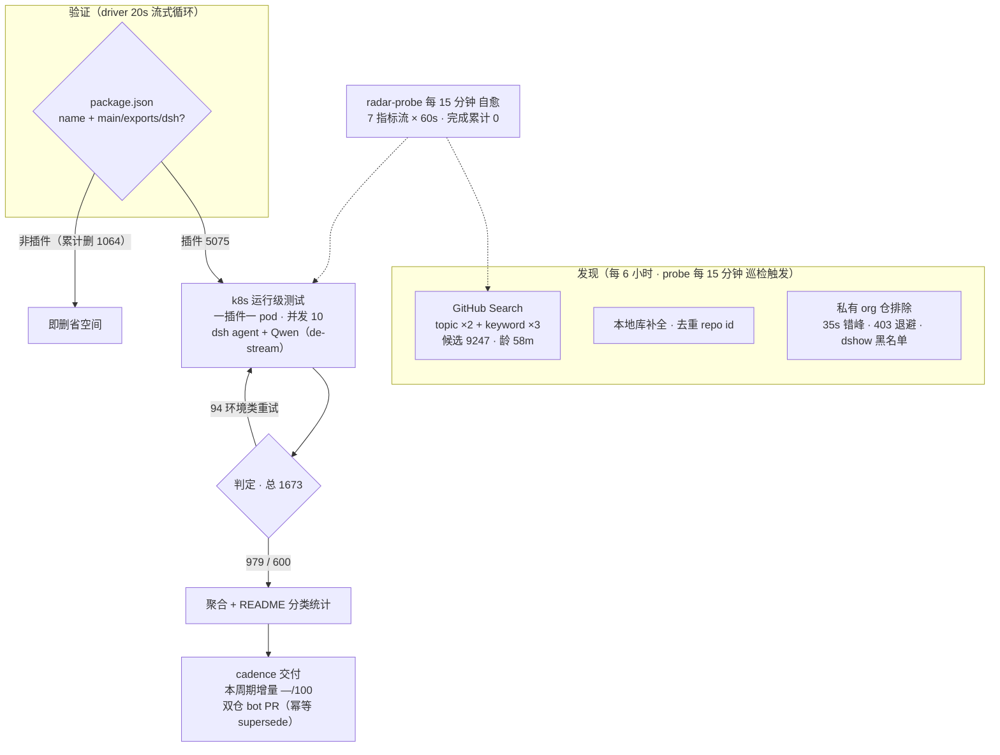

# Awesome DSH Plugins

   
  
 

  

**自动发现、证据验证的 DeepSeek Harness 插件生态雷达。自动发现 9200+ 候选、逐个 k8s 实测**

安装前就知道哪个能用，不用自己踩坑。

    

   

简体中文 | [English](README.en-US.md)

---

> 收录 5075 个 DSH 插件仓库（索引到9247个repos，正由专用K8s集群，动态在DSH最新版本下验证可用性，目前高速迭代中）。

## 工作原理

> 数据截至快照 `20260818T190001Z`（2026-08-19 03:00:01 UTC+8 · 分类器 unified-v2-bridge）

<!-- AUTO:pipeline:START -->

<!-- AUTO:pipeline:END -->

**🔌 开源计划 — 本页数据由「DSH 插件雷达」服务管线自动生产，服务雷达源码正在优化中，稳定后将分阶段开源：**

| 阶段 | 开源内容 | 状态 |
|---|---|---|
| Phase 1 | 管线文档：[总览与路线图](docs/radar/overview.md) · [架构](docs/radar/architecture.md) · [数据契约](docs/radar/data-contracts.md) | ✅ 已开源 |
| Phase 2 | 雷达引擎源码（发现 · 聚合 · 渲染 · 分发） | 🔜 稳定后开源 |
| Phase 3 | 测试引擎源码：轻量版（无需 k8s · 本地直跑）· 服务器版（k8s 集群） | 🔜 稳定后开源 |

## 快速导航

| 你的目标 | 跳转入口 |
|---|---|
| 看精选插件 | [精选插件榜](#精选插件榜) — rc.8 实测可用 · 类序星标降序 |
| 按用途找一个插件 | [分类目录](#分类目录) — 13 类功能领域 · 逐插件明细见 [PLUGINS-ALL.md](PLUGINS-ALL.md)；[PLUGINS.md](PLUGINS.md) 为 PR 登记清单 |
| 浏览自动发现的全部仓库 | [ 当前生态快照](#当前生态快照) — 日期化兼容矩阵 |
| 了解最近发生了什么 | [ CHANGELOG](CHANGELOG.md) |
| 登记或提交插件 | [ 给插件开发者](#给插件开发者) · 加 `dsh-plugin` topic → 8h 自动收录 · [PR 模板](.github/PULL_REQUEST_TEMPLATE.md) |
| 了解本雷达与开源计划 | [ 雷达总览与路线图](docs/radar/overview.md) · 架构与数据契约见 [docs/radar/](docs/radar/) |
| 给插件使用者指南 | [ 给插件使用者](#给插件使用者) |
| 本仓库如何判定兼容性 | [ 本仓库如何判定](#本仓库如何判定) |
| 加入社群交流 | [ DSH 学习社区](#dsh-学习社区-dshfindcom) · [社区讨论群](#社区讨论群) |

> [!IMPORTANT]
> **收录不等于兼容，静态检查不等于运行可用，运行可用也不等于安全审计。**
> 本仓库提供可追溯的筛选信号，不代表 DSH 官方背书。安装第三方插件前，请检查插件源码、权限、依赖、许可证及测试日期。

## 精选插件榜

<!-- AUTO:featured:START -->

> 人工策展 50 款 rc.8 实测可用插件（v4flash 全量重测通过者，2026-08-21），类序与类内均按星标降序；星标每 6 小时自动刷新（成员调整请提 PR 修改 data/awesome-50.json）。数据截至 2026-08-23 10:02（UTC+8）。

### 🚀 智力增强 Booster（6）

| 插件 | ⭐ | rc.8 实测 | 说明 |
|---|---:|---|---|
| [dsh-routing-suite](https://github.com/yjh051108/dsh-routing-suite) | 6643 | — | 注入器 × 思维模式路由套装：免重启运行时注入器 + 任务感知推理模式路由预设（P1-P23 实测） |
| [harmony-next.skills](https://github.com/linhay/harmony-next.skills) | 335 | ✅ | 技能驱动的工作流增强 |
| [superpowers-dsh](https://github.com/LayneChai/superpowers-dsh) | 81 | ✅ | TDD/调试/计划等开发技能集 |
| [forkprobe](https://github.com/Jayden-X-L/forkprobe) | 70 | ✅ | 同一任务跑多个技能对比，自动选优 |
| [dsh-tool-turbo](https://github.com/Electricitysheep/dsh-tool-turbo) | 7 | ✅ | 按轮次自动优化 reasoning_effort（推理力度） |
| [dsh-reasoning-settings](https://github.com/JuneLearn/dsh-reasoning-settings) | 6 | ✅ | 推理设置控制：让模型按任务切换思考档位 |

### 🖥 界面与工作台（7）

| 插件 | ⭐ | rc.8 实测 | 说明 |
|---|---:|---|---|
| [dsh-web-ui](https://github.com/zhu1090093659/dsh-web-ui) | 5605 | ✅ | Web UI 增强与皮肤合集：任务看板、Git 图、移动端、皮肤中心 |
| [DSH-better-sidebar](https://github.com/omdsh-dev/DSH-better-sidebar) | 2657 | ✅ | 侧边栏变完整工作台：文件编辑/终端/Git/子代理，支持三方注册扩展页 |
| [dsh-genui](https://github.com/omdsh-dev/dsh-genui) | 297 | ✅ | GenUI 内联组件：图表/表单/测验/3D 场景 + action 事件环 |
| [dsh-visualize](https://github.com/Nagi-ovo/dsh-visualize) | 204 | ✅ | 对话中生成交互式可视化卡片 |
| [Liang-Saint-Slider](https://github.com/BruzWJ/Liang-Saint-Slider) | 92 | ✅ | 模型与思考力度选择滑条 |
| [dsh-annotation](https://github.com/omdsh-dev/dsh-annotation) | 90 | ✅ | 划选文字→批注→随消息发送，回复逐条对照 |
| [dsh-navbar](https://github.com/vlln/dsh-nav