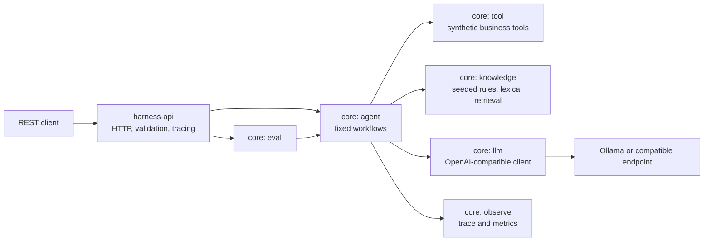

# Delivery Harness Engineering Platform

[简体中文](README.zh-CN.md) | English


[](LICENSE)

An AI harness reference implementation for on-demand delivery operations. It combines deterministic workflows, mock business tools, lightweight knowledge retrieval, an OpenAI-compatible model endpoint, evaluation scaffolding, and human-review guardrails.

> [!IMPORTANT]
> This repository is an educational MVP, not a production-ready delivery or compensation system. Business tools use synthetic data, most state is held in memory, and model output is advisory. Do not expose the application to the public internet, submit real personal/order data, or execute compensation decisions without authentication, policy enforcement, and human approval.

## What is implemented

- Two synchronous workflows: abnormal-order analysis and compensation suggestion.
- Four locally registered tools for orders, ETA, station capacity, and compensation rules. Every tool derives its result from its arguments.
- Synthetic orders that vary by order ID across six named scenarios, including one delivered on time.
- A deterministic timeline that splits an order into dispatch wait, to-shop, merchant prep, and on-road legs, reported alongside the model's answer as the baseline it has to beat.
- Compensation amounts decided by the rule engine, never by the model ([ADR-0002](docs/adr/0002-rule-engine-owns-the-compensation-amount.md)).
- OpenAI-compatible chat-completions client behind an interface, so workflows are testable without a model.
- In-memory document ingestion, text chunking, lexical retrieval scored by query-term overlap, and a rule and case base seeded at startup.
- In-memory evaluation runs whose scorers report "not measured" rather than a perfect score when a case declares no expectation.
- Request trace IDs, per-step durations, a bounded trace store, per-scenario metrics, feedback storage, and advisory output checks.
- A local Ollama profile, 100 tests, Maven Wrapper, and GitHub Actions CI.

The following are intentionally **not** claimed as implemented: autonomous agent planning, production tool integrations, durable persistence, vector embeddings/Milvus RAG, authentication, rate limiting, distributed tracing, or automatic compensation execution. See [Known limitations](#known-limitations).

## Architecture



All workflow steps run synchronously in the gateway process. Apart from the configured model endpoint, the default application has no required external services.

## Modules

| Module | Responsibility |
| --- | --- |
| `harness-common` | DTOs, exceptions, JSON/text helpers, and trace context. No dependencies. |
| `harness-core` | Everything that decides something: `agent` (workflows, timeline, guardrails, formatting), `tool` (synthetic business tools), `llm` (model routing and transport), `knowledge` (seeded rules and cases, lexical retrieval), `eval` (cases, runs, scorers), `observe` (traces, metrics, feedback). |
| `harness-api` | Executable Spring Boot application: controllers, validation, exception mapping, request tracing. |
| `llm-inference` | Pinned Ollama container definition and smoke-test script. |

Java packages are unchanged — `com.delivery.harness.{agent,tool,llm,knowledge,eval,observe}` still exist and still mean the same thing. Only the Maven build boundary moved; see [ADR-0004](docs/adr/0004-three-maven-modules-instead-of-nine.md).

## Prerequisites

- JDK 17 or newer
- Maven 3.6.3 or newer, or the included Maven Wrapper
- Docker with Compose support, only when running Ollama in a container
- Enough memory for the model you choose; `qwen2.5:7b` is the default example

## Quick start

### 1. Start a local model

If Ollama already runs on your machine, skip the first command.

```bash
docker compose up -d ollama
docker compose exec ollama ollama pull qwen2.5:7b
```

The Compose port binds to `127.0.0.1` only. Model weights are downloaded separately and are not part of this repository or its MIT license.

### 2. Build and test

```bash
./mvnw clean verify
```

### 3. Run the API

```bash
./mvnw -pl harness-api -am package
java -jar harness-api/target/harness-api.jar
```

The API listens on `http://localhost:8080` by default.

### 4. Call a workflow

```bash
curl --fail-