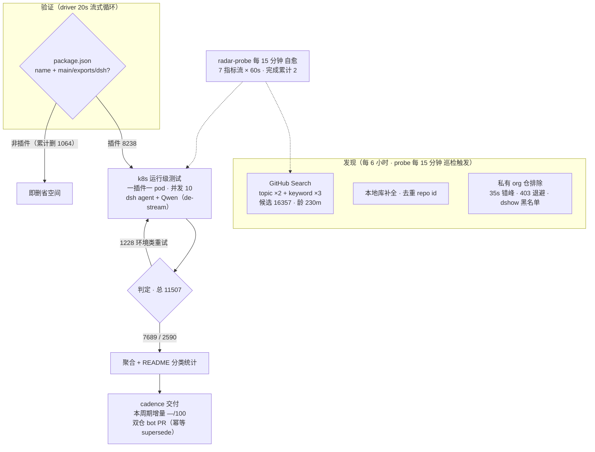

# DSH Plugin Radar

<p align="center">
  <br>
  


</p>

<p align="center">
  <a href="https://trendshift.io/repositories/147500" title="GitHub Trending 日榜 #22 · 2026-08-14 · 全语言口径"></a>
</p>


**开源的 DeepSeek Harness 插件生态雷达——持续发现、运行级验证、15 分钟快照。自动生成 artifact同步在[PLUGINS-ALL.md](PLUGINS-ALL.md)中更新。**


安装前就知道哪个能用，不用自己踩坑。

[](#精选插件榜) [](#当前生态快照) [](#本仓库如何判定) [](https://dshfind.com/zh/plugins/AdamPlatin123/dsh-plugin-radar?ref=badge) [](LICENSE)

[](#2-看懂状态统一四档口径) [](#2-看懂状态统一四档口径) [](#2-看懂状态统一四档口径)


简体中文 | [English](README.en-US.md)

---

> 已索引 15443 repos · 克隆验证为 DSH 插件 2996 · 清单呈现 2943 · 当前版本 0.1.1-rc.2 实测 345 个 DSH 插件仓库

**架构原则：目录是构建产物（Catalog is a build artifact）。**

```text
Radar Engine（开源 → engine/）
     ↓
机器可读快照（data/snapshots/，每 15 分钟）
     ↓
目录渲染器（聚合 · 分类 · 双语渲染）
     ↓
┌─ PLUGINS-ALL.md 全量清单
├─ 精选插件榜 / 整合包
├─ 生态快照 / 兼容矩阵
└─ dshfind 等下游消费方
```

## 工作原理

> 数据截至快照 `20260830T010001Z`（2026-08-30 09:00:02 UTC+8 · 分类器 unified-v2-bridge）

<!-- AUTO:pipeline:START -->

<!-- AUTO:pipeline:END -->

**🔌 开源计划 — 本页数据由「DSH 插件雷达」服务管线自动生产，服务雷达源码正在优化中，稳定后将分阶段开源：**

| 阶段 | 开源内容 | 状态 |
|---|---|---|
| Phase 1 | 管线文档：[总览与路线图](docs/radar/overview.md) · [架构](docs/radar/architecture.md) · [数据契约](docs/radar/data-contracts.md) | ✅ 已开源 |
| Phase 2 | 雷达引擎源码（发现 · 聚合 · 渲染 · 分发 + 运维自愈） | ✅ 已开源 → [engine/](engine/) |
| Phase 3 | 测试引擎源码：轻量版（无需 k8s · 本地直跑）· 服务器版（k8s 集群） | 🔜 稳定后开源 |

## 快速导航

| 你的目标 | 跳转入口 |
|---|---|
| 了解这个雷达系统本身 | [工作原理](#工作原理) · [架构原则](#工作原理) · [开源引擎源码 engine/](engine/) · [管线文档](docs/radar/overview.md) |
| 看精选插件 | [精选插件榜](#精选插件榜) — 人工策展 · 11 类 |
| 一把装好不挑单品 | [整合包](#-整合包) — 预设套件 / 能力合集 / 发行版 / 配方管理器 |
| 按用途找一个插件 | [分类目录](#分类目录) — 13 类功能领域 · 逐插件明细见 [PLUGINS-ALL.md](PLUGINS-ALL.md)；[PLUGINS.md](PLUGINS.md) 为 PR 登记清单 |
| 浏览自动发现的全部仓库 | [ 当前生态快照](#当前生态快照) — 日期化兼容矩阵 |
| 了解最近发生了什么 | [ CHANGELOG](CHANGELOG.md) |
| 登记或提交插件 | [ 给插件开发者](#给插件开发者) · 加 `dsh-plugin` topic → 8h 自动收录 · [PR 模板](.github/PULL_REQUEST_TEMPLATE.md) |
| 了解本雷达与开源计划 | [ 雷达总览与路线图](docs/radar/overview.md) · 架构与数据契约见 [docs/radar/](docs/radar/) |
| 给插件使用者指南 | [ 给插件使用者](#给插件使用者) |
| 本仓库如何判定兼容性 | [ 本仓库如何判定](#本仓库如何判定) |
| 加入社群交流 | [ DSH 学习社区](#dsh-学习社区-dshfindcom) · [社区讨论群](#社区讨论群) |

> [!IMPORTANT]
> **收录不等于兼容，静态检查不等于运行可用，运行可用也不等于安全审计。**
> 本仓库提供可追溯的筛选信号，不代表 DSH 官方背书。安装第三方插件前，请检查插件源码、权限、依赖、许可证及测试日期。

## 🛒 生态目录（雷达生成的 artifact）

以下所有目录内容——精选榜、整合包、分类目录、兼容矩阵——均由上述雷达管线自动生产与刷新（精选榜与整合包成员为人工策展，星标与状态由 bot 持续更新）。

### 精选插件榜

<!-- AUTO:featured:START -->

> 人工策展 56 款插件，按 11 类分组、类内按星标排序；星标每 6 小时自动刷新（成员调整请提 PR 修改 data/awesome-50.json）。数据截至 2026-08-30 13:31（UTC+8）。

### 🚀 智力增强 Booster（7）

-  **[dsh-routing-suite](https://github.com/yjh051108/dsh-routing-suite)** · 6953★ — 注入器 × 思维模式路由套装：免重启运行时注入器 + 任务感知推理模式路由预设（P1-P23 实测）
-  **[ouroboros](https://github.com/Q00/ouroboros)** · 5729★ — Agent OS：agent 自我变强、人只守底线——自进化运行时（5.7k★；rc.8 实测 ✅）
-  **[harmony-next.skills](https://github.com/linhay/harmony-next.skills)** · 342★ — 技能驱动的工作流增强
-  **[superpowers-dsh](https://github.com/LayneChai/superpowers-dsh)** · 108★ — TDD/调试/计划等开发技能集
-  **[forkprobe](https://github.com/Jayden-X-L/forkprobe)** · 71★ — 同一任务跑多个技能对比，自动选优
- <img src="assets/tile-ok.svg" alt="已兼容" width="122" hei