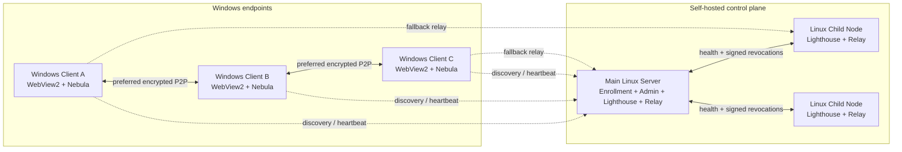

<div align="center">
  
  <h1>MeshLAN</h1>
  <p><strong>简体中文</strong> · <a href="README.en.md">English</a> · <a href="README.ja.md">日本語</a></p>
  <p><strong>以 P2P 为主、Relay 兜底的自托管虚拟局域网与本地服务协作平台</strong></p>
  <p>
    
    
    
    
    
  </p>
</div>

MeshLAN 在 [SlackHQ Nebula](https://github.com/slackhq/nebula) 之上提供自动配对、
P2P/NAT 优化、多 Lighthouse/Relay、服务映射、MeshDNS、文件直传、访问审批、
实时拓扑、历史回放、安全更新和可选 AI 自动化。Windows 用户只需运行一个便携
客户端；控制面和中继节点由你自己的 Linux 服务器承载。

> 本仓库包含 Windows 客户端、Linux 主控制服务器和 Linux 子节点的完整源码。
> 截图来自真实原生客户端，设备标识、IP、IPv6、域名和公网端点均已遮挡。

## 截图

### 实时网络拓扑


### 历史与回放


### AI 助手


## 核心能力

- **虚拟局域网**：基于 Nebula v2 证书和加密隧道连接异地 Windows 设备。
- **P2P 优先**：双栈打洞、稳定 UDP 端口、UPnP、STUN 诊断与 Route Guard。
- **Relay 兜底**：直连失败时自动中继；多节点根据延迟、抖动、丢包和健康状态择优。
- **多节点控制面**：主 Lighthouse 管理 Linux 子 Lighthouse/Relay，支持健康检查与故障切换。
- **服务映射**：把 `localhost` TCP/UDP 服务发布给同一 Mesh，支持自定义端口、暂停和健康检查。
- **访问审批**：服务可设置直接访问或手动批准；创建者只能管理自己的映射和授权。
- **MeshDNS**：设备使用 `alice.mesh`，服务使用 `api.alice.mesh` 等稳定名称。
- **HTTPS 网关**：为 `.mesh` HTTP 服务提供本地 CA、证书签发和无端口访问入口。
- **文件直传**：文件内容通过设备间加密链路传输，控制服务器只分发元数据。
- **实时可观测性**：拓扑、P2P/Relay 路径、Underlay、延迟、服务健康和实时字节动画。
- **按用户 Token 统计**：从模型响应的真实 `usage` 累计输入、输出、缓存与推理 Token，不读取对话正文。
- **历史与回放**：本地 SQLite 保留流量、路径、连接和事件；支持时间滑块与筛选。
- **AI 助手**：模型密钥只在服务端；上下文和结果端到端加密；所有修改必须由用户确认。
- **安全更新**：Ed25519 签名清单、SHA-256 校验、可选 Authenticode、健康检查和自动回滚。
- **多语言界面**：支持简体中文、繁體中文、English、日本語；界面与 AI 助手回复同步切换并在本机保存。

## 把异地设备变成一个局域网

MeshLAN 的核心不是把某一个 API 暴露到公网，而是让不同运营商、不同城市、不同 NAT
后的 Windows 设备加入同一个加密局域网。每台设备获得稳定的 Mesh IP，应用可以像访问
同一台路由器下的电脑一样访问其他设备；现有家庭网络、公司网络和默认网关不会被替换。

- 设备之间优先使用加密 P2P 直连，打洞失败才自动切换到可用 Relay；
- IPv4、IPv6 或智能双栈可按设备选择，Route Guard 避免全局代理/TUN 抢走 MeshLAN 链路；
- 拓扑图实时展示在线设备、实际 P2P/Relay 路径、延迟、流量和链路变化；
- 设备离线、换网或公网端点变化后会重新注册和建链，不需要重新分配 Mesh IP；
- 同一 Mesh 内可继续使用 ping、远程桌面、数据库、游戏服务器和自建 API 等现有协议。

```text
Windows A ── encrypted P2P ── Windows B
    │                              │
10.77.0.2                      10.77.0.3
    └──── Relay fallback（仅直连失败时）────┘
```

控制服务器负责设备授权、证书和发现信息，不承载正常的 P2P 业务数据。即使走 Relay，
中继看到的也只是 Nebula 加密数据包。

## MeshDNS：用名称访问设备和服务

Mesh IP 适合底层路由，人更适合记名称。MeshDNS 为每个用户/设备维护可修改的唯一前缀，
并根据当前设备和服务状态实时生成记录，无需在每台电脑上手写 `hosts` 文件。

假设设备前缀是 `alice`：

| 目标 | MeshDNS 名称 | 示例用途 |
|---|---|---|
| 设备本身 | `alice.mesh` | ping、RDP、SMB 或其他任意协议 |
| HTTP 服务 | `chat.alice.mesh` | 通过本地网关无端口访问 Web 服务 |
| 普通 TCP 服务 | `db.alice.mesh:5432` | 数据库、API 或自定义 TCP 协议 |
| UDP 服务 | `game.alice.mesh:27015` | 游戏服务器或其他 UDP 服务 |

用户可以修改自己的设备前缀，也可以为每个已发布服务单独修改三级前缀。创建、编辑、
暂停或删除映射后，服务目录与 MeshDNS 记录会随真实状态更新；名称冲突会在保存前提示，
不会静默指向错误设备。只有 HTTP/HTTPS 网关模式可以省略端口，普通 TCP/UDP 服务仍需
使用映射端口。

## 服务映射：共享 localhost，而不是暴露公网端口

很多开发工具只监听 `localhost`，例如本地 API、Web 面板、数据库或游戏服务器。
MeshLAN 可以把它发布到虚拟局域网，不需要在家庭路由器做端口转发，也不需要把服务
直接暴露给整个互联网。

创建映射时填写：

1. 服务名称，例如 `Chat API`；
2. 本地地址与端口，例如 `localhost` 和 `4571`；
3. TCP 或 UDP；
4. 自动分配或自定义 Mesh 端口；
5. MeshDNS 服务前缀，例如 `chat`；
6. 直接访问或需要创建者批准。

发布完成后，同一 Mesh 的成员会在“全网共享服务”中实时看到服务所有者、名称、协议、
健康状态、访问地址和端口。例如本机的 `localhost:4571` 可以发布为：

```text
http://chat.alice.mesh
# 或普通端口模式
chat.alice.mesh:20000
```

映射支持同时创建多个 TCP/UDP 服务。端口冲突会在创建前返回明确提示；创建者可以暂停
整个映射、暂停某个获准用户、查看当前连接者和流量，并随时恢复。需要审批的服务会生成
访问申请，创建者可在消息列表中同意或拒绝。所有用户都能查看共享目录，但只能修改或
删除自己创建的映射。

```text
peer request
    │
    ▼
chat.alice.mesh:20000
    │  MeshDNS + access policy
    ▼
alice (10.77.0.2)
    │  local encrypted forwarding
    ▼
localhost:4571
```

## 架构



### 组件

| 组件 | 平台 | 职责 |
|---|---|---|
| Windows Client | Windows 10/11 | 原生桌面窗口、配对、Nebula 服务、Route Guard、服务映射、MeshDNS、文件直传、AI 助手 |
| Main Server | Linux amd64/arm64 | 管理台、设备授权、证书签发、吊销、更新分发、主 Lighthouse/Relay、AI Provider |
| Child No