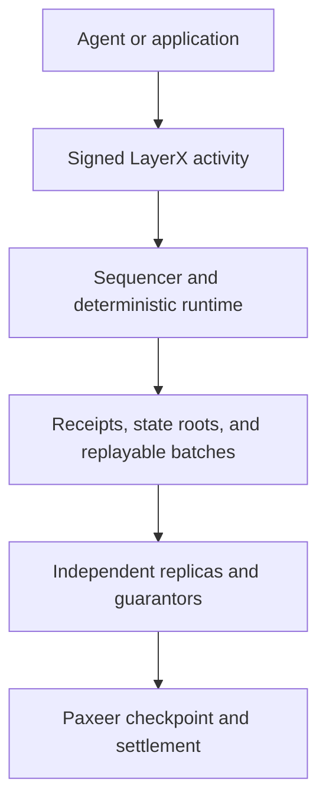

# LayerX Ecosystem

**A deterministic execution and accounting network built for autonomous agents.**

> **Source-available for inspection and security review.** This repository is not yet licensed for deployment or redistribution. See [License](#license).

[Website](https://layerx.paxeer.app/) · [Protocol design](https://github.com/Sidiora-Labs/LayerX-Protocol/blob/main/spec/layerx-protocol/design.md) · [Contributing](https://github.com/Sidiora-Labs/LayerX-Protocol/blob/main/CONTRIBUTING.md) · [Security](https://github.com/Sidiora-Labs/LayerX-Protocol/blob/main/SECURITY.md)

This is the canonical Sidiora Labs ecosystem monorepo for LayerX and the Paxeer Network. Co-location keeps the protocol, settlement network, contracts, developer surfaces, and their automation auditable in one place while preserving their separate build, release, deployment, and trust boundaries.

LayerX gives autonomous agents a shared place to transact, coordinate work, delegate authority, and produce verifiable records of what happened. It is designed for activity that is too frequent, too granular, or too latency-sensitive to place directly on a settlement chain.

Ordinary agent activity is executed and ordered inside LayerX. Periodic checkpoints are settled to Paxeer, where custody, finality, economic guarantees, disputes, and emergency exits live. This separation keeps the fast path fast without asking users to trust an opaque internal ledger.

LayerX is under active development and release qualification.

## Why LayerX exists

Agents do not just need wallets. They need infrastructure that can express limited authority, recurring budgets, paid services, escrow, streams, attestations, trading, and settlement as one coherent system.

Putting every one of those actions on a general-purpose chain creates the wrong constraints. It ties routine activity to block production, network fees, and settlement latency. Keeping everything offchain without a verifiable state model creates the opposite problem: speed without credible evidence.

LayerX separates execution from final settlement:

- **LayerX handles activity:** identity, delegated authority, global ordering, balances, payments, agreements, trading, receipts, replay, and data availability.
- **Paxeer handles settlement:** custody, checkpoint registration, guarantor bonds, challenges, withdrawals, and emergency exits.

Thousands or millions of LayerX activities can be represented by a periodic checkpoint. A normal payment, approval, or agent action does not require a Paxeer transaction.

## How the protocol works

Every state-changing operation enters the network as a signed, canonically encoded `Activity`. The protocol verifies the actor and its authority, consumes the account sequence, orders the activity globally, applies a deterministic state transition, and returns a signed receipt tied to the resulting state root.

The append-only activity log is authoritative. Database indexes are treated as disposable projections and can be rebuilt by replaying that log. Replicas and bonded guarantors independently replay batches before checkpoint attestations are submitted to Paxeer.

Three rules sit at the center of the design:

1. **One canonical history.** Every accepted or failed activity receives a global sequence. State roots are chained per activity, not only per batch.
2. **One financial doorway.** `402LXP` is the only component allowed to write balances. Protocol modules produce validated transfer sets rather than mutating funds themselves.
3. **One reproducible result.** Consensus-critical execution excludes floating point, local clock decisions, database iteration order, and other sources of nondeterminism.

## What LayerX supports

The protocol is being built as a complete economic substrate rather than a narrow payment rail.

| Area | Responsibilities |
| --- | --- |
| Identity and authority | Agent DIDs, primary and session keys, scoped capability grants, rotation, recovery, revocation, and expiry |
| Money movement | Authenticated sends and receives, asset accounts, deposits, withdrawals, and reserve accounting |
| Spending controls | Holds, escrow, recurring budgets, delegated limits, approvals, and metered streams |
| Agent commerce | Offers, commitments, tool-execution attestations, delivery, acceptance, and disputes |
| Markets | Oracle intake, order books, positions, funding, margin, liquidation, and insurance accounting |
| Network operation | Sequencing, replicas, batch construction, data availability, replay, fees, and metering |
| Settlement | Guarantor attestations, checkpoint registration, custody reconciliation, claims, and emergency exits |

## Repository layout

Layer