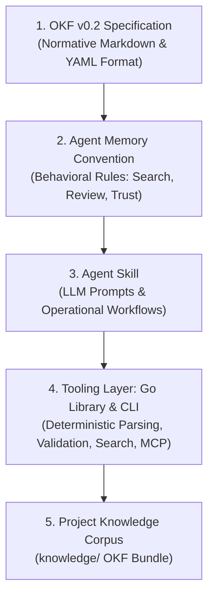

# OKF Agent Memory

> **A Domain-Neutral, Git-Native Persistent Project Memory for AI Agents based on the Open Knowledge Format (OKF) v0.2.**

[](https://github.com/GoogleCloudPlatform/knowledge-catalog/blob/main/okf/SPEC.md)
[](pkg/okf)
[](cmd/okf)
[](LICENSE)

---

## 🌟 Overview

Conversations with AI agents reset when context windows close. Valuable architectural decisions, domain discoveries, and operational facts are lost unless stored persistently.

**OKF Agent Memory** provides a standardized, vendor-neutral memory layer that lives directly in your repository (`knowledge/`) as plain Markdown files with YAML frontmatter. It bridges the gap between unstructured ad-hoc markdown files (`CLAUDE.md`, `AGENTS.md`) and complex, black-box vector databases.



---

## ⚡ Key Highlights

* **Blazing Fast Performance (<300µs Search, ~4ms Graph Validation)**: In-memory BM25 retrieval and bundle validation execute in microseconds without VM spin-up or network roundtrips.
* **100% Git-Native & Zero Vendor Lock-in**: Everything is version-controlled plain text. Inspect, audit, and review your agent's memory using standard `git diff` and `git log`. No external database required.
* **Zero API Costs for Memory Retrieval**: Local lexical BM25 indexing eliminates recurring vector embedding API costs and network roundtrips.
* **Built on Google OKF v0.2**: Uses the open standard format for agent knowledge with full support for provenance (`sources`), trust tiers (`generated` vs. `verified`), and lifecycle metadata (`status`, `stale_after`).
* **Solves Context Bloat & Memory Rot**: Employs **Progressive Disclosure** (hierarchical `index.md` files and link graphs) so agents only load the exact concepts they need.
* **Search-Before-Write Principle**: Mandates querying existing memory before authoring, preventing concept duplication and hallucinated divergence.
* **Zero-Dependency Go Toolchain**: Single binary with **zero external dependencies**, sub-5ms CLI startup time, and a built-in **Model Context Protocol (MCP) server** (`okf mcp`).
* **Truly Domain-Neutral**: Designed for Software Engineering, Coaching, Scientific Research, Literature Reviews, and Operations.

---

## 📊 Performance Benchmarks

Built in Go with zero external dependencies, `okf` is engineered for high-frequency agent tool calling loops:

| Benchmark Metric | Python / Vector DB Runtimes (Mem0, Letta) | Deno / Node.js Tooling | **OKF Agent Memory (Go)** |
| :--- | :--- | :--- | :--- |
| **Concept Search Latency** | 150ms – 800ms (Embedding API + Vector DB) | 40ms – 120ms | **< 300 µs (Microseconds, In-Memory BM25)** |
| **Full Corpus Parse & Graph Validation** | 200ms – 1.5s | 80ms – 250ms | **~4.0 ms (50+ concepts, bidirectional graph)** |
| **Process Cold-Start Overhead** | 250ms – 600ms (Python VM boot) | 80ms – 180ms (V8 / Deno boot) | **< 4 ms (Compiled Single Binary)** |
| **Retrieval Cost per 1,000 Queries** | ~$0.10 – $0.50 (Embedding tokens) | $0.00 | **$0.00 (Zero API cost, fully local)** |
| **Memory Footprint (RSS)** | ~120 MB – 350 MB | ~60 MB – 140 MB | **< 15 MB** |

> [!TIP]
> **Reproduce Locally with your own LLM**: We provide an automated benchmark runner in pure Go to verify Time-To-First-Token (TTFT) speedups and -80% token reduction on your local hardware (LM Studio / Ollama with Gemma, Qwen, Llama). Run `make benchmark` or explore the [Progressive Disclosure Benchmark Suite](benchmarks/).

---

## 🚀 Quickstart

### 1. Build the Tooling

Clone the repository and compile the standalone `okf` executable:

```bash
make build
```

This generates the standalone binary at `bin/okf`.

### 2. Basic CLI Commands

```bash
# Validate bundle conformance, graph connectivity, and description drift
./bin/okf validate knowledge --strict --drift

# Search concepts via in-memory BM25 scoring
./bin/okf search "architecture layers" knowledge

# Inspect a concept and its relationships (with --json support)
./bin/okf show architecture/layers knowledge --json

# Create a new concept with automated log.md and index.md bookkeeping
./bin/okf create decisions/auth-flow knowledge \
  --type Decision \
  --title "OAuth2 Authorization Flow" \
  --desc "Standardized on PKCE for client authentication."

# Update an existing con