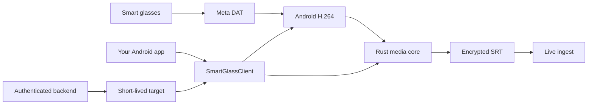

  
  <h1>VModal for Smart Glasses</h1>
  
<strong>Turn a first-person view into a live, reliable video experience.</strong>

  
Capture on the glasses. Encode on Android. Stream securely to your ingest. Keep your product focused on the experience—not the media plumbing.

  

 

<em>Build for the point of view no phone camera can reach.</em>

## Start here

| | Resource | Link |
|---|---|---|
| 💬 | **Developer support** | [Join the VModal AI Discord](https://discord.gg/XGxgBQqkaY) |
| 🚀 | **SDK quickstart** | [Build and start your first stream](docs_sdk/readme.md) |
| 🧭 | **Developer portal** | [Explore VModal developer resources](https://www.v-modal.com/developers) |
| 🌐 | **VModal platform** | [Visit VModal](https://www.v-modal.com) |

> [!NOTE]
> This SDK streams live camera video from Android smart glasses. For video
> upload, indexing, and multimodal search, use the VModal Android SDK instead.

## Make presence feel immediate

VModal combines an Android-native Kotlin client with a high-throughput Rust
media core. Your app owns the product experience; the SDK owns the demanding
path between a wearable camera and your live ingest service.

| Your smart-glass experience | VModal gives you |
|---|---|
| Remote expert support | Reliable first-person video with reconnect behavior |
| Hands-free field work | Meta DAT capture lifecycle and Android camera coordination |
| Live training and inspection | Hardware H.264 encoding and MPEG-TS muxing |
| AR / VR companion experiences | A compact Kotlin API using `Flow` and `StateFlow` |
| Production streaming | Bounded queues, backpressure signals, metrics, and typed failures |
| Your own branded UX | App-owned authentication, permissions, registration, and controls |

## A clean path from glasses to ingest

The separation is deliberate:

- **Kotlin client** manages the public API, Meta DAT integration, capture,
  `MediaCodec`, coroutine state, events, and lifecycle.
- **Rust core** manages bounded encoded-media queues, H.264 normalization,
  MPEG-TS muxing, SRT transport, reconnects, and transport metrics.
- **Your app** owns screens, permissions, Meta registration, foreground-service
  policy, authentication, and stream controls.
- **Your backend** validates the user and returns a short-lived ingest target,
  keeping account-level provider credentials away from the device.

The Activity never needs to understand a JNI handle, SRT socket, or encoded
GOP. The backend never needs to manage an Android camera session.

## Build with the SDK

The implementation guide keeps the Kotlin and command-line setup in one place:

**[Open the Smart Glass SDK quickstart →](docs_sdk/readme.md)**

It covers prerequisites, local builds, `SmartGlassClient` creation, short-lived
stream targets, state and metrics collection, and deterministic cleanup.

## Engineered for wearable constraints

### Bounded latency, not unbounded memory

GOP-aware backpressure and bounded queues keep a weak network from turning into
ever-growing latency. The SDK can signal the Kotlin layer to drop safely or
request a new keyframe when transport falls behind.

### Recovery without a broken experience

SRT reconnects use configurable delays, jitter, and timeouts. When a target is
expired or rejected, `LiveStreamTargetProvider` can fetch a fresh destination
while the app continues to present one coherent stream lifecycle.

### Native internals behind a Kotlin boundary

The public API does not expose Meta DAT types or Rust handles. Your host app
owns the camera permission and registration experience; the SDK owns its one
capture session only while streaming.

### Metrics your support team can use

`client.metrics` exposes connection health, queue pressure, and transport
behavior for a developer panel, field diagnostic screen, or support workflow.

## Production integration checklist

- Android **API 31+**, JDK **17**, and Android compile SDK **36**.
- A compatible Meta smart-glasses registration and Meta Wearables DAT setup.
- A user-facing camera permission and Meta registration flow in the host app.
- A foreground service when streaming may continue outside the foreground.
- An authenticated backend endpoint that returns a fresh `LiveStreamTarget`.
- Exactly one `Sm