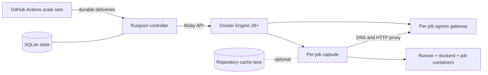

# Runpool

[](https://github.com/rhobuild/runpool/actions/workflows/ci.yml)
[](https://github.com/rhobuild/runpool/actions/workflows/codeql.yml)
[](go.mod)
[](docs/reference/support-matrix.md)
[](docs/architecture.md)
[](LICENSE)
[](https://github.com/rhobuild/runpool/releases)

Runpool is a Docker-native control plane for autoscaling ephemeral CI
runners on a single, capacity-bounded host. It translates provider demand
into durable assignments, isolated per-job execution capsules, and optional
repository-scoped cache lanes — without requiring Kubernetes.

## Architecture



The controller has no inbound service dependency. It maintains outbound
provider sessions, reconciles durable state with Docker, and admits work only
while scheduling and disk budgets are healthy. See the
[architecture guide](docs/architecture.md) for package boundaries, identity,
recovery, and capacity semantics.

## Why Runpool

- **Clean execution:** every workload gets a fresh runner, workspace, Docker
  daemon data root, and control filesystem.
- **Bounded capacity:** runner, inner daemon, child containers, and egress
  gateway share an aggregate cgroup budget.
- **Durable delivery:** assignments are persisted before broker
  acknowledgement; redelivery is idempotent and ambiguous execution is held
  for operator review.
- **Restricted egress:** the default profile provides kernel-enforced
  no-route isolation plus a policy-enforcing DNS and HTTP relay.
- **Safe ownership:** cleanup acts only on resources carrying the expected
  instance labels; Runpool never performs daemon-wide pruning.
- **Provider-neutral lifecycle core:** delivery, attempt, lease, cache, and
  cleanup state use opaque provider keys. GitHub-specific configuration and
  metadata remain at the composition and adapter boundary; GitHub Actions is
  the only implemented provider.

## Security boundary

Runpool is a resource-management, environment-hygiene, and network-policy
boundary for CI workloads approved by the operator.

> [!WARNING]
> **Runpool is not a hostile code sandbox.** It bounds and cleans up what an
> approved workload does; it does not contain code you would not have run.

Where that boundary ends:

- the controller holds the Docker socket, which is host-root authority;
- capsules run a privileged inner Docker daemon;
- GitHub's required `--jitconfig` interface makes the one-run JIT bundle
  observable to the assigned workload, although it is kept out of controller
  persistence, Docker metadata, logs, and later capsules;
- `shared-daemon` deliberately shares the Engine's compromise domain with the
  platform and its services; `dedicated-daemon` reduces that blast radius but
  is not a VM boundary;
- public fork pull requests are outside the supported model.

Under `public-internet-only`, direct egress is denied. Proxy-aware HTTP
clients can use absolute-form requests or CONNECT to allowed addresses on
ports 80 and 443. CONNECT is an opaque tunnel; Runpool applies destination
and port policy, not application-layer inspection. `git+ssh`, direct TCP,
non-DNS UDP, IPv6, and other ports fail closed. Read the complete
[threat model](docs/security/threat-model.md) before deployment.

## Evaluate locally

Prerequisites are Go 1.26.0 or newer and a Linux host with rootful Docker
Engine 28.
The selected release-qualification target is documented in the
[support matrix](docs/reference/support-matrix.md).

```bash
git clone https://github.com/rhobuild/runpool.git
cd runpool
go build -trimpath -o runpool ./cmd/runpool
./runpool config validate --file internal/config/testdata/example.yaml
go test ./...
```

That builds the controller and checks a configuration. Reaching a job
takes three more things: the two images, a target on GitHub, and a
workflow that names the tier.

```bash
docker build -f build/capsule/Dockerfile -t runpool-capsule:dev .
docker build -f build/controller/Dockerfile -t runpo