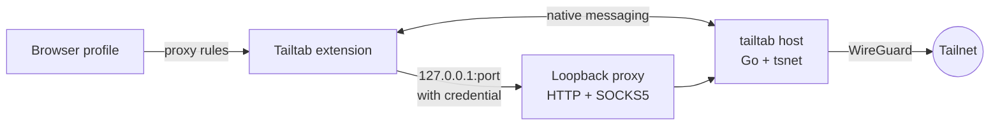

<p align="center">
  
</p>
<h1 align="center">Tailtab</h1>

<p align="center">
  A Tailscale node for each browser profile. Different profiles can sit on completely different tailnets at the same time.
</p>

<p align="center">
  <a href="https://github.com/Stocist/Tailtab/actions/workflows/ci.yml"></a>
  <a href="LICENSE"></a>
  
  
  
  
</p>

<p align="center">
  
  &nbsp;&nbsp;
  
</p>

## What it does

- **One node per browser profile.** Every profile gets its own machine on the tailnet, named `<host>-tailtab-<browser>`, with its own key and state. Nothing else on the computer gets touched.

- **Split tunnel by default.** Only tailnet traffic goes through Tailtab. That includes MagicDNS names, `*.ts.net`, your tailnet's own suffix, the `100.64.0.0/10` / `fd7a:115c:a1e0::/48` ranges, and any subnet a peer routes for the tailnet. Everything else goes out normally, so regular browsing does not depend on Tailtab being connected.

- **Exit nodes per profile.** You can pick an exit node for one browser profile and send that profile's web traffic through it while the rest of the machine carries on normally. If that exit node disappears, Tailtab blocks the traffic instead of silently letting it leak out directly.

- **Multiple Tailscale accounts without constantly logging back in.** Add another account, switch tailnets from the header, and each one keeps its own node key and state.

- **Your own coordination server.** Point the settings page at a Headscale (or any) control server and the next login uses it.

- **A proxy only that profile can use.** The loopback proxy uses a per-process credential and rejects anything that should not be going through the tailnet. Other programs on the machine cannot just borrow the browser profile's Tailscale identity.

- **Status that actually tells you what is happening.** The popup treats "the node is connected" and "the browser is actually routing through it" as two separate things, because they are. If they do not match, it tells you.

## How it works



The basic setup is pretty simple.

The extension talks to a small Go host through native messaging. That host embeds `tsnet`, which means the host itself becomes the Tailscale node. It then exposes an authenticated HTTP/SOCKS5 proxy over loopback for the browser to use.

Chromium gets pointed at the proxy through a PAC script. Firefox decides whether to proxy each request itself. Both browsers use the same routing rules, with a shared fixture there to make sure the implementations do not slowly drift apart.

More detail is in [docs/architecture.md](docs/architecture.md).

## Install

One command installs the host under your home directory and registers it with the browsers on the machine. No root or admin.

macOS / Linux:

```sh
curl -fsSL https://raw.githubusercontent.com/Stocist/Tailtab/main/scripts/install.sh | sh
```

Windows (PowerShell):

```powershell
irm https://raw.githubusercontent.com/Stocist/Tailtab/main/scripts/install.ps1 | iex
```

When upgrading on Windows, close all browsers that use Tailtab before rerunning the installer. It refuses to replace a running host rather than stopping your browser connections.

Both download the [latest release](https://github.com/Stocist/Tailtab/releases/latest), verify it against `SHA256SUMS`, and run `tailtab install`. Set `TAILTAB_VERSION` to pin a release. Then add the extension:

- **Zen / Firefox**: open `tailtab-<version>.xpi` from the release page in the browser. It is signed by Mozilla, installs permanently, and updates itself from later releases.
- **Edge / Chrome**: unzip `tailtab-chromium-<version>.zip` and load it unpacked from `edge://extensions` or `chrome://extensions` with developer mode on.

The host binary is not notarised or code-signed yet, so macOS may need a right-click **Open** the first time and Windows may show a SmartScreen warning. Linux and Windows hosts pass the same end-to-end smoke test in