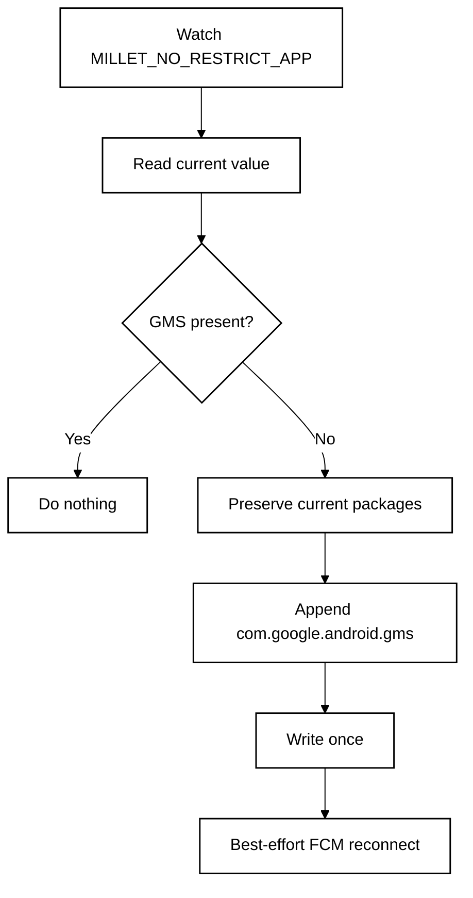

<p align="center">
  <a href="README.md"><strong>English</strong></a> · <a href="README.zh-CN.md">简体中文</a>
</p>

<p align="center">
  
</p>

# FCM Guard for HyperOS

**A lightweight, no-root watchdog for HyperOS 3 China ROM that keeps Google Play services in Xiaomi's no-restrict background list so FCM push stays reliable.**

**Designed for:** China-market Xiaomi / Redmi / POCO phones with Google Play services already installed and working.

<p align="center">
  <a href="https://github.com/ReedGAOOO/FCMGuard-HyperOS/releases/latest/download/FCMGuard-HyperOS.apk"><strong>Download latest APK</strong></a>
  ·
  <a href="https://github.com/ReedGAOOO/FCMGuard-HyperOS/releases/latest">Latest release</a>
</p>

## Highlights

- **No root or Shizuku** — uses the user-grantable **Modify system settings** permission instead of root, persistent ADB, Accessibility, VPN, overlay, or device-admin privileges.
- **Finance-app friendly** — keeps the implementation deliberately low-privilege for better compatibility with security-sensitive apps.
- **Low background power** — exact event-driven monitoring is the main path; the 30-minute fallback is in-process and does not deliberately wake a sleeping phone.
- **Reconnects only when needed** — FCM/MCS reconnect broadcasts are sent only after a real whitelist repair or a manual request.
- **Optional persistent notification** — foreground mode uses a visible-but-silent notification channel for stronger process survival; quiet background mode remains available.
- **FCM app assistant** — scans likely Firebase/GCM clients and, when HyperOS exposes the vendor AppOps state, shows read-only Autostart status with automatic re-check after returning from system settings.
- **Native dark mode** — System / Light / Dark, with **System** as the default.
- **10-language UI** — English, Simplified Chinese, Traditional Chinese, French, Japanese, Korean, Spanish, Portuguese, German, and Russian through Android's native per-app language mechanism.
- **Compact-phone ready** — responsive layout checks cover 320–480dp widths, including a Xiaomi 17-class 393dp profile.

## Quick setup

1. Install the latest APK from **GitHub Releases**.
2. Open FCM Guard and grant **Modify system settings**.
3. Tap **Repair now** once.
4. Enable **Automatic protection**.
5. In HyperOS, enable **Autostart** for FCM Guard and set battery policy to **No restrictions**.
6. Keep **Persistent notification** enabled for maximum survival reliability. If Android/HyperOS blocks notifications for FCM Guard, the app opens the system notification settings so the foreground notification can be enabled.
7. Optional: scan **FCM apps**. If HyperOS exposes readable Autostart state, the list marks apps as Enabled / Partial / Disabled / Unknown and refreshes after you return from **Configure all in HyperOS**. If the ROM blocks the query, FCM Guard shows a clear Unknown/unavailable fallback instead of guessing.
8. Optional: tap **Open FCM diagnostics** to open Google Play services diagnostics and inspect the `mtalk.google.com:5228` connection.
9. If one app still receives notifications late while other FCM apps are normal, configure that app separately. For apps such as **WhatsApp**, set **Battery saver / Battery optimization → No restrictions** in HyperOS; enabling **Autostart** is also recommended when available.

> FCM Guard is mainly for China-ROM HyperOS 3 devices where Google services work normally but PowerKeeper / Greezer can still interrupt the background FCM connection.

---

# Technical overview

## Core mechanism

Affected HyperOS builds can rebuild the private setting:

```text
Settings.System.MILLET_NO_RESTRICT_APP
```

If `com.google.android.gms` is removed, Google Play services can be treated like a normal background process and its long-lived FCM/MCS connection may be interrupted.

FCM Guard reads the current comma-separated value, preserves all existing packages, and appends `com.google.android.gms` only when it is missing.



## Why `targetSdk 22`?

FCM Guard intentionally uses `compileSdk 35` with `targetSdk 22`. The modern compile SDK keeps current tooling, while the legacy target preserves the compatibility path needed to write Xiaomi's vendor-private `Settings.System` key with the user-grantable **Modify system settings** permission and without root/Shizuku.

## Low-power design

- Exac