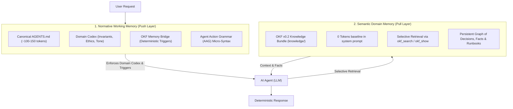
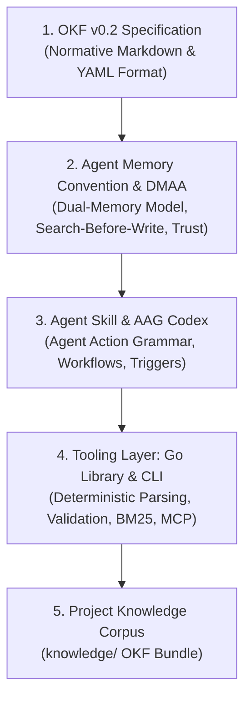

# OKF Agent Memory

> **A Domain-Neutral, Git-Native Persistent Project Memory for AI Agents based on the Open Knowledge Format (OKF) v0.2.**

---

## 🌟 Overview

Conversations with AI agents reset when context windows close. Valuable architectural decisions, domain discoveries, and operational facts are lost unless stored persistently.

Traditional approaches suffer from two fatal failure modes:
1. **The Prompt Monolith**: Stuffing all domain knowledge and rules into `AGENTS.md` or `CLAUDE.md` creates massive context bloat and causes **attention drift** (agents ignore critical instructions).
2. **The RAG Blindspot**: Dumping behavioral rules into vector databases fails because agents never semantically search for operational constraints (e.g. formatting or security rules) during general tasks.

**OKF Agent Memory** resolves this dilemma with the **Dual-Memory Agent Architecture (DMAA)**:

### The Universal Composition Model

In DMAA, every agent configuration is structured by a universal composition:

$$\text{AGENTS.md} = \underbrace{\text{Domain Codex (AAG)}}_{\text{Project Invariants, Tone, Guardrails}} + \underbrace{\text{OKF Memory Bridge}}_{\text{Standardized Triggers: Search-Before-Write}}$$

* **Layer 1: Normative Working Memory (Push Layer)**: A permanent, ultra-compact behavioral codex (~100–150 tokens) expressed in [**Agent Action Grammar (AAG)**](docs/spec/AGENT_ACTION_GRAMMAR_RFC.md). Loaded at session start, enforcing zero-tolerance invariants.
* **Layer 2: Semantic Domain Memory (Pull Layer)**: An [**OKF v0.2**](https://github.com/GoogleCloudPlatform/knowledge-catalog/blob/main/okf/SPEC.md) knowledge bundle (`knowledge/`) that consumes **0 tokens at baseline** and is queried on-demand in microseconds.

---

## ⚡ Key Highlights

* **Dual-Memory Cognitive Architecture (DMAA)**: Separates normative push working memory (`AGENTS.md` codex) from semantic pull domain memory (`knowledge/` bundle), completely eliminating prompt bloat.
* **Agent Action Grammar (AAG)**: Ultra-compact, deterministic ASCII micro-syntax saving **~78–85% tokens** compared to natural language prompt instructions.
* **Blazing Fast Performance (<300µs Search, ~4ms Graph Validation)**: In-memory BM25 retrieval and bundle validation execute in microseconds without VM spin-up or network roundtrips.
* **100% Git-Native & Zero Vendor Lock-in**: Everything is version-controlled plain text. Inspect, audit, and review your agent's memory using standard `git diff` and `git log`. No external database required.
* **Zero API Costs for Memory Retrieval**: Local lexical BM25 indexing eliminates recurring vector embedding API costs and network roundtrips.
* **Built on Google OKF v0.2**: Uses the open standard format for agent knowledge with full support for provenance (`sources`), trust tiers (`gen