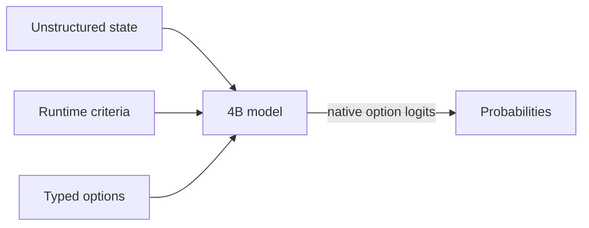

# SemIf (formerly OpenJev)

<div align="center">

**Semantic ifs from open models, on a 3090 at home.**

*Independent project; not affiliated with Jev or TypeSafe.*

**Wow! No waitlist.** [Run it in your browser today.](webgpu-demo/index.html)

[](demo/index.html)

*Same frozen 4B model · same state · same 21 questions · measured separately, aligned at t=0 in the replay*

</div>

> **Independent research project.** SemIf was formerly called OpenJev. It is not affiliated with or endorsed by TypeSafe. Jev, TypeSafe, and other names and marks are the property of their respective owners. No infringement is intended.


Most agent decisions are small: *route this*, *retry that*, *does the evidence support X?* A chat model can answer them, but it spends time generating text that software immediately parses back into an `if` statement.

Jev is TypeSafe's closed service for runtime-defined semantic decisions. This project reproduces that **interface pattern** with open models; it does not reproduce Jev's undisclosed model or training.

This baseline reads typed option probabilities directly from a model. No answer sentence, JSON repair, or decoding loop.

### Latest changes

**2026-09-22**

- Added PyTorch/MPS scoring for Apple Silicon — [@dp-IED](https://github.com/dp-IED) in [#15](https://github.com/TheoLeeCJ/SemIf/pull/15).
- Added a Qwen3.8-27B EXL3 bridge with corrected, committed evidence — [@jkyamog](https://github.com/jkyamog) in [#9](https://github.com/TheoLeeCJ/SemIf/pull/9).
- Added per-workload temperature calibration and calibrated prediction outputs — [@samarthpatel24](https://github.com/samarthpatel24) in [#19](https://github.com/TheoLeeCJ/SemIf/pull/19).

**2026-09-18**

- Added MiniCPM5 2B and Qwen3.5 4B to the browser demo.
- Added **Unsloppify site**, a switch to a conventional interface.

## Quick start

**Apple Silicon:** use the native [MLX backend](docs/MLX.md) for direct scoring,
serial prefix reuse, and parallel shared-state decisions on macOS arm64.
Install `pip install -e '.[test,mlx]'` and add `--backend mlx` to the scorer command.
PyTorch/MPS (`--device mps`) is also supported for direct, serial, and shared modes — see
[Apple Silicon](docs/APPLE_SILICON.md).

Python 3.10+, CUDA, and a GPU that can hold a 4B BF16 model:

```bash
python -m venv .venv
. .venv/bin/activate
export HF_HOME=/path/to/large-drive/huggingface
pip install -e '.[test]'
```

**CPU only:** the llama.cpp backend scores the same prompts from a local GGUF
checkpoint with no CUDA device. Install `pip install -e '.[test,llamacpp]'`,
fetch a GGUF (for example `Qwen_Qwen3.5-4B-Q4_K_M.gguf` from
`bartowski/Qwen_Qwen3.5-4B-GGUF`), and add `--backend llamacpp --gguf
/path/to/model.gguf`; `--llama-threads` caps the CPU threads. Prompt
construction stays on the pinned reference tokenizer, so `prompt_sha256`
matches the Torch backend row for row; scores carry the GGUF checksum and are
conditional on the quantized weights. Direct and prefix-cached execution can
have small numerical differences from different llama.cpp evaluation paths;
compare decisions or probabilities with a tolerance rather than raw logits
bit for bit. One loaded backend owns one stateful scoring context. For a much
slower full-precision Torch reference path, explicitly pass
`--device cpu --dtype float32` to the standard scorer command.

Run the owned examples:

```bash
CUDA_VISIBLE_DEVICES=0 semif-score \
  --mode direct \
  --model Qwen/Qwen3.5-4B \
  --revision 851bf6e806efd8d0a36b00ddf55e13ccb7b8cd0a \
  --input examples/decisions.jsonl \
  --output results.jsonl
```

Each result contains typed option scores, timing, the exact model revision, and a prompt hash.

If every row has the same exact state, switch to `--mode shared` to prefill it once and evaluate the criteria in parallel.

## How it works



- **Runtime-defined:** criteria and option descriptions arrive with the request.
- **Decision-native:** one forward pass reads declared option logits; no answer token is sampled.
- **Shared-state aware:** one long state can be prefetched once, then branched across many criteria.
- **Auditable:** the owned fixture, exact runners, row-level outputs, revisions, prompts, and known failures are committed.

## Speed

### Decisions versus a compact generated array

Same frozen Qwen3.5-4B, same owned state, same 21 binary criteria, one RTX 3090:

| Output path | Time | Output tokens | Result |
|---|---:|---:|---|
| Direct typed logits, median of 3 | **1.023 s** | **0** | 21 probability pairs |
| Autoregressive JSON array, median of 3 | 5.332 s | 111 | Valid ordered 