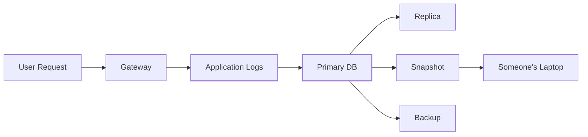

# scuttle

```text
$ cat scuttle

 ███████╗ ██████╗██╗   ██╗████████╗████████╗██╗     ███████╗
 ██╔════╝██╔════╝██║   ██║╚══██╔══╝╚══██╔══╝██║     ██╔════╝
 ███████╗██║     ██║   ██║   ██║      ██║   ██║     █████╗
 ╚════██║██║     ██║   ██║   ██║      ██║   ██║     ██╔══╝
 ███████║╚██████╗╚██████╔╝   ██║      ██║   ███████╗███████╗
 ╚══════╝ ╚═════╝ ╚═════╝    ╚═╝      ╚═╝   ╚══════╝╚══════╝

 tiny hybrid post-quantum encryption for sensitive data.

 > seal everywhere.
 > open somewhere else.
 > steal the database, get ciphertext.
 >
 > PLEASE BREAK IT.
```

[](https://go.dev/)
[](LICENSE)
[](#the-cryptographic-construction)
[](#the-cryptographic-construction)
[](#status)

<p align="center">
  <b>English</b> ·
  <a href="README.zh-CN.md">简体中文</a> ·
  <a href="README.ja.md">日本語</a> ·
  <a href="README.ko.md">한국어</a> ·
  <a href="README.de.md">Deutsch</a> ·
  <a href="README.fr.md">Français</a> ·
  <a href="README.es.md">Español</a>
</p>


`scuttle` is an open-source encryption layer for sensitive application logs.

It is designed for systems where request and response payloads need to be
temporarily observable, but copies may survive for years in databases,
replicas, snapshots and backups.

The normal application fleet receives **only a public capture key**. It can
encrypt new logs, but cannot use that key to decrypt historical ones.

Long-lived key material is protected with a **hybrid post-quantum construction
using ML-KEM-768 + X25519**, while payloads are encrypted using
**AES-256-GCM** with independently derived field keys.

> **scuttle is the hybrid post-quantum encryption layer for sensitive log
> payloads at [OrcaRouter](https://www.orcarouter.ai/).**
>
> The open-source library is published so the construction can be inspected,
> fuzzed, attacked and improved in public.

---

## Break it.

**We want people to attack this.**

Cryptography gets stronger when its assumptions are explicit and people are
incentivized to find where they fail.

[`ATTACK.md`](ATTACK.md) lists the security properties we believe the system
provides, ordered by how expensive it would be for us to be wrong, together
with fuzz targets aimed at those assumptions.

Found something?

→ Read [`SECURITY.md`](SECURITY.md)  
→ Reproduce it  
→ Break an invariant  
→ Tell us what we got wrong

## Status

> **v0 — not independently audited.**
>
> The wire format is not stable. Do not use this yet for data you cannot
> afford to lose or make permanently unreadable.

---

# Why “scuttle”?

To **scuttle** a ship is to deliberately make it unusable before an adversary
can capture it.

Scuttle applies the same idea to sensitive data.

```text
             attacker captures storage

                       │
                       ▼

              ┌─────────────────┐
              │    DATABASE     │
              │                 │
              │  █ ciphertext   │
              │  █ wrapped keys │
              │  █ metadata     │
              └────────┬────────┘
                       │
                       │  no capture private key
                       ▼

                 ┌───────────┐
                 │ ¯\_(ツ)_/¯ │
                 └───────────┘

               got the database.
                 not the data.
```

---

# The problem

AI infrastructure produces unusually sensitive logs.

A single request can contain:

- prompts
- model responses
- source code
- API output
- retrieved documents
- PII
- credentials accidentally included in context
- agent tool calls
- proprietary company data

A normal logging architecture eventually looks like this:



Deleting a row after 30 days does not necessarily delete yesterday's backup,
an oplog entry, a lagging replica or an old snapshot.

Encryption only at the storage layer also means that whoever obtains the
database's normal decryption path may obtain the plaintext.

`scuttle` moves encryption **before storage**.

---

# The architecture

```mermaid
flowchart LR
    P["Sensitive Payload"] --> Z["Independent zstd compression"]

    Z --> AES["AES-256-GCM"]

    LK["Ephemeral Leaf Key"] --> HKDF["HKDF"]
    HKDF --> FK["Per-record / per-field key"]
    FK --> AES

    AES --> CT["Encrypted Payload"]

    PUB["Public Capture Key"] --> KEM["Hybrid KEM<br/>ML-KEM-768 + X25519"]
    LK --> KEM
    KEM --> WK["Wrapped Leaf Key"]

    CT --> DB[("Untrusted Storage")]
    WK --